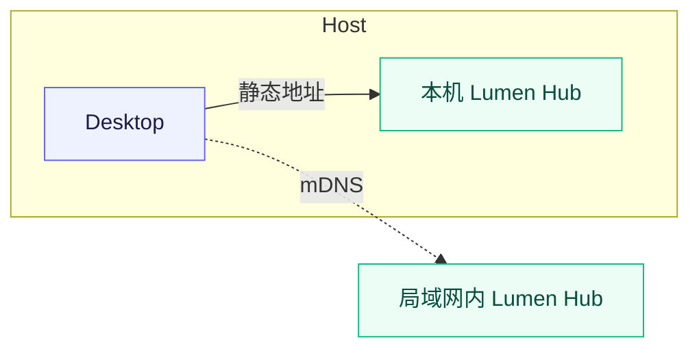

# Lumen AI

Lumen Hub 能够为流明集提供强大且多样的AI能力，它可以使用多种方式部署和连接，让算力和存储解耦。你可以将媒体存在NAS上，但将 Lumen Hub 部署在 PC, 家庭服务器，甚至是单片机，在局域网内，Lumen Hub 能够通过mDNS实现零配置+自发现，自动与流明集连接并提供高效的模型推理服务。

为什么我们需要算力和存储解耦？在NAS上，大多都使用低功耗芯片例如 Intel N100 等，这极大的限制了媒体的AI处理流程。如果你同时在单台NAS上运行 Jellyfin 做视频转码，Lumilio Photos 做照片处理，和各种AI图像推理任务，这些任务各自都需要占用大量的计算资源，导致任务被阻塞，性能下降，功耗增加。

Lumen Hub 使用 Home Native 协议，创新性将 AI 算力和存储解耦，让你能够在任何地方部署和运行推理服务，而不必担心硬件限制。你可以在 NAS 上部署 Lumilio Photos 和简单的 OCR文字识别服务，同时在 GPU 算力更强的服务器或者 PC 上部署图像语义分析、人物识别和 BioCLIP物种识别。你也可以仅在需要时开启这些 Lumen Hub 服务，从而降低能源消耗。

## Desktop

在 Desktop 上，我们提供了静态地址节点一键部署、启动和管理的方式。同时，Desktop 能通过 mDNS 发现局域网中的其他 Lumen Hub 并自动连接和注册模型推理能力。

### 本机静态节点部署

这是 Desktop 的默认路径。控制面板会自动注册并连接本机 Hub `127.0.0.1:50051` 静态节点。

1. 打开 **Desktop 控制面板 → Lumen**，开启本机 Lumen Hub。
2. 在配置向导或 **Lumen → 配置**中选择预设、计算后端和模型缓存位置；这些选项的含义见本页最后的[统一配置](#预设模型能力与资源占用)一节。
3. 你需要注意地区选择，在中国大陆，我们会使用Github和HuggingFace镜像站来下载程序和模型。
4. 保存配置。Desktop 会下载与当前系统匹配的Lumen Hub，首次启动还会下载所选模型。
5. 等待控制面板中的 Lumen 状态变为**运行中**或**就绪**。模型下载和预热完成前，节点可能已经启动但还不能处理任务。
6. 回到 Web 的 **设置 → AI**，打开需要的任务；在[状态](./monitor)中确认节点能力和队列状态。

模型缓存不是资源库的一部分。不建议把它放进媒体备份，也不要在 Hub 运行时手动删除缓存文件。

## CLI 命令行部署

Lumen CLI 是 Lumen Hub 的推荐的统一安装器和启动器，适用于几乎所有设备。它可以把一台 Windows、macOS Apple Silicon 或 Linux 计算机变成局域网推理节点。

### 安装与首次启动

macOS Apple Silicon、Linux x64 或 Jetson Linux：

打开终端(Terminal)，逐行输入：

~~~bash
# 下载安装脚本
curl --proto '=https' --tlsv1.2 -LsSf https://lumilio.org/lumen/install.sh | sh

# 初始化配置，会有引导选项，使用键盘方向键选择，回车确认
lumen-cli init

# 启动 Lumen Hub，稍后 Lumen Hub 会自动下载模型
lumen-cli start
~~~

::: tip macOS Apple Silicon
我们强烈推荐你选择 Metal 计算后端。
:::

::: tip Jetson Linux
Jetson Linux 推荐使用 CUDA 计算后端，其他 Linux ARM 平台推荐使用 CPU 计算后端。
:::

Windows x64 PowerShell：

打开 PowerShell，逐行输入：

~~~powershell
# 下载安装脚本
powershell -ExecutionPolicy Bypass -c "irm https://lumilio.org/lumen/install.ps1 | iex"

# 初始化配置，会有引导选项，使用键盘方向键选择，回车确认
lumen-cli init

# 启动 Lumen Hub，稍后 Lumen Hub 会自动下载模型
lumen-cli start
~~~

`lumen-cli init` 会依次询问下载区域、预设、计算后端和模型缓存目录，并在用户目录下的 `.lumen/` 写入 `config.yaml` 与 `bootstrap.json`。`lumen-cli start` 会下载匹配当前系统的 Hub，校验文件后在后台启动；模型会在 Hub 第一次启动时下载。

CLI 生成的 Hub 默认监听 `0.0.0.0:50051` 并启用 mDNS。等待 Hub 完成模型下载和预热后，局域网中的 Desktop 或使用默认 host network 的 Lumilio Server 会自动发现它。还要在运行 CLI 的设备防火墙中允许来自局域网的 TCP `50051` 和 mDNS 组播。

常用维护命令：

~~~bash
lumen-cli validate   # 只检查配置
lumen-cli reload     # 重新读取配置并重启 Hub
lumen-cli run        # 在前台运行并直接查看日志
lumen-cli stop       # 停止后台 Hub
~~~

不想运行安装脚本时，可以从 [Lumen-Hub Releases](https://github.com/EdwinZhanCN/Lumen-Hub/releases) 下载对应平台的 CLI 压缩包和校验文件。不要把一个平台的 Hub 压缩包复制到另一个平台使用。

## 自定义配置部署

如果预设不能满足需要，可以在下面分别选择节点设置和模型能力。表单会生成一份完整的 `lumen-config.yaml`；下载后，再根据运行系统与计算后端复制对应的 CLI 命令。

<LumenConfigBuilder />

## Docker Compose 部署

Docker 是 Linux 服务器、NAS 和独立 GPU 计算主机的正式分发路径。向导会把地区、预设和自定义模型组合直接写入完整 Compose，不要求用户手写 YAML、`.env`、端口映射或静态节点地址。

开始前只需确认目标设备能够运行现代 Docker Compose，并支持 Linux `host` network。Vulkan 还要求主机提供 `/dev/dri`；CUDA 还要求安装 [NVIDIA Container Toolkit](https://docs.nvidia.com/datacenter/cloud-native/container-toolkit/latest/install-guide.html)。

<DockerComposeConfigurator />

### 为什么必须使用 host network

Lumen Hub 会在模型就绪后通过 mDNS 发布自己的地址与能力。Lumilio Server 的默认 Compose 同样使用 host network，因此两者可以直接使用宿主机的局域网接口：

这保留了 Lumen 的核心拓扑：媒体和数据库留在 NAS，AI 可以运行在局域网中任何更合适的计算设备上，并且可以随时上线或下线。正常部署不需要把两者塞进同一个 Compose，也不需要把 Hub 地址写进 Lumilio 配置。

::: warning Host network 是当前 Docker 支持边界
不要把下载的配置改成 `bridge`，也不要添加 `ports: 50051` 后假设 mDNS 仍受支持。如果容器平台不能创建 host network 项目，当前官方 Docker 路径不支持在该平台上保留自动发现能力。
:::

### 启动与就绪状态

图形化容器管理器可以直接导入组件下载的文件。拥有终端时，也可以在文件所在目录运行：

~~~bash
docker compose -f lumen-cpu.compose.yml up -d --wait
~~~

把文件名替换成实际下载的 Vulkan 或 CUDA 版本即可。三份配置都使用名为 `lumen-models` 的持久化卷；更新或重建容器不会重复下载已经缓存的模型。

第一次启动会下载并加载向导中选择的模型。在这段时间里容器保持 `starting` 是正常现象；只有标准 gRPC Health 返回 `Serving` 后，容器才会变为 `healthy` 并开始发布 mDNS。可用下面两条命令查看状态和启动日志：

~~~bash
docker compose -f lumen-cpu.compose.yml ps
docker compose -f lumen-cpu.compose.yml logs -f lumen-hub
~~~

Hub 变为 `healthy` 后，到 Lumilio Photos 的[状态](./monitor)页确认节点和模型能力已经出现。只要 Photos 与 Hub 都按发行文件使用 host network，连接过程不需要额外配置。

### GPU 映射已经包含在文件中

- **Vulkan** 文件已经映射 `/dev/dri:/dev/dri`，用于支持 Vulkan 1.3 的 Intel 或 AMD GPU；默认容器无需 `RENDER_GID` 或 `.env`。
- **CUDA** 文件已经使用 Compose 的 `gpus: all` 把 NVIDIA GPU 交给容器。启动前应确保 `nvidia-smi` 正常，并已安装 NVIDIA Container Toolkit。
- **CPU** 文件不映射硬件设备，也是唯一同时提供 `amd64` 与 `arm64` 镜像的版本。

地区、预设和受支持的模型组合都可以直接在向导中完成。只有需要修改批处理、服务端口等向导没有提供的底层参数时，才使用上面的[自定义配置部署](#自定义配置部署)生成完整配置，并自行扩展 Compose，将文件只读挂载到 `/etc/lumen/config.yaml`；同时移除 Compose 中的 `LUMEN_REGION`、`LUMEN_PRESET` 和其他模型环境变量，让挂载文件保持完整权威。

## 预设、模型能力与资源占用

Desktop、CLI 和 Server 使用同一套 Lumen 模型与任务接口。Desktop 和 CLI 通过预设生成配置；Compose 没有图形化预设选择器，而是通过 `/etc/lumen/config.yaml` 选择同样的服务组合。无论选择哪种部署方式，Lumilio 都只会把已发现且已就绪的节点用于相应任务。

### 模型能力

| 能力 | 你会看到的结果 | Lumen 服务 | 适合的场景 |
| --- | --- | --- | --- |
| 图像语义分析 | 用自然语言查找“海边的船”“生日聚会”等内容；也可以用一张媒体查找相似内容 | SigLIP 2 | 不想先建立文件夹或标签时，用内容找媒体 |
| 视频语义 | 从视频帧生成语义索引，搜索视频中的场景 | SigLIP 2 + Lumilio 视频采样 | 查找包含某个场景的视频 |
| 人物 | 检测人脸、生成特征并聚类，随后可以在人物页整理和命名 | InsightFace `antelopev2` | 按人物回顾家庭活动或旅行记录 |
| OCR文字识别 | 识别媒体中的文字并建立全文检索 | PP-OCRv6 small | 收据、菜单、文档、截图和路牌 |
| BioCLIP物种识别 | 根据图像给出物种候选，并在生物图鉴相册中整理 | BioCLIP-2 | 植物、动物和自然观察记录 |

这些任务由 Lumilio 的后台队列按需执行。打开任务开关不会立即处理已有的全部媒体；可以在[状态](./monitor)中查看节点、队列和覆盖率，再选择补齐或重建。

### 预设

预设同时决定启用哪些服务、使用哪一种模型和需要预留的空间。控制面板和 `lumen-cli` 会根据设备情况给出推荐值；不确定时从**基础（basic）**开始。

| 预设 | 包含能力 | 主要模型和数据集 | 资源参考 |
| --- | --- | --- | --- |
| **最小（minimal）** | 图像语义分析、人物识别 | SigLIP 2 base + InsightFace `antelopev2` | 至少 4 GB 内存、2 GB GPU/统一内存、约 2 GB 磁盘 |
| **基础（basic）** | 最小 + OCR文字识别 + BioCLIP物种识别 | SigLIP 2 base、PP-OCRv6 small、BioCLIP-2 + `TreeOfLife200MCore` | 至少 6 GB 内存、3 GB GPU/统一内存、约 6 GB 磁盘 |
| **完整（brave）** | 更强的图像语义分析模型和完整 BioCLIP 物种目录 | SigLIP 2 `so400m-patch14-384`、PP-OCRv6 small、BioCLIP-2 + `TreeOfLife200M` | 至少 8 GB 内存、4 GB GPU/统一内存、约 10 GB 磁盘 |

发行 Compose 默认使用 `basic`，启用图像语义分析、人物识别、OCR文字识别和 BioCLIP物种识别。向导也可以选择 `minimal`、`brave` 或自定义组合。表中的数值是选型参考，不是所有设备的硬性上限。模型权重和 BioCLIP 目录会按需映射，首次下载和预热时可能出现短时内存峰值。

### 计算后端

计算后端决定模型在哪种硬件上执行，不会改变 Lumilio 的任务接口：

| 部署方式 | 可选后端 | 说明 |
| --- | --- | --- |
| Desktop | Metal、GPU、CPU | macOS Apple Silicon 优先 Metal；Windows x64 优先 GPU；CPU 兼容性最好 |
| CLI | macOS 的 Metal/CPU；Windows 的 GPU/CPU；Linux 的 CPU、Vulkan、CUDA、ROCm 等发布构建 | `lumen-cli` 会根据系统和硬件选择匹配的 Hub 构建 |
| Compose | `cpu`、`vulkan`、`cuda` 镜像标签 | 计算后端由镜像标签和容器设备映射决定；地区、预设和模型组合由向导写入环境变量 |

更强的后端通常速度更快，但也更依赖驱动、显存或统一内存。低功耗设备先使用最小预设和 CPU；如果节点已发现但任务不可用，先在[状态](./monitor)确认模型是否已经完成下载和预热。

### 数据边界

Lumen 节点会接收任务需要的媒体派生数据。远程节点的运行者可能看到这些数据和运行日志，请只使用你信任的设备。不要把 `50051` 端口直接暴露到公网；原始媒体、资源库数据库、Lumen 模型缓存和节点日志应分别备份。
