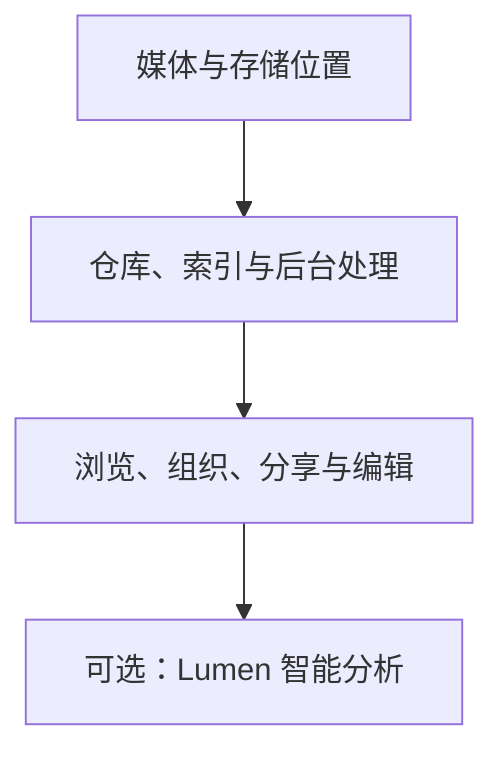

# 认识流明集

::: warning 注意
流明集当前处于 Beta 阶段。请先使用测试媒体或已有可靠备份的资料库进行试用，不要将本应用作为重要媒体的唯一存储位置。
:::

流明集是一款**开源、本地优先**的照片与媒体管理应用。它帮助你将媒体保存在自己选择的存储位置，并通过资源库、相册、合集、人物和地点等方式进行浏览与整理。后台任务按硬件能力调度，AI 与基础媒体服务彼此解耦，让日常管理保持轻量，也允许在需要时接入更强的推理设备。

流明集适合希望管理个人媒体的摄影用户和普通用户，也支持在 NAS 或 Linux 服务器上进行自托管部署。Desktop 适合单机使用，Docker 适合持续运行与多设备访问。

## 你的媒体，你的存储

首次设置时，Desktop 会准备一个本机默认存储位置，并在其中创建主仓库。之后可以在 Desktop 控制面板授权外置磁盘或网络卷作为额外存储位置，再从浏览器选择这些位置创建仓库。上传、扫描和云端导入都会进入同一套可理解的仓库与后台处理流程。

流明集的普通管理操作以保留原件为前提。扫描会原位登记已有文件；工作室调整与原件分开保存；当前 Beta 版本的普通删除使用软删除。

更多仓库行为请参阅[存储位置与仓库](./repositories.md)。

## 从浏览到整理

完成媒体入库后，你可以：

- 在资源库中浏览、筛选和检查照片、视频与音频。
- 使用相册、合集、人物、地点和堆叠组织媒体。
- 查找相同内容或视觉相似的重复项。
- 按指定权限分享媒体。
- 在工作室中保存非破坏性调整并导出新文件。
- 在管理和服务监控界面查看仓库、处理任务和服务状态。

如果你对术语不熟悉，请先阅读[核心概念](./concepts.md)。

## 可选的 Lumen 智能分析

根据所选预设与节点已安装的模型，Lumen 可以提供图像语义分析、人脸检测与特征提取、OCR 文字识别和 BioCLIP 物种识别。不同配置不一定同时包含全部能力。

AI 是辅助能力，不是基础媒体管理的必要条件。节点未连接或结果尚未生成时，媒体存储、浏览与手动组织仍然可用。具体能力和连接方式请参阅 [AI 与 Lumen](./lumen.md)。

Lumen 与 Lumilio Agent 是两条不同的 AI 路径：Lumen 负责视觉模型推理，可运行在本机或受信任的自托管节点；Lumilio Agent 是可配置的对话助手，是否连接外部 LLM 取决于管理员选择的服务商和接口地址。启用云端 LLM、iCloud 导入、公开分享或外部地理编码时，会发生相应的网络通信，因此“本地优先”不等于所有可选功能永不联网。

## 完整性保护不等于备份

流明集使用 BLAKE3 内容指纹、暂存后提交、软删除和非破坏性编辑降低意外覆盖或丢失风险。这些措施无法替代媒体与数据库的独立备份。

在使用正式资料库前，请阅读[数据完整性与备份](./integrity.md)。

## Beta 与实验性能力

流明集当前是面向公开试用的 Beta 项目。平台、格式、大型资料库与外部工具的兼容性仍在持续验证。

iCloud 导入依赖非 Apple 官方支持的网络服务行为，因此属于**永久实验性功能**。即使流明集未来进入稳定版本，也不承诺该集成长期可用。使用前请阅读[实验性功能与已知风险](./experimental.md)。

## 开始试用

1. 根据使用环境选择 Desktop 或 Docker，并完成[安装](./installation.md)。
2. 准备 3–10 张已有可靠备份的照片。
3. 按[首次使用](./first-use.md)完成管理员、主仓库、上传与恢复验证。
4. 确认基础路径符合预期后，再逐步增加媒体数量或启用 Lumen。

## 开源技术概览

流明集的主要组件包括：

- 基于 Go 的 API、媒体处理与后台任务服务。
- PostgreSQL 与 pgvector 数据存储。
- 基于 React、TypeScript 与 Vite 的 Web 界面。
- 基于 Wails 的 Desktop 宿主。
- 用于浏览器侧哈希、导出和媒体处理的 Rust/WASM 组件。
- 由 Lumen Hub 执行本地模型推理，由 Lumen SDK 负责节点发现与连接。

这些实现细节用于帮助用户理解部署、数据位置和功能依赖，不构成使用基础媒体管理的前置知识。
