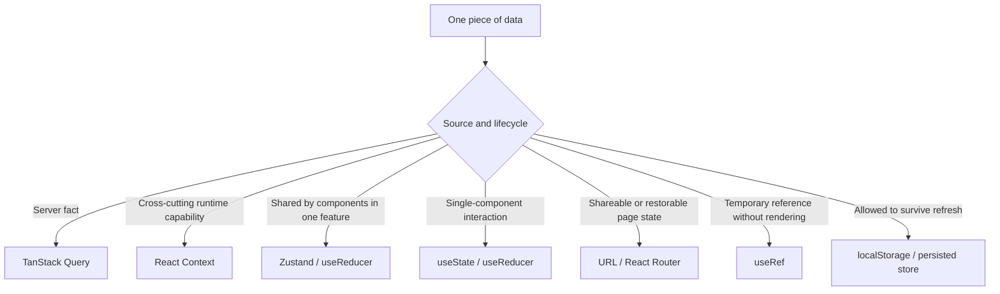

# Web Architecture

This document defines where frontend code belongs and which imports are allowed. Keep ownership close to the domain, keep public surfaces small, and preserve an acyclic dependency graph.

## Source ownership

| Path                      | Responsibility                                                                                                                                                                                                                            |
| ------------------------- | ----------------------------------------------------------------------------------------------------------------------------------------------------------------------------------------------------------------------------------------- |
| `src/app/`                | Application composition only: root providers, routing, shell, fatal-error handling, and process-wide effects. Domain behavior does not belong here.                                                                                       |
| `src/features/<feature>/` | One product/domain capability. A feature owns its routes, flows, model rules, API adapters, state lifecycles, tests, and feature-specific styles.                                                                                         |
| `src/components/`         | Reusable presentational UI with no feature/API/store dependency. Components accept plain data and callbacks; semantic families such as `collection` are allowed when multiple domains use them. Do not create a generic `shared/` bucket. |
| `src/lib/`                | Non-visual lower-layer code: HTTP/runtime adapters, algorithms, formatting, preferences, and stable contracts shared across features (for example `albums`, `assets`, or `upload`). It must not import or orchestrate a feature.          |
| `src/contexts/`           | Truly application-wide infrastructure such as global notifications or worker access. Feature-scoped contexts stay inside their feature.                                                                                                   |
| `src/workers/`            | Browser worker entry points and the shared worker client. Feature-owned algorithms stay with their feature; a `.worker.*` entry point may register a worker-safe feature runner.                                                          |
| `src/types/`              | Ambient and third-party declaration files. Domain types stay with their feature; reusable value types stay beside their implementation in `lib`.                                                                                          |
| `src/styles/`             | Global stylesheet entry points and genuinely global rules. Component- or feature-specific CSS is colocated with its owner.                                                                                                                |

## Standard feature shape

Every feature uses the same root vocabulary. Directories are optional—do not create empty placeholders—but a different root directory name is not allowed:

```text
src/features/<feature>/
├── api/          # TanStack Query definitions, mutations and DTO adapters
├── model/        # pure domain types, rules, codecs and transformations
├── flows/        # user workflows; each flow colocates its UI, hooks and local state
├── components/   # UI genuinely reused by multiple flows in this feature
├── hooks/        # rare feature-wide React mechanisms shared across flows
├── modules/      # technically isolated capabilities that are not user workflows
├── routes/       # router entry components
├── state/        # feature-wide state, persistence, migration and reset only
├── utils/        # legacy/general pure helpers with no domain vocabulary
├── types.ts      # feature-wide types
├── index.ts      # narrow cross-feature public API, only when needed
├── doc.ts        # architecture source, when documented
└── doc.md        # generated from doc.ts
```

- Root files other than `index.ts`, `types.ts`, `doc.ts`, and generated `doc.md` are not allowed.
- `api/` owns reusable server-state access and must not contain page composition or modal state.
- `model/` is React-free. Put domain names, normalization, validation, URL codecs, grouping, sorting, and other deterministic rules here rather than growing a catch-all `utils/` directory.
- `flows/<workflow>/` is the default home for workflow UI and orchestration. Colocate its components, hooks, reducers, scoped Zustand stores, tests, and styles; nested names such as `gallery/`, `selection/`, or `header/` describe parts of that workflow.
- `components/` is not a second UI dumping ground. A component used by only one flow stays in that flow; root components must have real consumers in multiple flows.
- `state/` owns only state whose lifecycle spans multiple flows or refreshes: persistence, migration, hydration, reset, or a genuinely feature-wide provider. A reducer or scoped store used by one flow stays with that flow.
- `modules/<capability>/` is for an isolated technical/product capability that is not itself a user journey. Name it after product vocabulary (`editor`, `widgets`, `process`), never `common`, `misc`, or `shared`.
- Tests and feature-specific styles stay beside the implementation they characterize.
- A small feature omits unused directories. Uniformity means identical directory semantics, not identical directory counts.
- The Assets feature expresses its main journeys as `flows/browse`, `flows/viewer`, and `flows/export`; pure filtering and browse-item rules live in `model`. It keeps `map/` and `picker/` as reviewed public sub-entry exceptions whose entry files remain narrow.
- The Events feature owns its cursor-backed index, Event detail orchestration,
  mutations, and presentation fallbacks. List and detail apply Repository
  Browse Scope as a read projection after owner authorization; counts, cover,
  and gallery come from that same resolved set. Rebuild status is polled only
  while a source revision is pending. Event detail composes
  `@/features/assets`; neutral bulk-action selection contracts remain in
  `src/lib/assets` so Assets does not depend on Events.
- The only handwritten documentation sources under `web/` are this file and
  feature-root `doc.ts` files. Put feature-specific architecture in `doc.ts`;
  do not add feature `README.md` files or supporting `docs/` directories.

## Dependency rules

The normal direction is:

```text
main.tsx -> app -> features -> components / contexts / hooks / lib / workers / types
                         \-> another feature's public API (acyclic only)
e2e -> public browser UI -> real API / database / storage / queues
```

- Lower layers (`components`, `config`, `contexts`, `hooks`, `lib`, `types`, and shared worker code) never import features.
- Nothing imports `app` except `main.tsx` and modules already inside `app`. `app` is the composition root and may import route implementations directly; this does not make those paths public to other features. Playwright E2E tests exercise public browser UI against isolated real services and do not import production feature internals. Attempts own distinct users and repositories through the shared workspace fixture; a global queue reaching zero is not completion for one test.
- Inside one feature, use relative imports. Do not import `@/features/<same-feature>/...` and do not route internal code through the feature's root public barrel. A cohesive submodule may use its own local `index.ts` through a relative path. Use the `@/...` alias when an import leaves the feature.
- Between features, import `@/features/<feature>` unless an approved narrow entry applies. The target feature's `index.ts` is its explicit public contract.
- Keep `index.ts` narrow. Export only symbols with real cross-feature consumers; do not expose internals merely to shorten a path.
- The approved narrow entries are `@/features/assets/map` and `@/features/assets/picker`. `map` exposes the asset-backed geospatial surface; `picker` exposes an isolated single-selection asset flow. These aliases are for consumers outside Assets; Assets internals still use relative paths. A new narrow entry requires a concrete boundary and a corresponding boundary-check update.
- Cross-feature runtime dependencies must remain acyclic. If two features need each other, move the neutral contract downward or invert the orchestration into `app` or a higher owning feature.
- A feature `doc.ts` may use deep, type-only imports so `{@link}` references resolve to real symbols. This documentation-only exception is not a runtime API.

Examples:

```ts
// Inside features/assets: relative to the owning flow.
import { useAssetSelection } from "./selection/useAssetSelection";

// Across features: use a public entry.
import { useMessage } from "@/features/notifications";

// Approved purpose-built entry.
import PhotoPicker from "@/features/assets/picker";
```

## State, data, and utility ownership

Choose state by source and lifecycle:


```mermaid
flowchart TD
    A["One piece of data"] --> B{"Source and lifecycle"}
    B -->|"Server fact"| C["TanStack Query"]
    B -->|"Cross-cutting runtime capability"| D["React Context"]
    B -->|"Shared by components in one feature"| E["Zustand / useReducer"]
    B -->|"Single-component interaction"| F["useState / useReducer"]
    B -->|"Shareable or restorable page state"| G["URL / React Router"]
    B -->|"Temporary reference without rendering"| H["useRef"]
    B -->|"Allowed to survive refresh"| I["localStorage / persisted store"]
```

| Source of truth                      | Owner                               | Placement and rule                                                                                                          |
| ------------------------------------ | ----------------------------------- | --------------------------------------------------------------------------------------------------------------------------- |
| Server fact                          | TanStack Query                      | Put reusable query/mutation definitions in the feature `api/`. Never copy fetched collections into Context or Zustand.      |
| Cross-cutting runtime capability     | React Context                       | App-wide capabilities live in `src/contexts`; feature-scoped providers and contexts live in that feature's `state/`.        |
| Shared workflow interaction          | Zustand or `useReducer`             | Colocate it under `flows/<flow>/`; use root `state/` only when the lifecycle genuinely spans flows or refreshes.            |
| Single component interaction         | `useState` or local `useReducer`    | Keep it beside the rendering component; do not promote it without multiple consumers.                                       |
| Shareable/restorable page state      | URL / React Router                  | The URL remains authoritative for search, tab, filter, entity, or view state that should survive navigation or be linkable. |
| Non-rendering temporary value        | `useRef`                            | Use for DOM handles, latest callbacks, request identity, and mutable bookkeeping that must not render.                      |
| Refresh-persistent client preference | Versioned storage / persisted store | Persistence code, migration, hydration, and reset live in `state/`; keys and versions use the shared settings registry.     |

- Keep ephemeral state in the component that renders it. Lift it only when multiple siblings need the same interaction state.
- Use TanStack Query for server data, pagination, loading/error state, cache invalidation, and mutations. Do not mirror fetched collections into Context or Zustand.
- Use a scoped Zustand store for transient interaction shared by several components in one flow, such as browse selection. Do not store applied filters, search, sorting, or the current route entity there when those values belong in the URL.
- Keep an unapplied form/filter draft in a local reducer; committing it writes to its authoritative owner (for example the URL or a mutation).
- Use Context for dependency/provider boundaries and truly cross-cutting runtime state. A domain-specific provider belongs under its feature, not `src/contexts`.
- Put workflow orchestration and feature-specific hooks in the owning feature. A small stable query/type contract used by several features may live under a named `lib/<concept>` namespace to avoid coupling those features. Use generated OpenAPI types through `lib/http-commons`; never hand-edit `src/lib/http-commons/schema.d.ts`.
- Keep workflow-specific types, formatters, validators, and adapters in the feature. Move code to `lib` only when it is a stable lower contract and does not depend on feature UI, state, or orchestration.
- A component that performs asset, album, repository, people, upload, or other product behavior is a feature component. A semantic presentational family may live in `components` when it has plain props and no feature dependency.
- Keep worker transport and scheduling in `workers`/`lib/workers`; keep the operation itself with the feature or neutral library that owns its semantics. A worker entry may register only the feature runner imports explicitly allowlisted in the boundary checker.

## Runtime composition

`src/main.tsx` wraps the whole application in a root error boundary whose
fallback uses a plain document link, so it still works when the router itself
fails. `src/app/App.tsx` mounts, in order: `I18nProvider`, `PreferencesEffects`,
`GlobalProvider`, `QueryClientProvider`, `AuthProvider`, the router and
bootstrap gates, worker and upload providers, then the shell.

`src/app/router/routes.tsx` is the authoritative route table and
`src/app/router/AppRouter.tsx` its gates. Authenticated routes render inside
`src/app/shell/AppShellLayout.tsx` (navigation, scroll container, and the
global ChatDock, which lazy-loads its renderer and mounts no queries while
collapsed). Studio, Map, Lumilio, Monitor, and Settings are route-level lazy
chunks. The final `*` route is a public 404 page outside setup and
authentication gates, so an invalid URL is explained rather than redirected.
`src/app/status/HealthPoller.tsx` owns runtime health polling.

## Server contract

OpenAPI is the only source of HTTP types. Use `$api` from
`src/lib/http-commons/queryClient.ts` (`$api.useQuery`, `$api.useInfiniteQuery`,
`$api.useMutation`); never hand-edit `src/lib/http-commons/schema.d.ts`, never
declare ad-hoc request or response types for an endpoint OpenAPI describes, and
treat an `as` cast on a response as a contract bug
([lumilio-api-contract-change](../.agents/skills/lumilio-api-contract-change/SKILL.md)).

Failures stay structured until presentation. `src/lib/http-commons/problem.ts`
validates the generated RFC 9457 Problem and Problem Reference unions and
separates registered Problems from unknown or malformed bodies, network
failures, and aborts. Manual fetch, XHR, download, and SSE adapters return that
same structure and never build messages from response text. Rendering calls
`localizeProblem`/`localizeProblemReference` with an already-localized fallback;
known types may override it through literal `apiErrors` keys. Behaviour branches
only on HTTP status or the exact Problem `type`, never on translated copy, and a
language change re-localizes a repeated failure without touching server state.
Architecture checks require every registered type to have a literal case and
non-empty English and Simplified Chinese strings.

## Session and storage of credentials

The browser keeps only the short-lived access token and the session-bound CSRF
proof; the refresh credential is a host-only `HttpOnly` cookie and never enters
a DTO or browser storage. `src/lib/http-commons/client.ts` sends credentials,
recovers the CSRF proof from the session endpoint, attaches `X-CSRF-Token` to
unsafe typed-client requests, and serializes refresh and logout under the
`lumilio-auth-refresh` Web Lock so tabs cannot replay a rotated credential.
Every session exit goes through `src/features/auth/state/resetSession.ts`, which
clears credentials, user-scoped caches and preferences, and in-flight Query and
Lumilio work before another user signs in.

## Repository scoping

List pages use `useBrowseScope`; upload alone uses `useWorkingRepository`; entity
actions use the entity's own `repository_id`. Ordinary users upload from
`/manage` (`GET /api/v1/storage/targets`); storage administration lives on
`/storage` over admin-only `/api/v1/storage/*`. Person and album pages take no
repository parameter.

## Browser runtime and large libraries

Development (`web/vite.config.ts`) and the Server's SPA handler
(`server/internal/api/spa.go`) both send `Cross-Origin-Opener-Policy:
same-origin` and `Cross-Origin-Embedder-Policy: credentialless`, which the
WASM and worker paths rely on. The Server serves the built SPA itself; there is
no separate web image.

Galleries keep full scroll geometry but mount only an overscanned window;
offscreen media nodes are removed and inactive list/search queries have bounded
cache lifetimes. The Home map loads only when visible and requests a bounded
preview; the Map route queries map points for its current viewport; the Places
rail drains location clusters but never map points.
`web/scripts/check-bundle-budget.ts` holds the production entry chunk to 420 KiB
gzip (`vp run test:bundle`).

## Test layers

The file name and directory choose the runner (`web/vite.config.ts`
`test.projects`); do not invent other conventions. Placement, GPU self-skip,
and proving a guard can fail:
[lumilio-write-a-test](../.agents/skills/lumilio-write-a-test/SKILL.md).

| Layer              | File                      | Runner / Vitest project                      | Answers                                                                            |
| ------------------ | ------------------------- | -------------------------------------------- | ---------------------------------------------------------------------------------- |
| Unit               | `*.test.ts`               | `unit` — Node, no DOM                        | React-free rules, transforms, codecs, validators, reducers, migrations, algorithms |
| Component          | `*.test.tsx`              | `integration` — Browser Mode (real Chromium) | one component or small tree: semantics, state, interaction                         |
| Flow integration   | `*.spec.tsx`              | `integration` — Browser Mode + MSW           | flows, routes, Router, Query, HTTP workflows                                       |
| Browser capability | `*.browser.test.ts`       | `browser` — Chromium                         | Worker, WASM, SSE, Blob, Canvas/WebGL                                              |
| Full E2E           | `web/e2e/specs/*.spec.ts` | Playwright + real services                   | key user paths on the real API, database, storage, and queues                      |

The `unit` project excludes `*.browser.test.ts` and `src/workers/**`, so an
accidental browser dependency fails instead of hiding. Core browsing UI belongs
to Playwright
([decision](../.agents/decisions/2026-08-14-frontend-test-layer-assignment.md)).
Playwright attempts own distinct state through the shared workspace fixture,
assert repository- or operation-scoped facts (a global queue reaching zero is
not completion for one test), and a retry-only pass is a failure
([determinism decision](../.agents/decisions/2026-09-03-test-matrix-determinism.md)).

## Validation

Run focused tests while editing, then the repository gates from the project root:

```bash
cd web
vp test run path/to/changed.test.ts
vp node scripts/check-source-boundaries.ts
cd ..
task web:test
```

If no direct test covers the change, run the nearest characterization tests plus typecheck, lint, and `vp node scripts/check-source-boundaries.ts`; add coverage when behavior is being changed or moved without it. The full gate remains required. Select broader evidence per [lumilio-select-checks](../.agents/skills/lumilio-select-checks/SKILL.md).

`task web:test` runs TypeScript checking, linting, the source-boundary checker, and the frontend test suite. The standalone `vp node scripts/check-source-boundaries.ts` command gives faster architectural feedback while editing. The checker rejects unresolved internal imports, non-standard feature roots, misplaced shared-state or persistence modules, reusable server queries under `hooks/`, same-feature aliases, cross-feature deep imports, reverse dependencies on `app`, lower-layer imports of features, unapproved worker registrations, runtime import cycles, and feature dependency cycles. Tests/specs participate in ownership and public-entry checks but stay out of the production cycle graph. `doc.ts`, WASM, and the generated schema are intentionally excluded from the runtime graph; `doc.ts` links are checked by the documentation lint rule instead.

Also run `vp run test:bundle` from `web/` after changes to workers, WASM, upload recovery/lifecycle, bundling, or other production-only browser paths: it builds the production app and enforces the bundle budget. Browser-capability tests (`*.browser.test.ts`) run in real Chromium as part of `task web:test`.

## Placement decision

Before adding a file, ask in order:

1. Does it implement one feature's workflow, UI, state, or API orchestration? Put it in that feature.
2. Is it a small non-visual query/type contract shared by several features with no feature dependency? Put it in a named `lib/<concept>` namespace.
3. Is it presentational UI reusable across unrelated features through plain props? Put it in `components`.
4. Is it a generic React mechanism with no workflow ownership and multiple consumers? Create `src/hooks/` for it (the directory does not exist until it has a real consumer).
5. Is it non-visual feature-neutral infrastructure or an algorithm? Put it beside the closest existing concept in `lib`.
6. Is it only application composition or process-wide wiring? Put it in `app` or, for a true global provider, `contexts`.

Do not create a new feature for a single generic helper. Do create one when a capability has its own vocabulary and at least one of: a route, workflow/API boundary, state lifecycle, or reusable domain UI.

## Migration checklist

- Identify one owner before moving code; split orchestration from reusable domain pieces when ownership differs.
- Move tests and feature-specific styles with their implementation.
- Convert same-feature imports to relative paths.
- Route every cross-feature consumer through the target public `index.ts` or an approved narrow entry.
- Remove the old path; do not leave compatibility re-export shims.
- Check that lower layers do not import a feature and that no runtime or feature cycle was introduced.
- Search for the old path and update real `doc.ts` references; never hand-edit generated `doc.md` files.
- Run focused tests, the source-boundary checker, `task web:test`, and `vp run test:bundle` when the browser-runtime criteria above apply.
- Review the final diff for accidental behavior, DOM, styling, generated-file, or public-contract changes.
