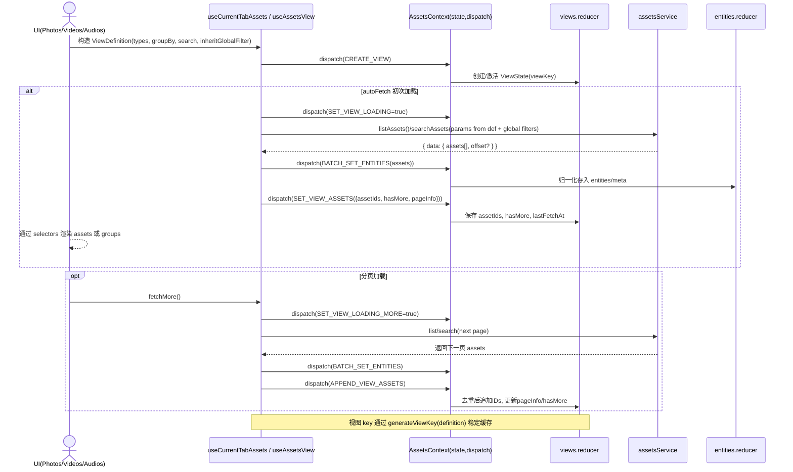
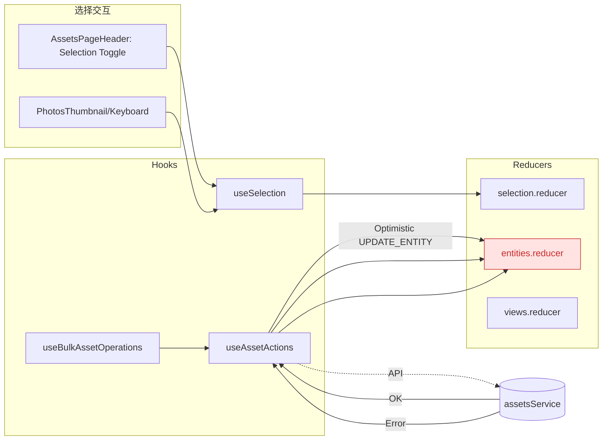
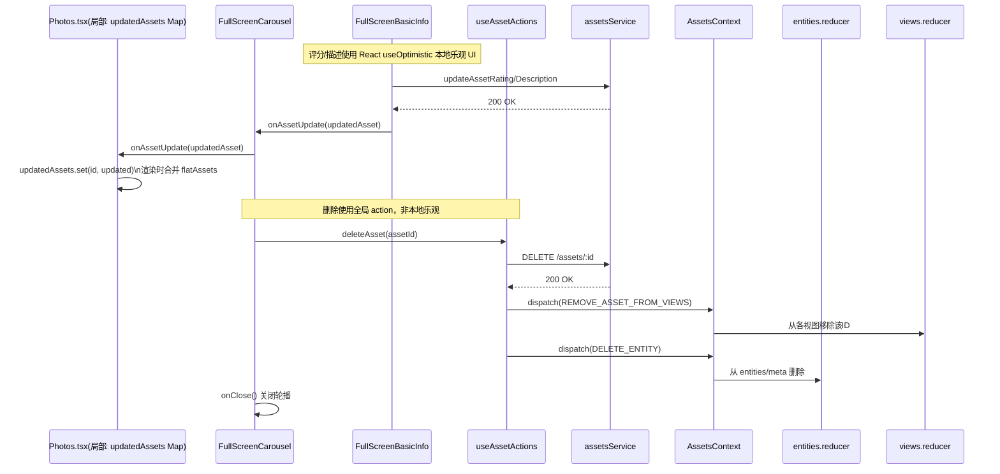

## Asset

### State Management

**(Provider、Router、Service、Routes、Hooks)**
```mermaid
flowchart TB
  subgraph Provider[AssetsProvider (Context + Reducers + Effects)]
    direction TB
    S1[AssetsState\n{entities, views, ui, filters, selection}]
    D1([dispatch])
    E1[[effects:\n- init from URL + settings\n- persist to localStorage(filters, selection)\n- sync URL<->UI\n- sync carousel by route param\n- cleanup stale views]]
    S1 <-.- D1
  end

  subgraph Router[react-router]
    L[location.pathname]
    Q[searchParams (?groupBy, ?q)]
    P[params.assetId]
  end

  subgraph External
    Settings[SettingsContext]
    Storage[(localStorage)]
    API[assetsService\n(list/search/update/delete...)]
    Geo[geoService]
    Workers[WorkerProvider]
  end

  subgraph Routes[Feature Routes]
    A1[Assets.tsx\n<AssetsProvider>…]
    Pht[Photos.tsx]
    Vid[Videos.tsx]
    Aud[Audios.tsx]
    Tabs[AssetTabs]
  end

  subgraph UI[Components + Hooks]
    Hd[AssetsPageHeader\n(GroupBy, SearchBar, FilterTool, SelectionToggle)]
    Masonry[PhotosMasonry -> PhotosThumbnail]
    Carousel[FullScreenCarousel]
    Info[FullScreenBasicInfo]
    hook1[useAssetsContext]
    hook2[useCurrentTabAssets/useAssetsView]
    hook3[useAssetActions]
    hook4[useSelection]
  end

  Settings --> Provider
  Workers --> Routes
  Storage <--> Provider
  Router --> Provider
  Provider --> Routes
  A1 --> Pht & Vid & Aud & Tabs

  Hd --> hook1
  Masonry --> hook1
  Carousel --> hook1
  Info --> hook1
  Hd --> hook2
  Pht --> hook2

  hook2 --> API
  API --> Provider
  hook3 --> API
  Info --> Geo

  %% URL <-> UI sync
  Hd -- change groupBy/search --> D1
  Provider -- write URL --> Router
  Router -- read URL --> Provider

  %% Navigation helpers
  Hd & Masonry & Carousel -- open/close/switch --> Provider

  %% Entities usage
  Provider -. exposes state .-> UI
  UI -. renders assets from selectors .-> Provider
```

**Root Reducer**
```mermaid
classDiagram
  class AssetsState {
    +entities: EntitiesState
    +views: ViewsState
    +ui: UIState
    +filters: FiltersState
    +selection: SelectionState
  }

  class EntitiesState {
    +assets: Record<string, Asset>
    +meta: Record<string, EntityMeta>
  }

  class ViewsState {
    +views: Record<string, ViewState>
    +activeViewKeys: string[]
  }

  class UIState {
    +currentTab: "photos"|"videos"|"audios"
    +groupBy: "date"|"type"|"album"|"flat"
    +searchQuery: string
    +searchMode: "filename"|"semantic"
    +isCarouselOpen: boolean
    +activeAssetId?: string
  }

  class FiltersState {
    +enabled: boolean
    +raw?: boolean
    +rating?: number
    +liked?: boolean
    +filename?: { mode, value }
    +date?: { from, to }
    +camera_make?: string
    +lens?: string
  }

  class SelectionState {
    +enabled: boolean
    +selectedIds: Set<string>
    +lastSelectedId?: string
    +selectionMode: "single"|"multiple"
  }

  class Reducers {
    +assetsReducer()
    +entitiesReducer()
    +viewsReducer()
    +uiReducer()
    +filtersReducer()
    +selectionReducer()
  }

  AssetsState --> EntitiesState
  AssetsState --> ViewsState
  AssetsState --> UIState
  AssetsState --> FiltersState
  AssetsState --> SelectionState

  Reducers ..> EntitiesState
  Reducers ..> ViewsState
  Reducers ..> UIState
  Reducers ..> FiltersState
  Reducers ..> SelectionState
```

**Data Fetch/View Cache**



**URL <-> UI State bijection, Carousel**

```
sequenceDiagram
  actor User
  participant UI as Component(Masonry/Thumbnail/Header)
  participant Nav as useAssetsNavigation(navigate)
  participant Router as react-router
  participant Provider as AssetsProvider(Effects)
  participant UI2 as UI(Carosuel)

  User->>UI: 点击缩略图
  UI->>Nav: openCarousel(assetId)
  Nav->>Router: navigate(/assets/:tab/:assetId?groupBy=&q=)
  Router-->>Provider: params.assetId 变化
  Provider->>Provider: dispatch(SET_CAROUSEL_OPEN,true)\n dispatch(SET_ACTIVE_ASSET_ID, id)
  Provider-->>UI2: context.ui 更新(isCarouselOpen=true, activeAssetId=id)
  UI2-->>User: 渲染 FullScreenCarousel

  User->>UI: 切换 GroupBy/输入 Search
  UI->>Provider: dispatch(SET_GROUP_BY / SET_SEARCH_QUERY)
  Provider->>Router: effect 写回 URL (?groupBy, ?q)\n(默认值则删除参数)
  Router-->>Provider: effect 读取 URL -> HYDRATE_UI_FROM_URL

  User->>UI2: 关闭轮播
  UI2->>Nav: closeCarousel()
  Nav->>Router: navigate(/assets/:tab?groupBy=&q=)
  Router-->>Provider: params.assetId 为空
  Provider->>Provider: dispatch(SET_CAROUSEL_OPEN,false)\n activeAssetId=undefined
```

**Selection and Batch Operations**



**Basic Info Panel**


