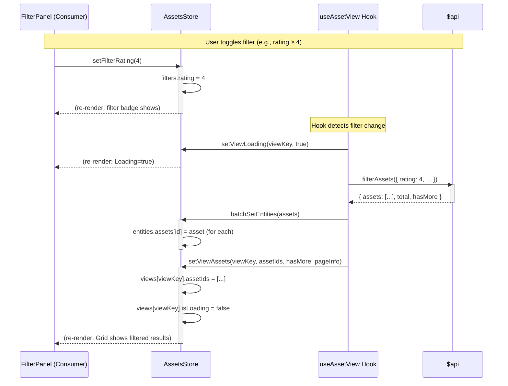

# Async Data Flow Diagrams

## 1. Filter Assets Flow

> User applies filters → fetch matching assets → update views

---

## 2. Search Assets Flow

> Filename or semantic search with debounced input

---

## 3. Infinite Scroll / Load More Flow

> Append new assets when scrolling to bottom

---

## 4. Asset Update Flow (Rating/Like)

> Optimistic update pattern for instant feedback

---

## 5. Selection & Bulk Delete Flow

> Multi-select then bulk operation

---

## Key Patterns Summary

| Pattern | When to Use |
|---------|-------------|
| **Optimistic Update** | Rating, like, quick metadata edits |
| **Loading → Fetch → Update** | Initial load, filter changes, search |
| **Append** | Infinite scroll / pagination |
| **Batch + Cleanup** | Bulk delete, bulk tag operations |
