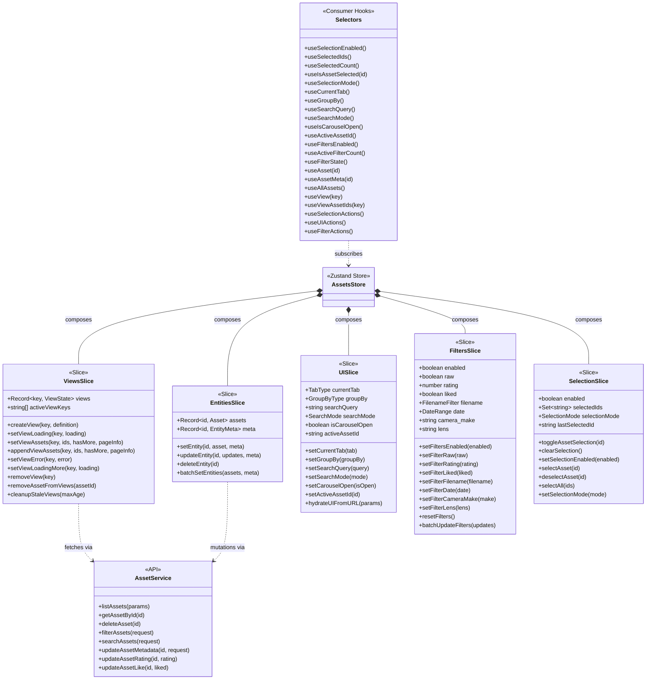

# AssetsStore Anatomy

> Store composition with 5 slices: Entities, Views, UI, Filters, and Selection

## Slice Responsibilities

| Slice | Purpose |
|-------|---------|
| **EntitiesSlice** | Normalized asset data cache (single source of truth for asset objects) |
| **ViewsSlice** | Manages paginated lists of asset IDs for different views/queries |
| **UISlice** | UI state like current tab, search query, carousel visibility |
| **FiltersSlice** | Advanced filter state (rating, date range, camera, lens, etc.) |
| **SelectionSlice** | Multi-select functionality for bulk operations |
