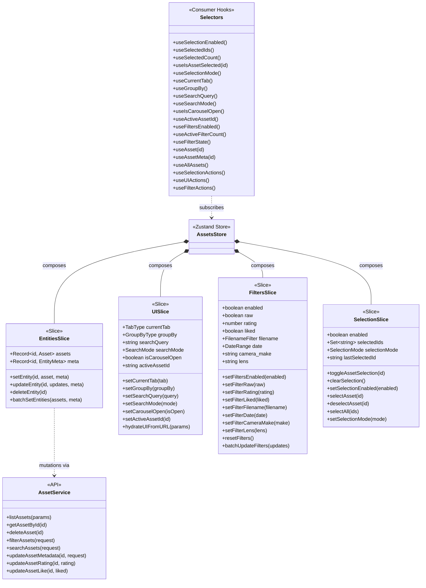

# AssetsStore Anatomy

> Store composition with 4 slices: UI, Filters, Selection, and Entities (Deprecated)

## Slice Responsibilities

| Slice | Purpose |
|-------|---------|
| **EntitiesSlice** | (Deprecated) Normalized asset data cache. Now assets are managed by React Query. |
| **UISlice** | UI state like current tab, search query, carousel visibility |
| **FiltersSlice** | Advanced filter state (rating, date range, camera, lens, etc.) |
| **SelectionSlice** | Multi-select functionality for bulk operations |
