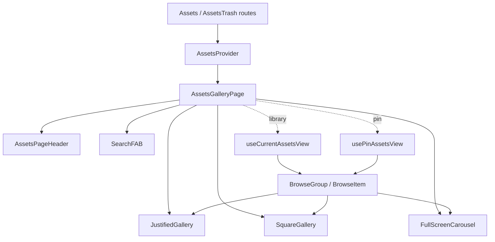

# Assets

The asset feature owns the main library timeline, trash timeline, reusable
gallery shell, carousel inspection, selection, and bulk asset actions.
[Assets](./routes/Assets.tsx) is the ordinary `/assets` route; [AssetsTrash](./routes/AssetsTrash.tsx) scopes the
same gallery to deleted assets; collection/person/agent routes reuse
[AssetsGalleryPage](./components/page/AssetsGalleryPage.tsx) with source-specific filters or a pin source.

## State

[AssetsProvider](./AssetsProvider.tsx) creates one scoped Zustand store with [createAssetsStore](./assets.store.ts).
The store is intentionally UI-only: [createUISlice](./slices/ui.slice.ts) holds sort, search
text and carousel route state; [createFiltersSlice](./slices/filters.slice.ts) holds local filter
controls; [createSelectionSlice](./slices/selection.slice.ts) holds selected [BrowseItem](./types/assets.type.ts) ids.
Fine-grained readers live in `selectors.ts`, while navigation helpers are
exposed through [useAssetsNavigation](./hooks/useAssetsNavigation.ts).

Server state stays in TanStack Query hooks. Durable asset mutations are in
[useAssetActions](./hooks/useAssetActions.tsx), and bulk commands resolve selection through
[useBulkAssetOperations](./hooks/useSelection.tsx); no fetched asset collection is mirrored into
the Zustand store.

## Data

[useCurrentAssetsView](./hooks/useAssetsView.tsx) adapts the scoped store state plus optional
route-level filters into an [AssetViewDefinition](./types/assets.type.ts), then reads
`/api/v1/assets/list` through [useAssetsView](./hooks/useAssetsView.tsx). When search text is
present, [useCurrentAssetsSearchView](./hooks/useAssetsView.tsx) switches to `/api/v1/assets/search`
and returns the same [AssetsViewResult](./types/assets.type.ts) shape.

The rendering contract is [BrowseGroup](./types/assets.type.ts) and [BrowseItem](./types/assets.type.ts), not raw
arrays of assets. [createBrowseGroupsFromBrowseItemDTOs](./utils/browseItems.ts),
[browseGroupsFromQueryLikePage](./utils/browseItems.ts), and [flattenBrowseGroups](./utils/browseItems.ts) keep
ordinary assets and stacks in one flattened browse model so selection,
carousel positioning, and gallery tiles can share behavior.

[usePinAssetsView](./hooks/usePinAssetsView.tsx) is the agent-board adapter. It hydrates
`/api/v1/agent/pins/{id}/assets` into [PinAssetsViewResult](./hooks/usePinAssetsView.tsx), which is
shaped like [AssetsViewResult](./types/assets.type.ts) for rendering, but its source currently
supports only snapshot pagination. It does not consume the ordinary library
sort, filter, or search state.

## Composition

[AssetsGalleryPage](./components/page/AssetsGalleryPage.tsx) is the route orchestrator: it picks the source hook,
contributes visible selection to Lumilio context via
[useGalleryContextContributor](@/features/lumilio/contributors/useGalleryContextContributor.ts), renders the chosen gallery layout, and
keeps URL-backed carousel navigation in sync.
[AssetsPageHeader](./components/shared/AssetsPageHeader.tsx) owns route-level controls; [JustifiedGallery](./components/page/JustifiedGallery/JustifiedGallery.tsx)
and [SquareGallery](./components/page/SquareGallery/SquareGallery.tsx) render the browse model; [FullScreenCarousel](./components/page/FullScreen/FullScreenCarousel/FullScreenCarousel.tsx)
inspects the current flattened asset set; [SearchFAB](./components/page/SearchFAB.tsx) only applies to
sources that support the ordinary library search query.

## Decisions

Browse items are the shared asset-set surface. Source adapters may all return
[AssetsViewResult](./types/assets.type.ts), but controls must remain capability-aware: a library
view can sort, filter, search, and scan repositories; an agent pin/ref view is
a snapshot-hydration source unless the backend contract grows those query
semantics.

Selection stores browse item ids, not raw asset ids. Bulk actions call
[resolveBrowseSelectedAssetIds](./utils/browseItems.ts) so stacks can choose whether an action
affects the visible representative or every member.
