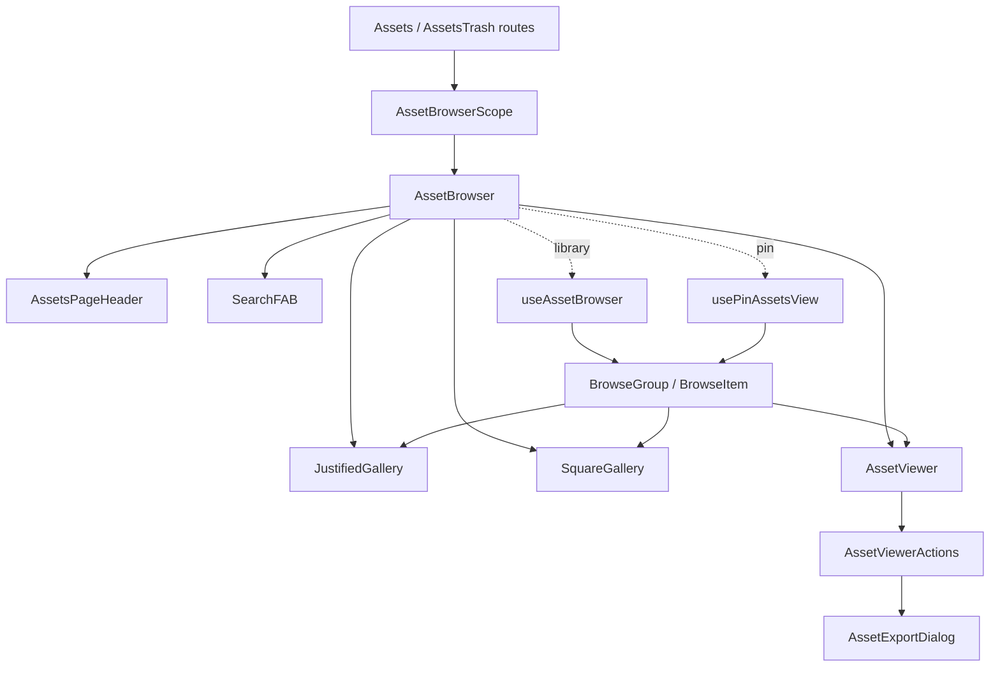

# Assets

The asset feature owns the main library timeline, trash timeline, reusable
browser surface, viewer inspection, selection, and export/bulk asset actions.
[Assets](./routes/Assets.tsx) is the ordinary `/assets` route; [AssetsTrash](./routes/AssetsTrash.tsx) scopes the
same gallery to deleted assets; collection/person/agent routes reuse
[AssetBrowser](./flows/browse/AssetBrowser.tsx) with source-specific constraints or a pin source.

## State

[useAssetBrowseRouteState](./flows/browse/useAssetBrowseRouteState.ts) makes search, sort and applied filters URL-owned.
Page constraints are merged through [mergeAssetFilters](./model/filter.ts) and cannot be
overridden by user parameters. [AssetBrowserScope](./flows/browse/selection/AssetBrowserScope.tsx) creates one scoped
Zustand store with [createAssetSelectionStore](./flows/browse/selection/selection.store.ts); that store only holds
selected [BrowseItem](./types.ts) ids. Navigation helpers are exposed through
[useAssetBrowserNavigation](./flows/browse/selection/AssetBrowserScope.tsx).

Server state stays in TanStack Query hooks. Durable asset mutations are in
[useAssetActions](./api/useAssetActions.ts), and bulk commands resolve selection through
[useBulkAssetActions](./flows/browse/bulk-actions/useBulkAssetActions.ts); no fetched asset collection is mirrored into
the Zustand store.

## Structure

`api/` contains server-state access and DTO adaptation; `model/` contains
React-free filtering, grouping, sorting, and browse-item rules. User journeys
are colocated under `flows/browse`, `flows/viewer`, and `flows/export`, so
workflow-specific components, hooks, state, tests, and styles have one owner.
Root `components/` is reserved for UI reused by multiple flows. Root `state/`
only holds the one-time persisted-state migration; it does not become a
second home for route state or server data.

## Data

[useAssetBrowser](./flows/browse/useAssetBrowser.ts) adapts explicit route state plus a page
constraint into an [AssetViewDefinition](./types.ts), then reads
`/api/v1/assets/list` through [useAssetsList](./api/useAssetsList.ts). When search text is
present, it switches to `/api/v1/assets/search`
and returns the same [AssetsViewResult](./types.ts) shape.

The rendering contract is [BrowseGroup](./types.ts) and [BrowseItem](./types.ts), not raw
arrays of assets. [createBrowseGroupsFromBrowseItemDTOs](./model/browseItems.ts),
[browseGroupsFromQueryLikePage](./model/browseItems.ts), and [flattenBrowseGroups](./model/browseItems.ts) keep
ordinary assets and stacks in one flattened browse model so selection,
carousel positioning, and gallery tiles can share behavior.
Physical files are composed into logical media items before they reach this
browse surface: RAW/JPEG pairs and Live Photo still/video components render
once through their primary asset, while burst/manual presentation stacks
contain those logical items. [useAssetMediaItem](./api/useAssetMediaItem.ts) resolves components
for [MediaViewer](./flows/viewer/media/MediaViewer.tsx); [useStackCarouselAssets](./api/useStackCarouselAssets.ts) resolves one primary
asset per logical stack member, so file counts never inflate burst counts.
In [AssetViewer](./flows/viewer/AssetViewer.tsx), the logical primary remains the Swiper item,
while RAW/JPEG selection is lifted into an active physical component that
drives metadata and asset-level actions without duplicating carousel slides.

[usePinAssetsView](./api/usePinAssetsView.ts) is the agent-board full-gallery adapter. It reads
`/api/v1/agent/pins/{id}/assets/list` and
`/api/v1/agent/pins/{id}/assets/search`, returning the same
[PinAssetsViewResult](./api/usePinAssetsView.ts)/[AssetsViewResult](./types.ts) browse shape as library
views while constraining the backend query to the pin asset set. The older
`GET /api/v1/agent/pins/{id}/assets` hydration endpoint remains a lightweight
snapshot-order API for board previews.

## Composition

[AssetBrowser](./flows/browse/AssetBrowser.tsx) is the route orchestrator: it picks the source hook,
contributes visible selection to Lumilio context via
[useBrowseSelectionContext](./flows/browse/useBrowseSelectionContext.ts), renders the chosen gallery layout, and
keeps URL-backed carousel navigation in sync.
[AssetsPageHeader](./flows/browse/header/AssetsPageHeader.tsx) owns route-level controls; [JustifiedGallery](./flows/browse/gallery/JustifiedGallery/JustifiedGallery.tsx)
and [SquareGallery](./flows/browse/gallery/SquareGallery/SquareGallery.tsx) render the browse model; [AssetViewer](./flows/viewer/AssetViewer.tsx)
inspects the current flattened asset set; [SearchFAB](./flows/browse/SearchFAB.tsx) writes debounced
search text to the URL and the selected source hook decides how to execute it.
[AssetViewer](./flows/viewer/AssetViewer.tsx) owns carousel/media inspection and delegates mutation
dialogs and action state to [AssetViewerActions](./flows/viewer/AssetViewerActions.tsx); export and reprocess
behavior live in the separate export flow through [AssetExportDialog](./flows/export/AssetExportDialog.tsx).
[PhotoPicker](./picker/PhotoPicker.tsx) is the narrow cross-feature picker entry: it creates an
isolated single-selection asset scope while keeping gallery and filter
implementation details inside Assets.
Both galleries use [useGalleryViewportWindow](./flows/browse/gallery/useGalleryViewportWindow.ts): the full layout height
remains stable, while only an overscanned vertical slice mounts thumbnail
components. Leaving that slice removes media nodes instead of retaining every
tile ever visited. Inactive list/search queries have a short bounded GC time.
[AssetPreviewGrid](./flows/browse/AssetPreviewGrid.tsx) is the finite dashboard-preview entry used outside
Assets; it hides browse-group conversion, gallery implementation, and its
isolated selection scope behind one public component.

## Decisions

Browse items are the shared asset-set surface. Source adapters may all return
[AssetsViewResult](./types.ts), but controls must remain capability-aware: library
and pin views can sort, filter, and search through source-scoped backend
queries, while repository scan remains a library maintenance action and is
hidden for pin/ref contexts.

Selection stores browse item ids, not raw asset ids. Bulk actions call
[resolveBrowseSelectedAssetIds](./model/browseItems.ts) so stacks can choose whether an action
affects the visible representative or every member.
