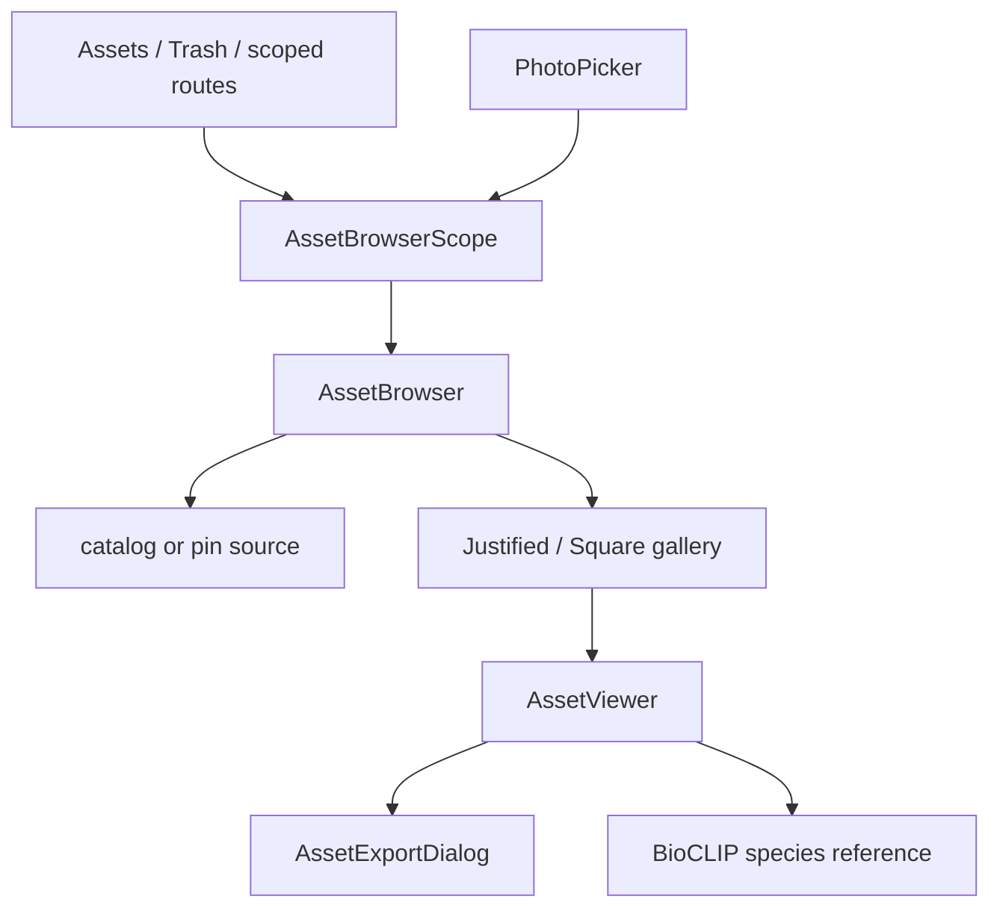

# Assets

Assets owns catalog and Trash browsing, reusable asset-set presentation,
selection, filtering, viewer inspection, and export/bulk asset actions.
Collection, People, Home, Share, Studio, and Lumilio reuse its reviewed
public surfaces instead of implementing another gallery or viewer.

## State

[useAssetBrowseRouteState](./flows/browse/useAssetBrowseRouteState.ts) makes search, sort, and applied filters URL
state (`q` for text, `similar` for a catalog image query). [FilterTool](./flows/browse/filtering/FilterTool.tsx)
keeps an unapplied draft in a local reducer and commits normalized values to
that route state. Page constraints are combined through
[mergeAssetFilters](./model/filter.ts); constrained fields remain locked and cannot be
removed by user controls. A local file query stays in [SearchFAB](./flows/browse/SearchFAB.tsx)
React state and is not URL-addressable.

[AssetBrowserScope](./flows/browse/selection/AssetBrowserScope.tsx) creates one scoped Zustand selection store through
[createAssetSelectionStore](./flows/browse/selection/selection.store.ts). It holds only selected [BrowseItem](./types.ts)
identities and viewer-navigation callbacks. Asset collections, metadata, and
mutation results remain TanStack Query server state. The root `state/`
directory contains only migration from the retired persisted browse state.

## Flows

```mermaid
flowchart TD
    ROUTES["Assets / Trash / scoped routes"] --> SCOPE["AssetBrowserScope"]
    SCOPE --> BROWSER["AssetBrowser"]
    BROWSER --> SOURCE["catalog or pin source"]
    BROWSER --> GALLERY["Justified / Square gallery"]
    GALLERY --> VIEWER["AssetViewer"]
    VIEWER --> EXPORT["AssetExportDialog"]
    VIEWER --> SPECIES["BioCLIP species reference"]
    PICKER["PhotoPicker"] --> SCOPE
```

[Assets](./flows/library/AssetsFlow.tsx) and [AssetsTrash](./flows/trash/AssetsTrashFlow.tsx) are thin route flows over
[AssetBrowser](./flows/browse/AssetBrowser.tsx); album, person, folder, tag, classifier, and pin
surfaces pass a constraint or source instead. [JustifiedGallery](./flows/browse/gallery/JustifiedGallery/JustifiedGallery.tsx) and
[SquareGallery](./flows/browse/gallery/SquareGallery/SquareGallery.tsx) share the same browse model and virtualize the mounted
viewport. [AssetViewer](./flows/viewer/AssetViewer.tsx) keeps the logical primary as the carousel item
while allowing the active RAW/JPEG physical component to drive metadata and
actions. [AssetSimilarRail](./flows/viewer/AssetSimilarRail.tsx) previews visually similar media for the
current asset from the share/export menu; See all opens the main Repository view
with `?similar=`.
[SearchFAB](./flows/browse/SearchFAB.tsx) defaults to text search. Image mode keeps the same-width
slot as a repository [PhotoPicker](./picker/PhotoPicker.tsx) primary button and a circular local-file
control. The text input uses the same height as the FAB close control so the
image-mode toggle does not shift it.

[AssetExportDialog](./flows/export/AssetExportDialog.tsx) owns export and reprocess interaction.
[PhotoPicker](./picker/PhotoPicker.tsx) is the isolated single-selection entry used by other
features, while [AssetPreviewGrid](./flows/browse/AssetPreviewGrid.tsx) is the finite dashboard-preview
entry. Neither exposes gallery implementation details.

## Data

[useAssetBrowser](./flows/browse/useAssetBrowser.ts) reads `/api/v1/assets/list` through
[useAssetsList](./api/useAssetsList.ts) and switches to `/api/v1/assets/search` when search is
active, including `similar_to_asset_id` and
`/api/v1/assets/search/by-image`. Source adapters return
[AssetsViewResult](./types.ts); rendering consumes
[BrowseGroup](./types.ts) and [BrowseItem](./types.ts). The conversion helpers, including
[createBrowseGroupsFromBrowseItemDTOs](./model/browseItems.ts), compose physical files into
logical media items before presentation.

[useAssetMediaItem](./api/useAssetMediaItem.ts) resolves RAW/JPEG and Live Photo components.
[useStackCarouselAssets](./api/useStackCarouselAssets.ts) resolves one logical primary per burst/manual
stack member, and [MediaCompositionBadges](./flows/browse/gallery/media/MediaCompositionBadges.tsx) distinguishes composition
from stacking. BioCLIP output is normalized by
[parseSpeciesPrediction](./flows/viewer/fieldGuide.ts); [SpeciesReferenceTrigger](./flows/viewer/SpeciesReferenceTrigger.tsx) fetches a
localized reference only when opened.

[usePinAssetsView](./api/usePinAssetsView.ts) adapts pin-scoped list/search endpoints to the same
browse contract. Durable mutations live in [useAssetActions](./api/useAssetActions.ts); bulk
commands use [useBulkAssetActions](./flows/browse/bulk-actions/useBulkAssetActions.ts) and
[resolveBrowseSelectedAssetIds](./model/browseItems.ts) so stacks can deliberately target the
representative or all members. The root `index.ts`, `map/index.ts`, and
`picker/index.ts` are the only cross-feature runtime entries.
