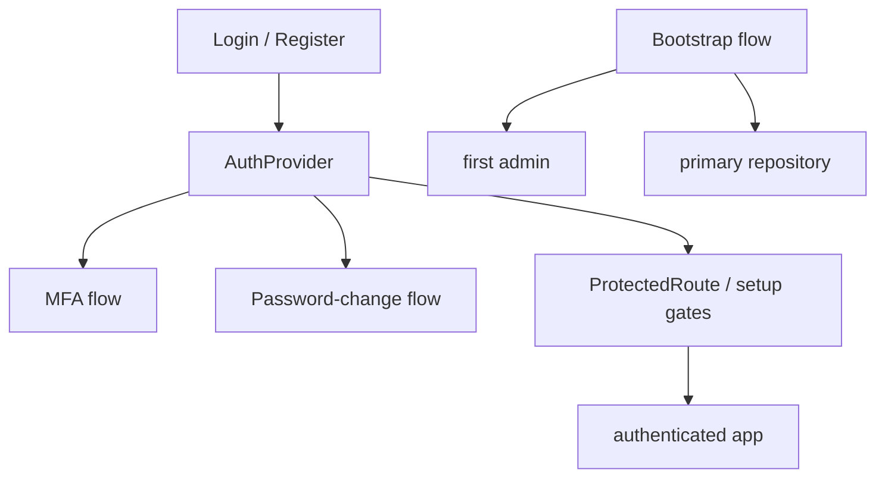

# Authentication

Authentication owns the verified browser session, public sign-in and
registration flows, MFA and password challenges, first-run bootstrap, and
application access gates. Profile editing and ordinary user administration
remain in Users and Settings.

## State

[AuthProvider](./state/AuthProvider.tsx) owns the session reducer and the verified user. Browser
JavaScript stores only the short-lived access token and session-bound CSRF
proof; the refresh credential remains a host-only `HttpOnly` cookie.
[refreshBrowserSession](../../lib/http-commons/client.ts) rotates the cookie and access token under a
cross-tab Web Lock, and [logoutBrowserSession](../../lib/http-commons/client.ts) uses the same lock.

Password-change and MFA challenges are one-use, session-scoped values; they
are not written to URL history or browser persistence. Every session exit
converges on [resetSession](./state/resetSession.ts), which removes credentials, resets feature
and global runtime state, clears user-scoped preferences, cancels Query work,
and clears the Query cache before another user can authenticate.

## Flows

[useLoginFlow](./flows/sign-in/useLoginFlow.ts) coordinates identifier-first login, passkey selection,
password fallback, MFA challenge, and redirect recovery.
[useRegistrationFlow](./flows/registration/useRegistrationFlow.ts) handles registration plus optional TOTP,
passkey, and recovery-code onboarding. [useMFAFlow](./flows/mfa/useMFAFlow.ts) owns authenticated
MFA management, with its `mfa` and `action` URL parameters authoritative.
[useBootstrapFlow](./flows/bootstrap/useBootstrapFlow.ts) composes first-admin registration with repository
creation without copying either domain's server state.

[ProtectedRoute](./modules/access/ProtectedRoute.tsx), [BootstrapGate](./modules/access/BootstrapGate.tsx), and
[PrimaryRepositoryGate](./modules/access/PrimaryRepositoryGate.tsx) are composition capabilities, not page
implementations. Route files only re-export their owning flows.

## Data

[authMiddleware](../../lib/http-commons/client.ts) attaches the access token and CSRF proof, then retries
one failed request from a clone captured before body consumption.
[registerSessionExpiredHandler](../../lib/http-commons/sessionEvents.ts) reports transport refresh exhaustion
back to React without coupling the HTTP client to routing.
Auth and bootstrap flows preserve generated Problem objects until their
presentation boundary calls [localizeAPIProblem](../../lib/http-commons/problem.ts) with the current
language and an operation-specific fallback. Session recovery branches on
HTTP status or exact Problem type, never on localized or server-authored copy.

Reusable auth queries and mutations live in `api/`; browser WebAuthn
conversion stays in [getPasskeySupport](./modules/webauthn/webauthn.ts), and deterministic account
policy stays in the React-free model through
[normalizeUsernameInput](./model/credentialPolicy.ts). [useBrowserCapabilities](./api/useBrowserCapabilities.ts) reads the
server-resolved origin/security contract used by public flows and
[BrowserSecurityNotice](./components/BrowserSecurityNotice.tsx). The root `index.ts` is the only runtime
cross-feature entry.
