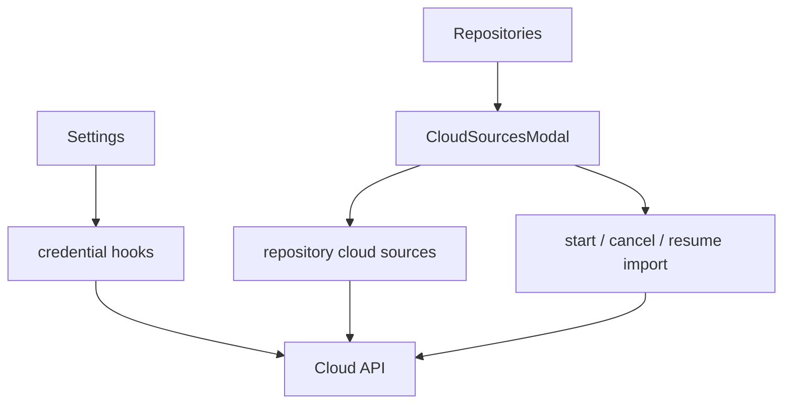

# Cloud

Cloud is an API capability shared by Settings, Repositories, and Manage. It
owns provider descriptors, authenticated cloud credentials, repository
bindings, explicit import runs, and the repository source-management flow.

## State

Cloud facts remain TanStack Query server state. The feature has no Context,
Zustand store, URL state, or browser persistence. Credential mutations
invalidate the credential list, and repository import status polls only
while its latest run is queued or running.

## Flows

Settings composes provider and credential setup. After repository creation,
[CloudSourcesModal](./flows/repository-sources/CloudSourcesModal.tsx) binds one or more connected accounts (including a
provider-specific remote scope), renders their durable receipts, and starts,
cancels, or resumes repository-scoped imports.

## Data

[useCloudProviders](./api/useCloudCredentials.ts) and [useCloudCredentials](./api/useCloudCredentials.ts) read server
metadata and connected accounts. Credential creation, challenge,
reconnect, disconnect, and removal live beside those queries.
[useRepositoryCloudStatus](./api/useRepositoryCloud.ts) reads every visible binding and latest run.
[useBindRepositoryCloudSource](./api/useRepositoryCloud.ts), [useStartRepositoryCloudImport](./api/useRepositoryCloud.ts),
[useCancelCloudImport](./api/useRepositoryCloud.ts), and [useResumeCloudImport](./api/useRepositoryCloud.ts) mutate that
server-owned state and invalidate repository-facing status.

Generated OpenAPI aliases live in `types.ts` because both API modules and
consumers share them. [createProviderTextResolver](./model/providerText.ts) maps backend i18n
keys to extractor-visible defaults while allowing future provider keys to
degrade to their raw value. The root `index.ts` is the feature's complete
public contract.
