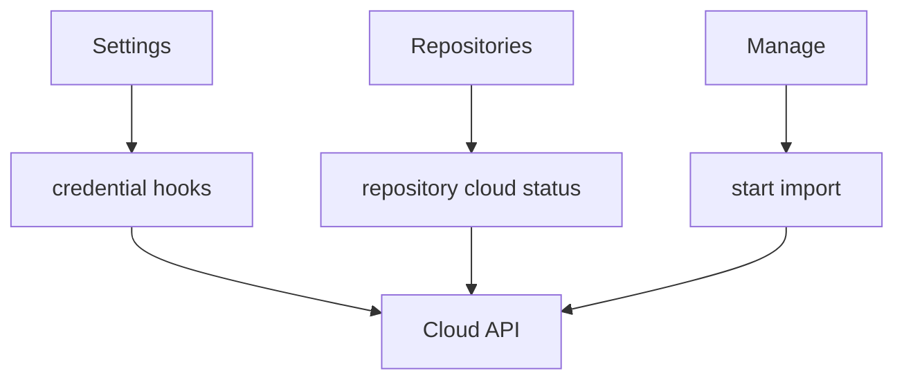

# Cloud

Cloud is an API capability shared by Settings, Repositories, and Manage. It
owns provider descriptors, authenticated cloud credentials, repository
bindings, and explicit import runs; it has no route or feature-owned UI.

## State

Cloud facts remain TanStack Query server state. The feature has no Context,
Zustand store, URL state, or browser persistence. Credential mutations
invalidate the credential list, and repository import status polls only
while its latest run is queued or running.

## Flows

Settings composes provider and credential setup. Repositories uses cloud
credentials when creating a cloud-backed repository and renders binding
status on repository cards. Manage starts repository-scoped imports. These
consumers use the root public entry; Cloud does not import their UI.

## Data

[useCloudProviders](./api/useCloudCredentials.ts) and [useCloudCredentials](./api/useCloudCredentials.ts) read server
metadata and connected accounts. Credential creation, challenge,
reconnect, disconnect, and removal live beside those queries.
[useRepositoryCloudStatus](./api/useRepositoryCloud.ts) reads one binding and latest import run;
[useStartRepositoryCloudImport](./api/useRepositoryCloud.ts) queues a new run and invalidates
repository-facing status.

Generated OpenAPI aliases live in `types.ts` because both API modules and
consumers share them. [createProviderTextResolver](./model/providerText.ts) maps backend i18n
keys to extractor-visible defaults while allowing future provider keys to
degrade to their raw value. The root `index.ts` is the feature's complete
public contract.
