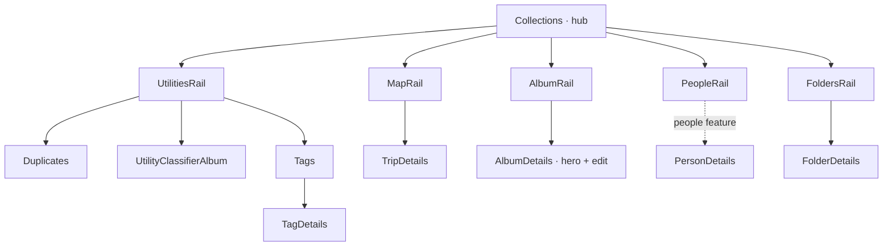

# Collections

The hub for every way of *grouping* assets that isn't the raw library
timeline: albums, places/trips, people, folders, tags, and utility views
(classifier albums, duplicates). [Collections](./flows/hub/CollectionsFlow.tsx) is the landing page —
rails that each preview a full route. Person *detail* lives in the
`people` feature; collections only owns the people rail/grid entry into it.
Folders sit alongside albums/places/people as their own hub rail — a
browsing concept, not a maintenance tool. Tags are reached through
[useUtilityShortcuts](./flows/utilities/useUtilityShortcuts.ts) alongside Duplicates and Trash, since it's a
browse-only utility-style view, not its own hub rail.

## State

[AlbumsProvider](./flows/albums/state/AlbumsProvider.tsx) (read via [useAlbumsState](./flows/albums/state/AlbumsProvider.tsx)) holds only the
feature's transient UI state — album multi-select and which edit/create modal
is open — reduced by [albumsReducer](./flows/albums/state/reducer.ts) as [AlbumsAction](./flows/albums/state/types.ts)
over [AlbumsState](./flows/albums/state/types.ts). Everything durable is server state in TanStack
Query; nothing fetched is mirrored here.

## Data

Each rail has a distinct backend story, and the differences are the point:

- **Albums** — a real backend entity. [useAlbums](./api/useAlbums.ts) paginates
  `/api/v1/albums`; [mapAlbumToUI](./api/useAlbums.ts) shapes each DTO for the grid.
- **Duplicates** — a backend-computed graph. [useDuplicateSummary](./api/useDuplicates.ts),
  [useDuplicateGroupList](./api/useDuplicates.ts) and [useDetectDuplicates](./api/useDuplicates.ts) wrap
  `/api/v1/duplicates/*`.
- **Utility classifier albums** — not entities at all: [UTILITY_CLASSIFIERS](./model/utilityClassifiers.ts)
  is a static client table of saved tag-source queries (documents, receipts,
  illustration) rendered as virtual albums over the asset list. **Liked**
  ([Liked](./flows/utilities/LikedFlow.tsx)) is the same shape over `{ liked: true }` — no favorites
  table, just the existing `assets.liked` column filtered through the
  normal list/search endpoints.
- **Places / trips** — fully derived client-side. [useCityTrips](./flows/places/useCityTrips.ts) segments
  map points by geohashed city + time gaps into trips. It explicitly drains
  both map-point and location-cluster pagination before claiming a complete
  result; there is **no backend
  trip entity**, so a trip is identity-less and editing it is meaningless.
- **Folders** — derived from `assets.storage_path` prefixes; there is no
  folders table. [useFolders](./api/useFolders.ts) lists immediate child folders (recursive
  counts/covers) and [useFolderSummary](./api/useFolders.ts) aggregates one folder path, both
  backed by new `/api/v1/assets/folders*` endpoints. Route identity is a
  `{ repositoryId, folderPath }` pair packed by [encodeFolderKey](./model/folderKey.ts) /
  [decodeFolderKey](./model/folderKey.ts) into an opaque `:folderKey` segment, since a raw
  path can contain slashes. Both queries exclude the app-managed
  `.lumilio/` and `inbox/` prefixes, so the rail only ever shows folders a
  human placed or scanned into the repository.
- **Tags** — a real vocabulary, but grouped by `(tag_id, source)` because the
  same tag name can carry both manual and AI/system assignments across
  different assets. [useTagSummaries](./api/useTagSummaries.ts) wraps the new
  `/api/v1/assets/tag-summaries` endpoint (counts/covers), distinct from the
  autocomplete-only `/api/v1/assets/tags` used by `@`-mentions. Route
  identity uses [encodeTagKey](./model/tagKey.ts) / [decodeTagKey](./model/tagKey.ts) over
  `{ tagName, source }`, matching the `tag_name` + `tag_source` filter pair
  `AssetFilterDTO` already supports.
- **Liked** — the utility rail ([useUtilityShortcuts](./flows/utilities/useUtilityShortcuts.ts)) also includes
  Liked alongside Duplicates and Trash. [Liked](./flows/utilities/LikedFlow.tsx) scopes
  [AssetBrowser](@/features/assets) to `{ liked: true }` and hides the default
  `set-liked` bulk menu in favor of a single scoped "remove from Liked"
  action, since setting liked=true is meaningless on a page already
  filtered to liked assets.

## Composition

[Folders](./flows/folders/FoldersFlow.tsx) and [Tags](./flows/tags/TagsFlow.tsx) are the list pages that route into
[FolderDetails](./flows/folders/FolderDetailsFlow.tsx) and [TagDetails](./flows/tags/TagDetailsFlow.tsx).

[AlbumDetails](./flows/albums/AlbumDetailsFlow.tsx), [TripDetails](./flows/places/TripDetailsFlow.tsx), [UtilityClassifierAlbum](./flows/utilities/UtilityClassifierFlow.tsx),
[FolderDetails](./flows/folders/FolderDetailsFlow.tsx) and [TagDetails](./flows/tags/TagDetailsFlow.tsx) all render through the shared
[AssetBrowser](@/features/assets) orchestrator, differing only by injection points:
album scopes by `{ album_id }`, trip by `{ location(bbox), date }`, classifier
and tag detail by `{ tag_name, tag_source }`, folder detail by
`{ repository_id, folder_path, folder_recursive }`. Album detail carries an
*editable* hero — [CollectionHero](@/components/collection) composed with [AlbumFormModal](./flows/albums/components/AlbumFormModal.tsx);
trips, classifier albums, and tag detail pass no `hero` and expose no edit,
because they have no entity to mutate. [FolderDetails](./flows/folders/FolderDetailsFlow.tsx) passes a `hero`
with breadcrumb/child-folder drilldown chips, not an edit surface — folders
still aren't a mutable entity. [Duplicates](./flows/utilities/DuplicatesFlow.tsx) is the one review-style
page, not an asset grid.

## Decisions

Editing is modal-only — [AlbumFormModal](./flows/albums/components/AlbumFormModal.tsx) both creates and edits albums
over a shared modal shell, with no inline editing. Trips, classifier albums,
folders, and tags expose no edit affordance by design: they have no entity to
mutate (or, for tags, mutation is out of scope for v1 per the exec plan).
