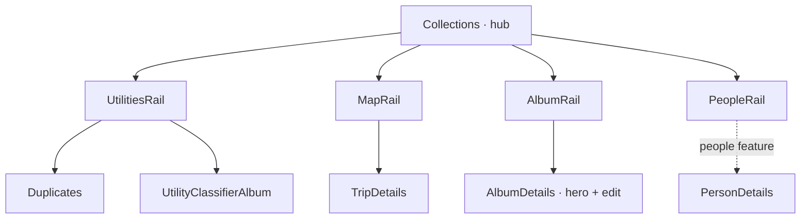

# Collections

The hub for every way of *grouping* assets that isn't the raw library
timeline: albums, places/trips, people, and utility views (classifier albums,
duplicates). [Collections](./routes/Collections.tsx) is the landing page — four rails, each a
preview that links to its own full route. Person *detail* lives in the
`people` feature; collections only owns the people rail/grid entry into it.

## State

[CollectionsProvider](./CollectionsProvider.tsx) (read via [useCollections](./CollectionsProvider.tsx)) holds only the
feature's transient UI state — album multi-select and which edit/create modal
is open — reduced by [collectionsReducer](./collections.reducer.ts) as [CollectionsAction](./collections.type.ts)
over [CollectionsState](./collections.type.ts). Everything durable is server state in TanStack
Query; nothing fetched is mirrored here.

## Data

Each rail has a distinct backend story, and the differences are the point:

- **Albums** — a real backend entity. [useAlbums](./hooks/useAlbums.ts) paginates
  `/api/v1/albums`; [mapAlbumToUI](./hooks/useAlbums.ts) shapes each DTO for the grid.
- **Duplicates** — a backend-computed graph. [useDuplicateSummary](./hooks/useDuplicates.ts),
  [useDuplicateGroupList](./hooks/useDuplicates.ts) and [useDetectDuplicates](./hooks/useDuplicates.ts) wrap
  `/api/v1/duplicates/*`.
- **Utility classifier albums** — not entities at all: [UTILITY_CLASSIFIERS](./utils/utilityClassifiers.ts)
  is a static client table of saved tag-source queries (documents, receipts,
  illustration) rendered as virtual albums over the asset list.
- **Places / trips** — fully derived client-side. [useCityTrips](./hooks/useCityTrips.ts) segments
  map points by geohashed city + time gaps into trips; there is **no backend
  trip entity**, so a trip is identity-less and editing it is meaningless.

## Composition

[AlbumDetails](./routes/AlbumDetails.tsx) and [UtilityClassifierAlbum](./routes/UtilityClassifierAlbum.tsx) render through the
shared [AssetsGalleryPage](@/features/assets/components/page/AssetsGalleryPage.tsx) orchestrator. [TripDetails](./routes/TripDetails.tsx) still
hand-rolls the same layers (its own provider + header + gallery), reusing only
the [CollectionTitle](@/components/collection) / [MetaStatRow](@/components/collection) pieces — folding it into the
orchestrator is still pending. Album detail carries an *editable* hero (title
+ edit modal); trips and classifier albums show a title/stat header but no
edit, because they have no entity to mutate. [Duplicates](./routes/Duplicates.tsx) is the one
review-style page, not an asset grid.

## Decisions

Editing is modal-only — [AlbumFormModal](./components/AlbumFormModal.tsx) both creates and edits albums
over a shared modal shell, with no inline editing. Trips and classifier albums
expose no edit affordance by design: they have no entity to mutate.
