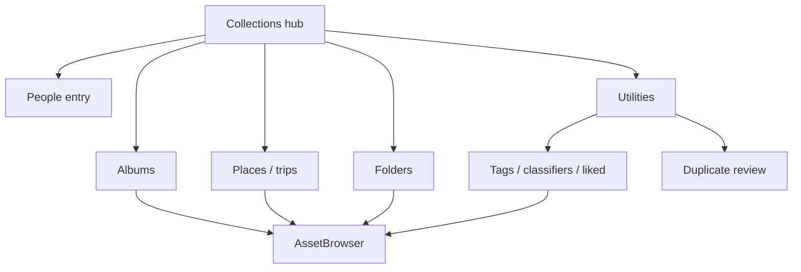

# Collections

Collections owns grouped ways of browsing the catalog: albums, places and
derived trips, people entry surfaces, folders, tags, Liked, duplicate review,
shared-link navigation, and classifier views. Person identity correction
remains in People; asset presentation remains in Assets.

## State

Durable albums, folders, tag summaries, duplicate groups, and asset results
are TanStack Query server state. [AlbumsProvider](./flows/albums/state/AlbumsProvider.tsx) keeps only the album
flow's transient selection and modal interaction, reduced by
[albumsReducer](./flows/albums/state/reducer.ts). Repository scope comes from Repositories; scoped
gallery search, filters, sort, and viewer identity remain URL state owned by
Assets.

Trips and utility classifiers are derived views, not client-persisted
entities. Folder and tag route identities use
[encodeFolderKey](./model/folderKey.ts)/[decodeFolderKey](./model/folderKey.ts) and
[encodeTagKey](./model/tagKey.ts)/[decodeTagKey](./model/tagKey.ts) so paths and composite identities
survive navigation without a second store.

## Flows

```mermaid
flowchart TD
    HUB["Collections hub"] --> ALBUMS["Albums"]
    HUB --> PLACES["Places / trips"]
    HUB --> PEOPLE["People entry"]
    HUB --> FOLDERS["Folders"]
    HUB --> UTILITIES["Utilities"]
    UTILITIES --> TAGS["Tags / classifiers / liked"]
    UTILITIES --> DUPLICATES["Duplicate review"]
    ALBUMS --> BROWSER["AssetBrowser"]
    PLACES --> BROWSER
    FOLDERS --> BROWSER
    TAGS --> BROWSER
```

[Collections](./flows/hub/CollectionsFlow.tsx) renders preview rails driven by the same
[useUtilityShortcuts](./flows/utilities/useUtilityShortcuts.ts) list used on the Utilities page.
[AlbumDetails](./flows/albums/AlbumDetailsFlow.tsx), [TripDetails](./flows/places/TripDetailsFlow.tsx), [FolderDetails](./flows/folders/FolderDetailsFlow.tsx),
[TagDetails](./flows/tags/TagDetailsFlow.tsx), and [UtilityClassifierAlbum](./flows/utilities/UtilityClassifierFlow.tsx) all compose
[AssetBrowser](../assets/index.ts) with different constraints. Only album detail has an
editable entity hero; folders provide navigation, and trips/tags/classifiers
expose no entity editor. [Duplicates](./flows/utilities/DuplicatesFlow.tsx) is a review workflow rather than
an asset grid.

## Data

[useAlbums](./api/useAlbums.ts) paginates real album entities.
[useDuplicateSummary](./api/useDuplicates.ts), [useDuplicateGroupList](./api/useDuplicates.ts), and
[useDetectDuplicates](./api/useDuplicates.ts) wrap the duplicate graph and its maintenance
command. [useFolders](./api/useFolders.ts)/[useFolderSummary](./api/useFolders.ts) derive folder summaries
from repository storage paths, and [useTagSummaries](./api/useTagSummaries.ts) groups tag usage
by name and source.

[useCityTrips](./flows/places/useCityTrips.ts) derives trips from complete map-point and
location-cluster pagination; there is no backend trip entity.
[UTILITY_CLASSIFIERS](./model/utilityClassifiers.ts) defines saved classifier constraints, while
Liked is the ordinary asset browse contract constrained by `liked: true`.
Biological album detail can enqueue an album-scoped BioCLIP rebuild and
invalidates indexing coverage after acceptance. Only
[useDetectDuplicates](./api/useDuplicates.ts) is exported from the root public entry because
Manage is its sole cross-feature consumer.
