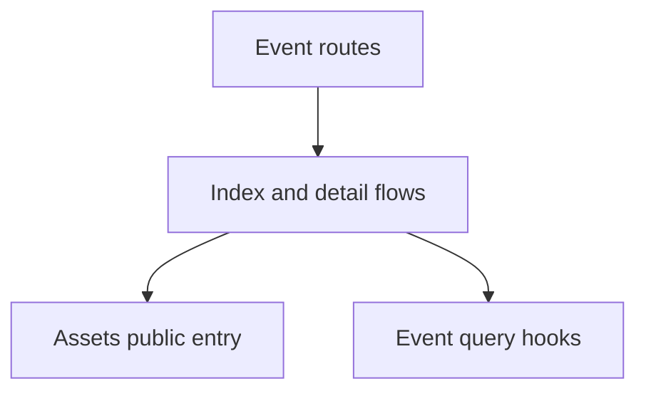

# Events

Events owns deterministic, user-correctable media organization.

## State

Server Event state remains in TanStack Query through [useEvents](./api/useEvents.ts) and
[useEvent](./api/useEvents.ts). [useEventRebuildStatus](./api/useEvents.ts) polls the owner-wide rebuild
lifecycle only while a source revision is pending. Gallery selection remains
owned by the Assets scope. List and detail apply Repository Browse Scope as
a read projection; counts, cover, and gallery come from that same resolved
set.

## Flows

[EventsIndexFlow](./flows/index/EventsIndexFlow.tsx) presents stable Event summaries and cursor paging.
[EventDetailFlow](./flows/detail/EventDetailFlow.tsx) composes the public Assets browser with an
owner-scoped `event_id` constraint. [EventHero](./flows/detail/components/EventHero.tsx) owns the collection
presentation and entry points into focused edit, share, and add-media
dialogs. [EventEditModal](./flows/detail/components/EventEditModal.tsx) keeps metadata and merge correction together,
using [EventPicker](./flows/detail/components/EventPicker.tsx) instead of exposing internal Event IDs.
[EventPicker](./flows/detail/components/EventPicker.tsx) searches on the server rather than filtering the first
loaded page. [useEventBulkActions](./flows/detail/useEventBulkActions.tsx) owns selection-derived cover, split,
move, remove, and snapshot-share workflows outside the route component.

## Data

[EventSummary](./model/event.ts) is generated from OpenAPI and carries canonical and
projected counts from the shared Event resolver. Event titles are live,
localized presentation fallbacks rather than persisted prose.
