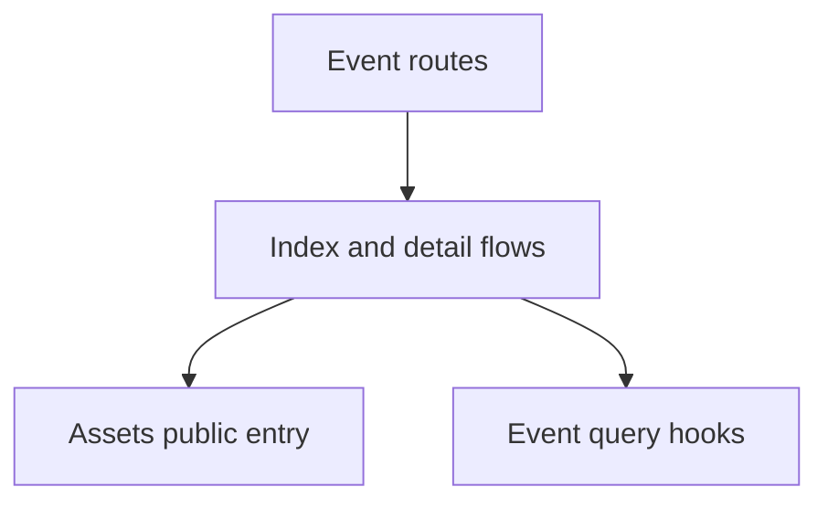

# Events

Events owns deterministic, user-correctable media organization.

## State

Server Event state remains in TanStack Query through [useEvents](./api/useEvents.ts) and
[useEvent](./api/useEvents.ts). Gallery selection remains owned by the Assets scope.

## Flows

[EventsIndexFlow](./flows/index/EventsIndexFlow.tsx) presents stable Event summaries and cursor paging.
[EventDetailFlow](./flows/detail/EventDetailFlow.tsx) composes the public Assets browser with an
owner-scoped `event_id` constraint.

## Data

[EventSummary](./model/event.ts) is generated from OpenAPI. Event titles are live,
localized presentation fallbacks rather than persisted prose.
