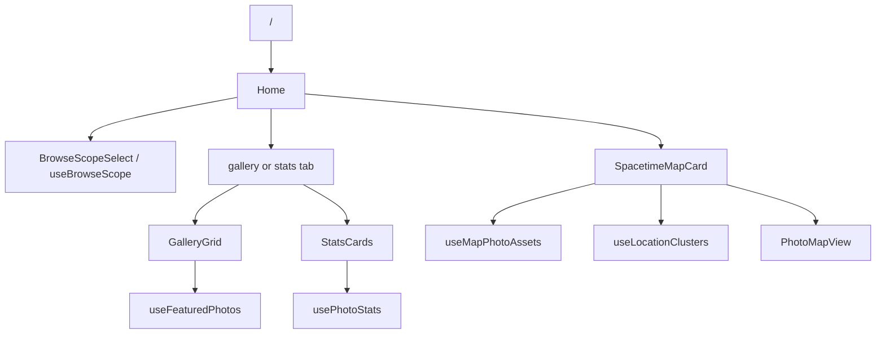

# Home

The Home feature owns the authenticated `/` landing dashboard. It is a
read-oriented composition page for featured photos, library statistics, and
the spacetime map. It does not own asset browsing, upload targets, collection
membership, or settings persistence; it consumes shared hooks and routes the
user to the feature that owns the selected object.

## State

[Home](./routes/Home.tsx) stores only view state from the URL. The default `gallery` view
omits the `tab` query parameter; the statistics view is addressed as
`?tab=stats`. The page header includes [BrowseScopeSelect](@/components/BrowseScopeSelect), and the
selected browse scope is read through [useBrowseScope](@/features/settings).

Browse scope is the only repository preference Home observes. When the user
chooses a repository, the scoped id is passed to featured-photo, statistics,
map-point, and location-cluster hooks. Home does not use the working
repository because it never creates new assets.

[StatsCards](./components/StatsCards.tsx) owns only local presentation state for its selected
heatmap year. Changing repository scope resets the selected year so the
default can be recalculated from the scoped available-years response.

## Data

[useFeaturedPhotos](./hooks/useFeaturedPhotos.ts) reads `/api/v1/assets/featured` with a small count
and a larger candidate window. [GalleryGrid](./components/GalleryGrid.tsx) renders those assets
through the shared square gallery grouping helpers and uses skeleton cards
when no featured assets have loaded.

[usePhotoStats](./hooks/usePhotoStats.ts) coordinates focal-length, camera/lens, time-of-day,
available-years, and daily-activity as independent TanStack Query entries.
[StatsCards](./components/StatsCards.tsx) owns only the selected heatmap year and transforms cached
responses into percentages and heatmap values.

[useMapPhotoAssets](./hooks/useMapPhotoAssets.ts) reads paginated map points from
`/api/v1/assets/map-points`. Home enables its bounded preview only when the
map card nears the viewport; the full Map route sends the visible bounding
box and replaces its query as the viewport changes. [useLocationClusters](./hooks/useLocationClusters.ts) reads paginated
location clusters for the map badge. [SpacetimeMapCard](./components/SpacetimeMapCard.tsx) delegates map
rendering to [PhotoMapView](@/components/PhotoMapView); clicking a point navigates to the owning
asset route instead of opening an editor inside Home.

## Composition

Home composes already-owned surfaces: gallery rendering comes from Assets,
repository scope comes from Settings, heatmap rendering comes from shared
components, and map presentation comes from the shared map component.

## Decisions

Home is overview-first. It favors compact summaries and deep links over
editing controls, because the authoritative asset and collection workflows
live elsewhere.

Repository scope is browse scope. "All repositories" is a valid Home scope;
upload's concrete working repository is intentionally not used here.

Map previews are deliberately bounded. Trips opt into exhaustive map and
cluster pagination because their derived grouping requires the full scoped
dataset; ordinary map rendering never drains the entire GPS library.
