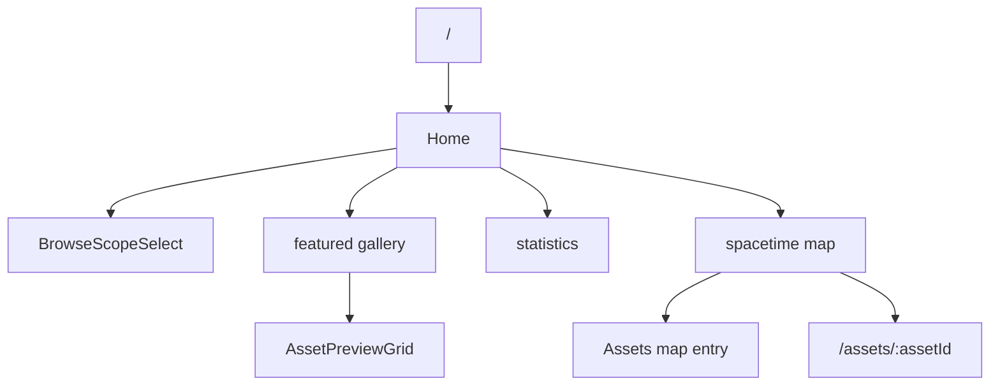

# Home

Home owns the authenticated `/` dashboard: featured media, catalog
statistics, and a bounded spacetime-map preview. It is a read-oriented
composition surface; editing, asset browsing, collection membership, upload
destinations, and preference persistence remain with their owning features.

## State

[Home](./flows/overview/HomeFlow.tsx) keeps its `gallery`/`stats` mode in the `tab` URL parameter; the
default gallery mode omits the parameter. Repository selection comes from
[useBrowseScope](../repositories/index.ts), so "all repositories" remains a valid scope. Home
never reads the working repository because it creates no media.

[StatsCards](./flows/overview/StatsCards.tsx) keeps only its selected heatmap year locally and resets it
when repository scope changes. Featured assets, statistics, map points, and
location clusters are independent TanStack Query server facts.

## Flows

```mermaid
flowchart TD
    ROUTE["/"] --> HOME["Home"]
    HOME --> SCOPE["BrowseScopeSelect"]
    HOME --> GALLERY["featured gallery"]
    HOME --> STATS["statistics"]
    HOME --> MAP["spacetime map"]
    GALLERY --> ASSETS["AssetPreviewGrid"]
    MAP --> MAPENTRY["Assets map entry"]
    MAP --> ROUTEASSET["/assets/:assetId"]
```

[GalleryGrid](./flows/overview/GalleryGrid.tsx) delegates finite asset presentation to Assets.
[SpacetimeMapCard](./flows/overview/SpacetimeMapCard.tsx) is lazy-loaded only when its card nears the viewport
and delegates map rendering to [PhotoMapView](./flows/overview/PhotoMapView.tsx). Selecting a map point
navigates to the owning asset route rather than opening an editor in Home.

## Data

[useFeaturedPhotos](./api/useFeaturedPhotos.ts) reads `/api/v1/assets/featured` with a small result
count and larger candidate window. [usePhotoStats](./api/usePhotoStats.ts) coordinates
focal-length, camera/lens, time-distribution, available-year, and daily
activity queries without merging them into client state.

[useMapPhotoAssets](../assets/map/useMapPhotoAssets.ts) requests a bounded map-point preview after the map
becomes visible. [useLocationClusters](../assets/map/useLocationClusters.ts) supplies the place count. Home
deliberately does not drain either paginated source.
