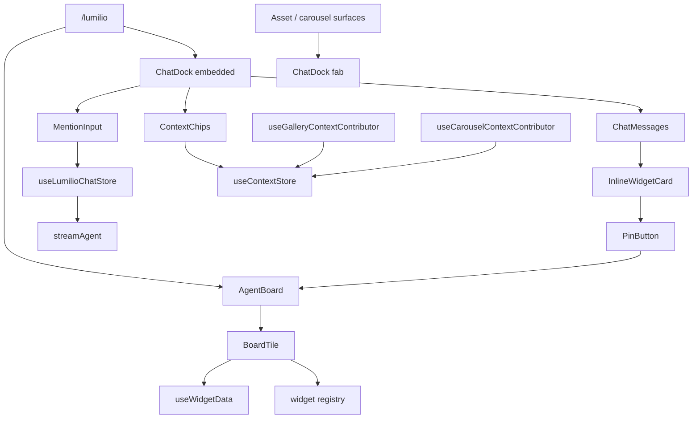

# Lumilio

The Lumilio feature owns the authenticated agent experience: the `/lumilio`
board route, the reusable chat dock, streamed assistant blocks, contextual
asset handoff, `@` mentions, `/` modes, and durable board pins. It is not the
base media workflow; assets, collections, people, and settings stay in their
own features and Lumilio consumes them through explicit context or mentions.

## State

Feature-local interactive state lives in three Zustand stores:

- [useLumilioChatStore](./state/chatStore.ts) owns the thread id, streamed message blocks,
  generation/error state, confirmation interrupts, token usage, and the
  send/resume/new-conversation commands. Its session reset aborts the active
  SSE request before clearing the conversation.
- [useContextStore](./state/contextStore.ts) is the cross-surface context bus. Contributors
  register current asset selections or carousel viewing context, and
  [ContextChips](./components/Chat/ContextChips.tsx) lets the user exclude a contribution before send.
- [useDockStore](./state/dockStore.ts) owns only the user's chat collapse override; route
  defaults still decide whether an untouched dock starts expanded or collapsed.

Server state stays in TanStack Query: pins, ref hydration, widget metadata,
widget assets, mention source lists, and capabilities are fetched at the
component/hook edges instead of being mirrored into those stores.

## Data

[streamAgent](./api/agentStream.ts) opens authenticated SSE streams to `/api/v1/agent/chat`
and `/api/v1/agent/chat/resume`. The stream emits typed chat blocks:
[TextBlock](./types.ts), [ReasoningBlock](./types.ts), [ToolBlock](./types.ts),
[WidgetBlock](./types.ts), and [ConfirmBlock](./types.ts). Tool status, widgets, and
token usage arrive through [SideChannelEvent](./types.ts); an interrupt becomes a
confirmation card and resumes through the same store.

The stream side channel passes handles, not full asset payloads:
[RefPayload](./types.ts) carries a ref id, count, widget hint, and params. Inline
widgets hydrate that handle through [InlineWidgetCard](./widgets/chrome/InlineWidgetCard.tsx); durable pins
copy the snapshot server-side through [PinButton](./widgets/PinButton.tsx) and are later read by
[AgentBoard](./components/Board/AgentBoard.tsx). [useWidgetData](./widgets/useWidgetData.ts) normalizes ref/pin metadata into
[WidgetData](./widgets/types.ts), while thumbnail-heavy views fetch assets separately.

Mentions are explicit, typed constraints. [MentionInput](./components/Chat/MentionInput.tsx) uses
[createMentionSources](./mentions/mentionSources.ts) to build searchable person, album, pin, camera,
and lens sources; picked entities are sent as [MentionPayload](./mentions/mentionSources.ts). Slash
modes come from [useSlashMacros](./slash/slashMacros.ts) and constrain the tool subset without
inserting a canned prompt.

## Composition

[LumilioChatPage](./routes/LumilioChat.tsx) is intentionally thin: it renders [AgentBoard](./components/Board/AgentBoard.tsx)
and an embedded [ChatDock](./components/Chat/ChatDock.tsx). The dock composes [MentionInput](./components/Chat/MentionInput.tsx),
[ContextChips](./components/Chat/ContextChips.tsx), and [ChatMessages](./components/Chat/ChatMessages.tsx); asset and carousel surfaces
mount it in `fab` mode and contribute context through
[useGalleryContextContributor](./contributors/useGalleryContextContributor.ts) / [useCarouselContextContributor](./contributors/useCarouselContextContributor.ts).
Board pins render through [BoardTile](./widgets/chrome/BoardTile.tsx), so the agent UI is a feature
overlay rather than another gallery implementation.

## Decisions

Context is opt-out at send time. Contributions stay visible as chips, and
exclusions are cleared after sending so the next message starts from the
current page context rather than a hidden stale exclusion.
Both Lumilio stores also expose a full session reset used by authentication;
conversation, contributions, and exclusions never cross a user boundary.

Pins are the durability boundary. Chat widgets are session refs; pinning
copies the result to `/api/v1/agent/pins`, after which layout, title, view,
size, and removal are board concerns.

Widget views are registry entries. [registerWidget](./widgets/registry.ts) wires a widget type
to its view and icon; all views share the same S/M/L footprints from
[DIMS](./widgets/registry.ts), so switching view never resizes the board cell.
