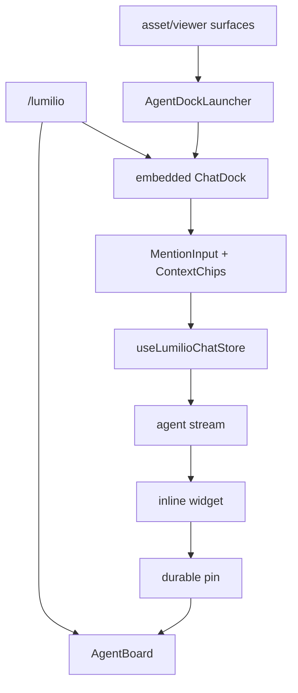

# Lumilio

Lumilio owns the authenticated assistant experience: the `/lumilio` board,
reusable chat dock, streamed assistant blocks, contextual asset handoff,
mentions, slash modes, and durable board pins. Media, collections, people,
and settings remain in their own features and contribute only explicit
context or public data.

## State

[useLumilioChatStore](./state/chatStore.ts) owns thread/run identity, streamed blocks,
generation and error state, confirmation interrupts, token usage, and
send/resume/stop/new-conversation commands. [useContextStore](../../lib/assistant/index.ts) is the
lower shared context bus for current selections and viewer context.
[useDockStore](../../lib/assistant/index.ts) owns only the user's collapse override.

Pins, ref hydration, widget data, mention sources, and capabilities remain
TanStack Query server state. Closing or collapsing the dock does not cancel a
run. [resetLumilioSession](./state/resetSession.ts) is the user-session boundary: it starts a
best-effort server cancellation, closes transport, and clears chat and
context state.

## Flows

```mermaid
flowchart TD
    ROUTE["/lumilio"] --> BOARD["AgentBoard"]
    ROUTE --> DOCK["embedded ChatDock"]
    APP["asset/viewer surfaces"] --> LAUNCHER["AgentDockLauncher"]
    LAUNCHER --> DOCK
    DOCK --> INPUT["MentionInput + ContextChips"]
    INPUT --> STORE["useLumilioChatStore"]
    STORE --> SSE["agent stream"]
    SSE --> WIDGET["inline widget"]
    WIDGET --> PIN["durable pin"]
    PIN --> BOARD
```

[LumilioChatPage](./flows/workspace/LumilioWorkspaceFlow.tsx) composes [AgentBoard](./flows/board/AgentBoard.tsx) and an embedded
[ChatDock](./flows/chat/ChatDock.tsx). Other routes mount the dock through
[AgentDockLauncher](./flows/chat/AgentDockLauncher.tsx). Asset-owned contributors publish selected or
viewed media through [useBrowseSelectionContext](../assets/flows/browse/useBrowseSelectionContext.ts) and
[useViewerContextContributor](../assets/flows/viewer/useViewerContextContributor.ts); [ContextChips](./flows/chat/ContextChips.tsx) lets the user
exclude a contribution for one send.

[MentionInput](./flows/chat/MentionInput.tsx) combines text, typed mentions, slash modes, send,
confirmation, and Stop. Inline results render through
[InlineWidgetCard](./modules/widgets/chrome/InlineWidgetCard.tsx); pinning copies the server snapshot and
[BoardTile](./modules/widgets/chrome/BoardTile.tsx) renders the durable result through the widget registry.

## Data

[streamAgent](./api/agentStream.ts) opens authenticated SSE for chat/resume.
`session_info` binds a run, text becomes [TextBlock](./model/chatTypes.ts), tool/widget side
channels become [ToolBlock](./model/chatTypes.ts)/[WidgetBlock](./model/chatTypes.ts), and interrupts become
[ConfirmBlock](./model/chatTypes.ts). Stream failures carry a generated Problem Reference;
[ChatDock](./flows/chat/ChatDock.tsx) localizes that reference from current i18n state instead of
storing display copy. [cancelAgentRun](./api/agentStream.ts) targets the exact thread/run;
[cancelActiveBlocks](./state/blocks.ts) preserves partial text while marking unfinished
blocks stopped.

[createMentionSources](./modules/mentions/mentionSources.ts) builds typed person, album, pin, camera, and
lens constraints. Ref events carry handles rather than full media payloads;
[useWidgetData](./modules/widgets/useWidgetData.ts) hydrates ref or pin metadata and widget assets remain
separate queries. The root `index.ts` exports only the dock surfaces and
session reset; stream, widget, and store internals are private.
