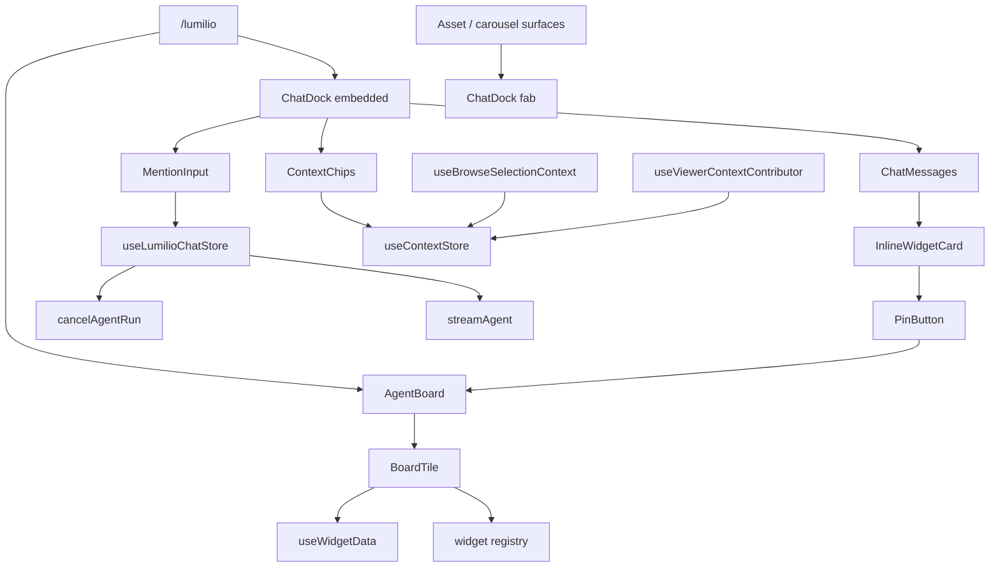

# Lumilio

The Lumilio feature owns the authenticated agent experience: the `/lumilio`
board route, the reusable chat dock, streamed assistant blocks, contextual
asset handoff, `@` mentions, `/` modes, and durable board pins. It is not the
base media workflow; assets, collections, people, and settings stay in their
own features and Lumilio consumes them through explicit context or mentions.

## State

Feature-local interactive state and the shared assistant surface use three
small Zustand stores with explicit ownership:

- [useLumilioChatStore](./state/chatStore.ts) owns the thread id, active run id, streamed
  message blocks, generation/stopping/error state, confirmation interrupts,
  token usage, and the send/resume/stop/new-conversation commands. Stop is a
  server operation: it calls [cancelAgentRun](./api/agentStream.ts) with the exact
  `(thread_id, run_id)` before aborting the local SSE transport.
- The lower-level [useContextStore](@/lib/assistant/index.ts) is the cross-surface context bus. Contributors
  register current asset selections or carousel viewing context, and
  [ContextChips](./flows/chat/ContextChips.tsx) lets the user exclude a contribution before send.
- The lower-level [useDockStore](@/lib/assistant/index.ts) owns only the user's chat collapse override; route
  defaults still decide whether an untouched dock starts expanded or collapsed.

Server state stays in TanStack Query: pins, ref hydration, widget metadata,
widget assets, mention source lists, and capabilities are fetched at the
component/hook edges instead of being mirrored into those stores.

## Data

[streamAgent](./api/agentStream.ts) opens authenticated SSE streams to `/api/v1/agent/chat`
and `/api/v1/agent/chat/resume`. Every request sends an explicit mode
(`free` for the unconstrained tool set). `session_info` binds the stream to a
fresh run id and `run_status` carries [AgentRunStatus](./model/chatTypes.ts). Product SSE
contains assistant text only—provider reasoning is never accepted into the
public stream contract. Assistant chunks become [TextBlock](./model/chatTypes.ts); tool
status and widgets arrive through [SideChannelEvent](./model/chatTypes.ts) and become
[ToolBlock](./model/chatTypes.ts) / [WidgetBlock](./model/chatTypes.ts). An interrupt becomes a
[ConfirmBlock](./model/chatTypes.ts) and resumes through the same store.

[cancelActiveBlocks](./state/blocks.ts) preserves partial assistant text after Stop,
marks unfinished tools `cancelled`, disables an unresolved confirmation, and
marks the turn as stopped. [MentionInput](./flows/chat/MentionInput.tsx) reuses its primary action
slot as a Stop button while a run is generating or awaiting confirmation.
`newConversation` waits for that cancellation request before clearing local
state; collapsing or closing the dock never cancels.

The stream side channel passes handles, not full asset payloads:
[RefPayload](./model/chatTypes.ts) carries a ref id, count, widget hint, and params. Inline
widgets hydrate that handle through [InlineWidgetCard](./modules/widgets/chrome/InlineWidgetCard.tsx); durable pins
copy the snapshot server-side through [PinButton](./modules/widgets/PinButton.tsx) and are later read by
[AgentBoard](./flows/board/AgentBoard.tsx). [useWidgetData](./modules/widgets/useWidgetData.ts) normalizes ref/pin metadata into
[WidgetData](./modules/widgets/types.ts), while thumbnail-heavy views fetch assets separately.

Mentions are explicit, typed constraints. [MentionInput](./flows/chat/MentionInput.tsx) uses
[createMentionSources](./modules/mentions/mentionSources.ts) to build searchable person, album, pin, camera,
and lens sources; picked entities are sent as [MentionPayload](./modules/mentions/mentionSources.ts). Slash
modes come from [useSlashMacros](./modules/slash/slashMacros.ts) and constrain the tool subset without
inserting a canned prompt.

## Composition

```mermaid
flowchart TD
    ROUTE["/lumilio"] --> BOARD["AgentBoard"]
    ROUTE --> DOCK["ChatDock embedded"]
    FAB["Asset / carousel surfaces"] --> DOCK2["ChatDock fab"]
    DOCK --> INPUT["MentionInput"]
    DOCK --> CHIPS["ContextChips"]
    DOCK --> MESSAGES["ChatMessages"]
    INPUT --> STORE["useLumilioChatStore"]
    STORE --> CANCEL["cancelAgentRun"]
    CHIPS --> CTX["useContextStore"]
    GALLERY["useBrowseSelectionContext"] --> CTX
    CAROUSEL["useViewerContextContributor"] --> CTX
    STORE --> SSE["streamAgent"]
    MESSAGES --> INLINE["InlineWidgetCard"]
    INLINE --> PIN["PinButton"]
    PIN --> BOARD
    BOARD --> TILE["BoardTile"]
    TILE --> DATA["useWidgetData"]
    TILE --> REG["widget registry"]
```

[LumilioChatPage](./flows/workspace/LumilioWorkspaceFlow.tsx) is intentionally thin: it renders [AgentBoard](./flows/board/AgentBoard.tsx)
and an embedded [ChatDock](./flows/chat/ChatDock.tsx). The dock composes [MentionInput](./flows/chat/MentionInput.tsx),
[ContextChips](./flows/chat/ContextChips.tsx), and [ChatMessages](./flows/chat/ChatMessages.tsx); asset and carousel surfaces
mount it in `fab` mode. Asset-owned contributors publish context through the
shared assistant bus via
[useBrowseSelectionContext](@/features/assets/flows/browse/useBrowseSelectionContext.ts) / [useViewerContextContributor](@/features/assets/flows/viewer/useViewerContextContributor.ts).
Board pins render through [BoardTile](./modules/widgets/chrome/BoardTile.tsx), so the agent UI is a feature
overlay rather than another gallery implementation.

## Decisions

Context is opt-out at send time. Contributions stay visible as chips, and
exclusions are cleared after sending so the next message starts from the
current page context rather than a hidden stale exclusion.
[resetLumilioSession](./state/resetSession.ts) is the feature reset exposed to application
composition. It starts a best-effort server cancellation before closing the
transport, then clears the chat store and shared context bus so conversation,
contributions, and exclusions never cross a user boundary.

Pins are the durability boundary. Chat widgets are session refs; pinning
copies the result to `/api/v1/agent/pins`, after which layout, title, view,
size, and removal are board concerns.

Widget views are registry entries. [registerWidget](./modules/widgets/registry.ts) wires a widget type
to its view and icon; all views share the same S/M/L footprints from
[DIMS](./modules/widgets/registry.ts), so switching view never resizes the board cell.
