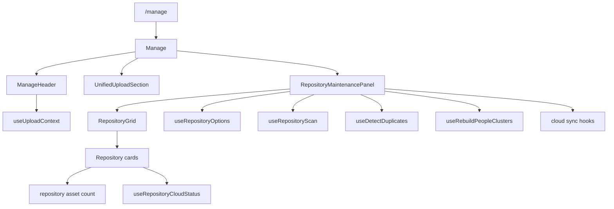

# Manage

The Manage feature owns the authenticated `/manage` maintenance surface. It
composes upload intake with repository operations, so users have one place
to add new media and repair or refresh the repositories that already exist.
It does not own browse scope, asset gallery layout, album membership, people
editing, or system settings persistence; those concerns live in their
respective features and are invoked here through explicit hooks.

## State

[Manage](./routes/Manage.tsx) is intentionally thin. It renders the page header, exposes
the supported-format modal, and mounts [UnifiedUploadSection](@/features/upload) before
[RepositoryMaintenancePanel](./components/RepositoryMaintenancePanel.tsx). The panel passes maintenance state and
callbacks to the repository-owned, presentational [RepositoryGrid](@/features/repositories).
The header reads [useUploadContext](@/features/upload) only to summarize the current
queue; upload queue mutation remains in the upload feature.

Repository maintenance orchestration is local to
[RepositoryMaintenancePanel](./components/RepositoryMaintenancePanel.tsx). Each action tracks its own pending
repository id or job state:

- [useRepositoryScan](@/features/repositories) tracks rescan and stack-detection ids.
- [useDetectDuplicates](@/features/collections) runs duplicate detection for one repository.
- [useRebuildPeopleClusters](@/features/people) starts the library-wide people rebuild.
- [useStartRepositoryCloudImport](@/features/cloud) starts cloud import for a bound
  repository.

Creating repositories is also local to the grid modal. Local repositories
need only a display name; cloud repositories must pick a connected
credential from [useCloudCredentials](@/features/cloud).

## Data

Repository options come from [useRepositoryOptions](@/features/repositories), the same
repository-owned source used by browse and working-repository pickers. Manage
reads from that source but does not persist repository selection
preferences.

Repository cards show a scoped asset count through `/api/v1/assets/list` and
cloud status through [useRepositoryCloudStatus](@/features/cloud). A repository scan
mutation only acknowledges a queued background job.
[waitForRepositoryScan](@/features/repositories) follows its scan run through running and
terminal backend states; repository-aware queries are invalidated only after
completion. Other maintenance mutations retain scoped invalidation behavior.

The action scope is deliberately mixed:

- Rescan, stack detection, duplicate detection, location rebuild, and cloud
  import are repository-scoped.
- People rebuild is library-wide because face clusters can span
  repositories.
- Upload target selection belongs to [UnifiedUploadSection](@/features/upload) through the
  repositories feature's working-repository hook, not to Manage itself.

## Composition

[Manage](./routes/Manage.tsx) is therefore a composition route, not a data owner. It brings
together upload and repository maintenance but leaves each subsystem's
durable state in the feature that already owns it.

## Decisions

Manage is the home for maintenance actions because the consequences are
repository- or library-wide. Gallery pages can show scoped media, but they
should not hide operations that rescan folders, rebuild locations, or launch
import jobs.

Repository cards expose one busy state per action. This keeps a long-running
duplicate scan or cloud import from implying that unrelated repositories are
unavailable.

People rebuild stays visible here even though People owns the domain model.
The rebuild is operational maintenance, not person editing, and it is
library-wide by design.
