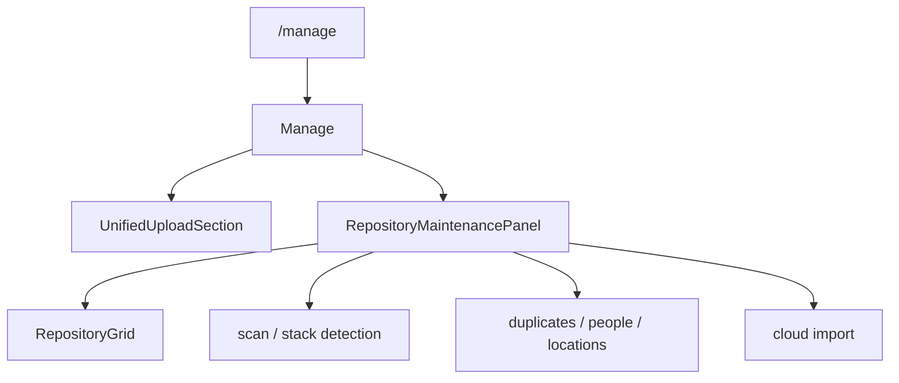

# Manage

Manage owns the authenticated `/manage` operations surface. It composes
upload intake with repository- and library-maintenance commands; durable
upload, repository, cloud, people, and duplicate state remains in those
domain features.

## State

[Manage](./flows/overview/ManageFlow.tsx) has no durable state. Upload queue state comes from
[useUploadContext](../upload/index.ts). [RepositoryMaintenancePanel](./flows/overview/RepositoryMaintenancePanel.tsx) keeps only
interaction state for the repository or job currently pending in each
action. Repository options and operation results remain TanStack Query
server state; Manage persists neither browse nor working-repository scope.

## Flows

```mermaid
flowchart TD
    ROUTE["/manage"] --> PAGE["Manage"]
    PAGE --> UPLOAD["UnifiedUploadSection"]
    PAGE --> PANEL["RepositoryMaintenancePanel"]
    PANEL --> GRID["RepositoryGrid"]
    PANEL --> SCAN["scan / stack detection"]
    PANEL --> LIBRARY["duplicates / people / locations"]
    PANEL --> CLOUD["cloud import"]
```

[Manage](./flows/overview/ManageFlow.tsx) composes the upload editor and
[RepositoryMaintenancePanel](./flows/overview/RepositoryMaintenancePanel.tsx). The panel supplies commands to the
repository-owned [RepositoryGrid](../repositories/index.ts); cards do not import maintenance
domains themselves. Upload target choice remains inside
[UnifiedUploadSection](../upload/index.ts).

Repository scans, stack detection, duplicate detection, location rebuild,
and cloud import are repository-scoped. People clustering is library-wide
because identities can span repositories. Keeping these commands on Manage
prevents gallery pages from hiding expensive operational work.

## Data

Repository lists come from [useRepositoryOptions](../repositories/index.ts).
[useRepositoryScan](../repositories/index.ts) follows scan runs through
[waitForRepositoryScan](../repositories/index.ts) before invalidating repository-aware views.
[useDetectDuplicates](../collections/index.ts), [useRebuildPeopleClusters](../people/index.ts), and
[useStartRepositoryCloudImport](../cloud/index.ts) remain public commands of their owning
features.

Repository cards use the typed asset-list count and
[useRepositoryCloudStatus](../cloud/index.ts). A mutation acknowledgement may represent
queued background work; completion-aware hooks own any necessary polling and
invalidation rather than Manage copying job state.
