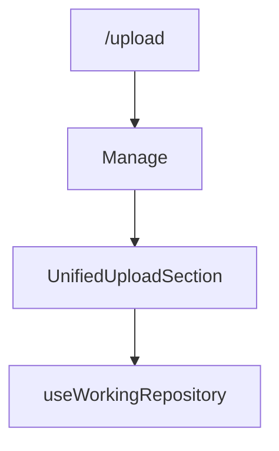

# Upload

Upload owns the authenticated `/upload` surface. It presents itself as
Upload, not Manage: it is not an administration page, and storage
administration, verification, cloud source binding, and catalog rebuilds
live on the admin Storage route inside `features/repositories`.

## State

[Manage](./flows/overview/ManageFlow.tsx) has no durable state. Upload queue state comes from
[useUploadContext](../upload/index.ts); the chosen upload target is user-scoped persisted
preference resolved by the upload feature. Manage persists neither browse nor
working-repository scope.

## Flows

```mermaid
flowchart TD
    ROUTE["/upload"] --> PAGE["Manage"]
    PAGE --> UPLOAD["UnifiedUploadSection"]
    UPLOAD --> TARGET["useWorkingRepository"]
```

[Manage](./flows/overview/ManageFlow.tsx) composes the upload editor only. Upload target choice lives
inside [UnifiedUploadSection](../upload/index.ts), which reads the non-admin
`GET /api/v1/storage/targets` contract through the repositories feature and
explains a blocked target in place instead of switching it silently.

## Data

Manage issues no admin-only storage request. Repository eligibility arrives
as a Server admission decision on the upload target selector, so this page
never derives eligibility locally. The selector resolves its persisted
choice through [useWorkingRepository](../repositories/index.ts).
