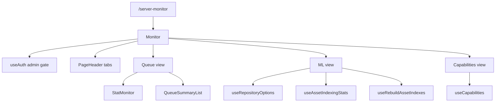

# Monitor

The Monitor feature owns the authenticated `/server-monitor` operational
dashboard. It is an admin-only surface for queue health, ML indexing
coverage, rebuild actions, and runtime capability status. It observes and
triggers backend work, but it does not define queue semantics, ML task
enablement, or repository configuration.

## State

[Monitor](./routes/Monitor.tsx) gates the route to admin users through `useAuth`. Non-admin
users get an access message before any monitor queries render. Admin users
switch between three URL-addressable tabs: queue, ML, and capabilities. The
default queue tab omits the `tab` query parameter; ML and capabilities store
`?tab=ml` and `?tab=capabilities`.

Monitor-local state is intentionally small:

- [Monitor](./routes/Monitor.tsx) stores only the selected tab and the optional local
  repository id used by the ML tab.
- [QueueSummaryList](./components/QueueSummaryList.tsx) stores expanded queue rows and the transient
  "copied diagnostic" key.
- [MLMonitor](./components/MLMonitor.tsx) stores the reindex confirmation modal and whether the
  action should include already-indexed assets.

## Data

[StatMonitor](./components/StatMonitor.tsx) polls `/api/v1/admin/river/stats` every five seconds and
summarizes active, completed, and issue jobs from [JobStatsResponse](./types.ts).

[QueueSummaryList](./components/QueueSummaryList.tsx) polls `/api/v1/admin/river/queue-summary` every five
seconds with a small error sample limit. The response shape is
[QueueSummaryResponse](./types.ts); queue rows use [QueueSummaryDTO](./types.ts);
expandable diagnostics use
[QueueErrorSampleDTO](./types.ts) and copy a plain-text troubleshooting block to
the clipboard.

[MLMonitor](./components/MLMonitor.tsx) reads repository-aware indexing coverage through
[useAssetIndexingStats](./api/useAssetIndexing.ts). It can trigger [useRebuildAssetIndexes](./api/useAssetIndexing.ts)
for semantic, OCR, or face tasks, passing the selected repository id when
the user narrows the ML view to one repository. The rebuild response is
interpreted through [extractRebuildResponseData](./api/useAssetIndexing.ts) so disabled tasks can
be reported without guessing from mutation shape.

[CapabilitiesMonitor](./components/CapabilitiesMonitor.tsx) reads [useCapabilities](@/lib/capabilities/useCapabilities.ts) on a five-second
interval. It reports ML node counts, task enabled/available state, and LLM
agent configuration. Capability status is display-only here; durable toggles
still belong in Settings.

## Composition

Queue and capabilities views are pure monitor surfaces. The ML view borrows
repository options from Repositories only to scope coverage and rebuild actions;
it does not persist a browse or working repository preference.

## Decisions

Monitor is admin-only because it exposes operational failure details and can
enqueue rebuild work. User-facing progress summaries should live in feature
pages, not here.

Polling is short and explicit. Queue and capability data are operationally
volatile, so components own their own five-second intervals instead of
relying on stale global state.

Reindex actions stay task-scoped. The user confirms one ML task at a time
and can choose missing-only or full rebuild, which avoids hiding expensive
library-wide work behind a generic refresh button.
