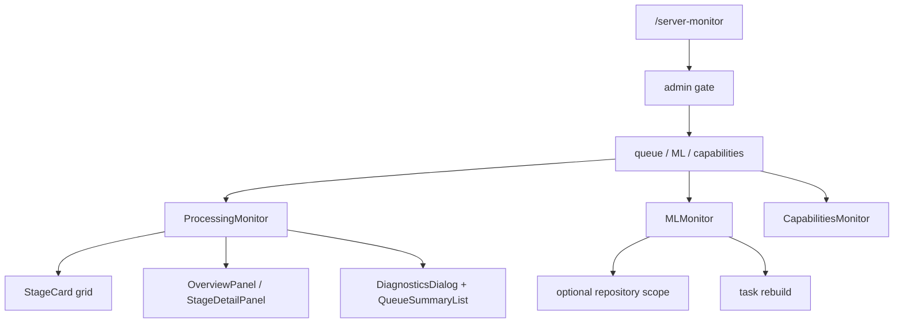

# Monitor

Monitor owns the admin-only `/server-monitor` operational dashboard for
current Catalog processing, ML indexing coverage, rebuild commands, and
runtime capabilities. It observes and triggers backend work but does not
define task enablement, queue semantics, or repository configuration.

## State

[MonitorOverview](./flows/overview/MonitorOverview.tsx) keeps the selected queue/ML/capabilities tab in the
`tab` URL parameter, and [ProcessingMonitor](./flows/overview/ProcessingMonitor.tsx) keeps the selected stage
in `stage` beside it. The ML view's optional repository scope is local to
the route and is not persisted as browse or upload preference.
[QueueSummaryList](./flows/overview/QueueSummaryList.tsx) keeps only expanded rows and transient copied status;
[MLMonitor](./flows/overview/MLMonitor.tsx) keeps its confirmation dialog and missing-only/full choice.
Hub selection and capability filtering remain local to the overview; nodes
are ordered by identity, four per orbit page.

Processing, capability, Lumen runtime, and indexing results remain TanStack
Query server state. The route checks the authenticated user before monitor
queries render.

## Flows

```mermaid
flowchart TD
    ROUTE["/server-monitor"] --> ADMIN["admin gate"]
    ADMIN --> TABS["queue / ML / capabilities"]
    TABS --> QUEUE["ProcessingMonitor"]
    QUEUE --> GRID["StageCard grid"]
    QUEUE --> PANEL["OverviewPanel / StageDetailPanel"]
    QUEUE --> DIAG["DiagnosticsDialog + QueueSummaryList"]
    TABS --> ML["MLMonitor"]
    TABS --> CAP["CapabilitiesMonitor"]
    ML --> REPOSITORY["optional repository scope"]
    ML --> REBUILD["task rebuild"]
```

[MonitorFrame](./flows/overview/MonitorFrame.tsx) gives every tab one compact snapshot heading: the
successful-read timestamp, that tab's actions, and refresh. The route header
already names the tab and the primary visual already enumerates its subjects,
so the heading never repeats a title or tallies targets. A failed background
read retains cached facts with an explicit stale warning. Each tab retains
its own polling interval.

[ProcessingMonitor](./flows/overview/ProcessingMonitor.tsx) is a grid of identical [StageCard](./flows/overview/StageCard.tsx)s beside one
panel. Media cards (Import, Scan, Metadata, Thumbnails, Video, Analysis)
count files or Repositories; Catalog cards (Events, Places, Text search,
Backup) count updates or runs. Each card shows its status, the remaining
count in its unit, and one line: failures first, otherwise running work.
With nothing selected the panel is [OverviewPanel](./flows/overview/StagePanel.tsx): the Rive tray
driven by media in progress and six totals. Selecting a card turns it into
[StageDetailPanel](./flows/overview/StagePanel.tsx): four counts, facts (done, requesting sources,
oldest waiting, last activity), failed items with per-file and whole-stage
retry, then waiting items. Back or re-selecting the card restores the
overview. [DiagnosticsDialog](./flows/overview/DiagnosticsDialog.tsx) holds River delivery totals and queue
error samples, labelled as delivery attempts rather than file progress.
The Rive [ProcessingTray](./modules/rive/ProcessingTray.tsx) appears once; reduced motion and runtime failure use static
geometry.

ML uses equal hundred-cell coverage fields with one shared detail region.
A cell is approximately one percent, not a file; no-applicable-content is
separate from complete coverage. The five fields collapse to three, then two
columns at narrow container widths.
[CapabilityOrbit](./flows/overview/CapabilityOrbit.tsx) shows actual Hub endpoints and their advertised
capabilities; layout encodes no hardware, latency, or performance topology.
Advertisements filter nodes but do not override public capability composition.
Agent configuration, backend and full node diagnostics remain expandable.
[MLMonitor](./flows/overview/MLMonitor.tsx) combines coverage, repository options, and one confirmed
rebuild command. It reports no job backlog, cross-tab links, or hidden
legend: files still awaiting analysis are a Processing lane. [CapabilitiesMonitor](./flows/overview/CapabilitiesMonitor.tsx) is display-only; durable ML and
agent settings stay in Settings.

Storage administration is not a Monitor tab. Storage Locations,
Repositories, capacity, verification, and the lifecycle audit belong to the
admin Storage route owned by `features/repositories`; Monitor reports
processing health only. Keeping storage out of Monitor leaves exactly one
authority for a storage fact.

## Data

[useProcessingSummary](./api/useProcessing.ts) polls `/api/v1/admin/processing` every five
seconds. Every stage has the same fields — remaining, queued, running,
retrying, failed, and done for per-file stages — computed from Catalog
desired/applied facts; River supplies only running and retryable
deliveries. Reindex work is attributed as a source of Analysis, never a
stage. [useProcessingStageItems](./api/useProcessing.ts) pages a stage's failed or waiting
subjects with public reason codes; [useRetryProcessingStage](./api/useProcessing.ts) and
[useRetryProcessingItem](./api/useProcessing.ts) re-request failures through the Catalog.
[useProcessingDiagnostics](./api/useProcessing.ts) reads delivery diagnostics only while the
dialog is open.
[useCapabilities](../../lib/capabilities/useCapabilities.ts) and [useLumenRuntime](./api/useLumenRuntime.ts) poll every five seconds.
The public capability snapshot supplies de-sensitized task availability;
the administrator runtime snapshot supplies typed discovery-backend,
transport, compatibility, and node diagnostics. Refresh observes both
snapshots and never restarts or rescans discovery.

[useAssetIndexingStats](./api/useAssetIndexing.ts) polls repository-aware coverage every fifteen
seconds. [AssetIndexingStats](./api/useAssetIndexing.ts) distinguishes photo and video totals and
semantic, video-semantic, BioCLIP, OCR, and face coverage.
[useRebuildAssetIndexes](./api/useAssetIndexing.ts) can enqueue semantic, video-semantic, OCR, or
face work; BioCLIP is visible here but its album-scoped rebuild belongs to
Collections. [extractRebuildResponseData](./api/useAssetIndexing.ts) interprets accepted/disabled
task results without inventing response shapes.
