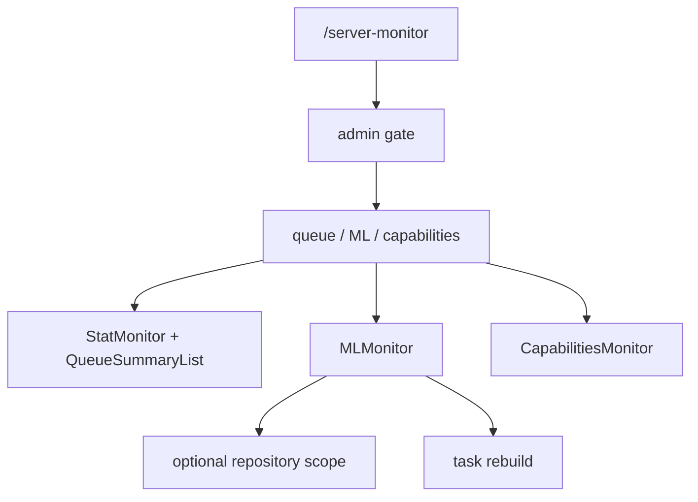

# Monitor

Monitor owns the admin-only `/server-monitor` operational dashboard for
River queues, ML indexing coverage, rebuild commands, and runtime
capabilities. It observes and triggers backend work but does not define task
enablement, queue semantics, or repository configuration.

## State

[MonitorOverview](./flows/overview/MonitorOverview.tsx) keeps the selected queue/ML/capabilities tab in the
`tab` URL parameter. The ML view's optional repository scope is local to the
route and is not persisted as browse or upload preference.
[QueueSummaryList](./flows/overview/QueueSummaryList.tsx) keeps only expanded rows and transient copied status;
[MLMonitor](./flows/overview/MLMonitor.tsx) keeps its confirmation dialog and missing-only/full choice.

Queue, capability, and indexing results remain TanStack Query server state.
The route checks the authenticated user before monitor queries render.

## Flows

```mermaid
flowchart TD
    ROUTE["/server-monitor"] --> ADMIN["admin gate"]
    ADMIN --> TABS["queue / ML / capabilities"]
    TABS --> QUEUE["StatMonitor + QueueSummaryList"]
    TABS --> ML["MLMonitor"]
    TABS --> CAP["CapabilitiesMonitor"]
    ML --> REPOSITORY["optional repository scope"]
    ML --> REBUILD["task rebuild"]
```

[StatMonitor](./flows/overview/StatMonitor.tsx) and [QueueSummaryList](./flows/overview/QueueSummaryList.tsx) form the queue view.
[MLMonitor](./flows/overview/MLMonitor.tsx) combines coverage, repository options, and one confirmed
rebuild command. [CapabilitiesMonitor](./flows/overview/CapabilitiesMonitor.tsx) is display-only; durable ML and
agent settings stay in Settings.

## Data

Queue stats and summary endpoints poll every five seconds. Queue summaries
include bounded error samples suitable for copied diagnostics.
[useCapabilities](../../lib/capabilities/useCapabilities.ts) also polls every five seconds.

[useAssetIndexingStats](./api/useAssetIndexing.ts) polls repository-aware coverage every fifteen
seconds. [AssetIndexingStats](./api/useAssetIndexing.ts) distinguishes photo and video totals and
semantic, video-semantic, BioCLIP, OCR, and face coverage.
[useRebuildAssetIndexes](./api/useAssetIndexing.ts) can enqueue semantic, video-semantic, OCR, or
face work; BioCLIP is visible here but its album-scoped rebuild belongs to
Collections. [extractRebuildResponseData](./api/useAssetIndexing.ts) interprets accepted/disabled
task results without inventing response shapes.
