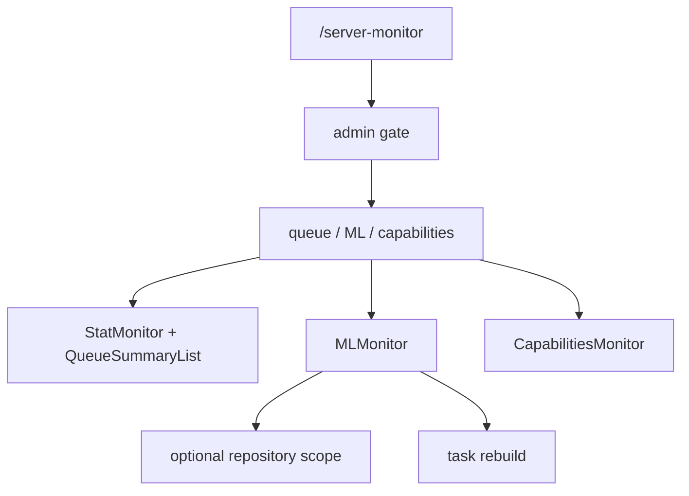

# Monitor

Monitor owns the admin-only `/server-monitor` operational dashboard for
current Catalog processing, ML indexing coverage, rebuild commands, and
runtime capabilities. It observes and triggers backend work but does not
define task enablement, queue semantics, or repository configuration.

## State

[MonitorOverview](./flows/overview/MonitorOverview.tsx) keeps the selected queue/ML/capabilities tab in the
`tab` URL parameter. The ML view's optional repository scope is local to the
route and is not persisted as browse or upload preference.
[QueueSummaryList](./flows/overview/QueueSummaryList.tsx) keeps only expanded rows and transient copied status;
[MLMonitor](./flows/overview/MLMonitor.tsx) keeps its selected coverage field, confirmation dialog, and
missing-only/full choice. Hub selection and capability filtering remain local
to the overview; nodes are ordered by identity, four per orbit page.

Queue, capability, Lumen runtime, and indexing results remain TanStack Query server state.
The route checks the authenticated user before monitor queries render.

## Flows

```mermaid
flowchart TD
    ROUTE["/server-monitor"] --> ADMIN["admin gate"]
    ADMIN --> TABS["queue / ML / capabilities"]
    TABS --> QUEUE["StatMonitor + QueueSummaryList"]
    TABS --> ML["MLMonitor"]
    TABS --> CAP["CapabilitiesMonitor"]
    ML --> REPOSITORY["optional repository scope"]
    ML --> REBUILD["task rebuild"]
```

[MonitorFrame](./flows/overview/MonitorFrame.tsx) gives every tab one compact snapshot heading: the
successful-read timestamp, that tab's actions, and refresh. The route header
already names the tab and the primary visual already enumerates its subjects,
so the heading never repeats a title or tallies targets. A failed background
read retains cached facts with an explicit stale warning. Each tab retains
its own polling interval.

[StatMonitor](./flows/overview/StatMonitor.tsx) converges Processing on exactly two patterns. Files
awaiting processing are the one animated tray, [ProcessingTray](./modules/rive/ProcessingTray.tsx): a
fixed eighteen-layer reference of 32 files per layer that the Rive asset
quantises into four tiers, with retry waits and attention beside it. Every
other kind of work — Repository scans, optional ML analysis, reindex
requests, projections, and operations — is a [WorkLaneList](./flows/overview/WorkLaneList.tsx) row that
states what the work is, its exact pending count, a status, attention, and
the route that owns it. [QueueSummaryList](./flows/overview/QueueSummaryList.tsx) follows as historical
delivery diagnostics. Exact counts always stay in the DOM, independent of
rendering; reduced motion and runtime failure use static geometry.

ML uses equal hundred-cell coverage fields with one shared detail region.
A cell is approximately one percent, not a file; no-applicable-content is
separate from complete coverage. The five fields collapse to three, then two
columns at narrow container widths.
[CapabilityOrbit](./flows/overview/CapabilityOrbit.tsx) shows actual Hub endpoints and their advertised
capabilities; layout encodes no hardware, latency, or performance topology.
Advertisements filter nodes but do not override public capability composition.
Agent configuration, backend and full node diagnostics remain expandable.
[MLMonitor](./flows/overview/MLMonitor.tsx) combines coverage, repository options, and one confirmed
rebuild command. It reports no job backlog, cross-tab links, or hidden
legend: files still awaiting analysis are a Processing lane. [CapabilitiesMonitor](./flows/overview/CapabilitiesMonitor.tsx) is display-only; durable ML and
agent settings stay in Settings.

Storage administration is not a Monitor tab. Storage Locations,
Repositories, capacity, verification, and the lifecycle audit belong to the
admin Storage route owned by `features/repositories`; Monitor reports
processing health only. Keeping storage out of Monitor leaves exactly one
authority for a storage fact.

## Data

[useProcessingMonitor](./api/useProcessingMonitor.ts) shares one five-second query and refresh for
`/api/v1/admin/monitor/processing`. The response separates `processing`
(Catalog work) from `deliveries` (state totals and queue diagnostics). StatMonitor reads
current Catalog file, Repository, projection, and operation work from the
processing response, including `pending_analysis_assets` for the optional
enrichment stage and `pending_reindex_requests`. File counts deduplicate stages; a terminal stage puts the file
in the attention count. Retry waits survive QueueDB replacement. River counts
are separately labeled delivery records and never stand in for file progress.
Queue summaries
include bounded error samples suitable for copied diagnostics.
[useCapabilities](../../lib/capabilities/useCapabilities.ts) and [useLumenRuntime](./api/useLumenRuntime.ts) poll every five seconds.
The public capability snapshot supplies de-sensitized task availability;
the administrator runtime snapshot supplies typed discovery-backend,
transport, compatibility, and node diagnostics. Refresh observes both
snapshots and never restarts or rescans discovery.

[useAssetIndexingStats](./api/useAssetIndexing.ts) polls repository-aware coverage every fifteen
seconds. [AssetIndexingStats](./api/useAssetIndexing.ts) distinguishes photo and video totals and
semantic, video-semantic, BioCLIP, OCR, and face coverage.
[useRebuildAssetIndexes](./api/useAssetIndexing.ts) can enqueue semantic, video-semantic, OCR, or
face work; BioCLIP is visible here but its album-scoped rebuild belongs to
Collections. [extractRebuildResponseData](./api/useAssetIndexing.ts) interprets accepted/disabled
task results without inventing response shapes.
