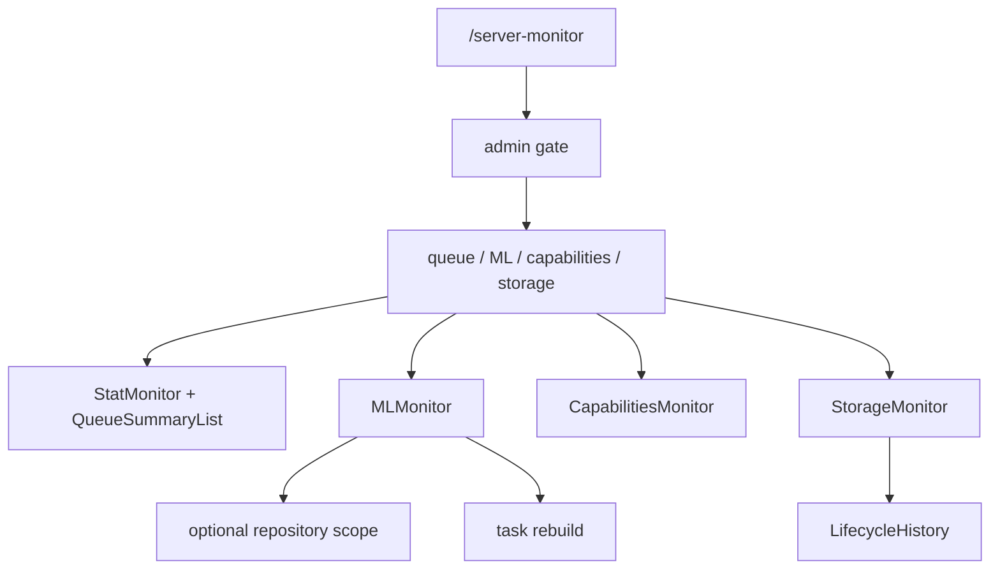

# Monitor

Monitor owns the admin-only `/server-monitor` operational dashboard for
River queues, ML indexing coverage, rebuild commands, runtime capabilities,
and hierarchical storage health. It observes and triggers backend work but
does not define task enablement, queue semantics, or repository configuration.

## State

[MonitorOverview](./flows/overview/MonitorOverview.tsx) keeps the selected queue/ML/capabilities/storage tab in the
`tab` URL parameter. The ML view's optional repository scope is local to the
route and is not persisted as browse or upload preference.
[QueueSummaryList](./flows/overview/QueueSummaryList.tsx) keeps only expanded rows and transient copied status;
[MLMonitor](./flows/overview/MLMonitor.tsx) keeps its selected coverage field, confirmation dialog, and
missing-only/full choice. Hub selection and capability filtering remain local
to the overview; nodes are ordered by identity, four per orbit page.

Queue, capability, Lumen runtime, and indexing results remain TanStack Query server state.
The route checks the authenticated user before monitor queries render.

## Flows

```mermaid
flowchart TD
    ROUTE["/server-monitor"] --> ADMIN["admin gate"]
    ADMIN --> TABS["queue / ML / capabilities / storage"]
    TABS --> QUEUE["StatMonitor + QueueSummaryList"]
    TABS --> ML["MLMonitor"]
    TABS --> CAP["CapabilitiesMonitor"]
    TABS --> STORAGE["StorageMonitor"]
    STORAGE --> HISTORY["LifecycleHistory"]
    ML --> REPOSITORY["optional repository scope"]
    ML --> REBUILD["task rebuild"]
```

[MonitorFrame](./flows/overview/MonitorFrame.tsx) gives all four tabs one compact snapshot heading: the
successful-read timestamp, that tab's actions, and refresh. The route header
already names the tab and the primary visual already enumerates its subjects,
so the heading never repeats a title or tallies targets. A failed background
read retains cached facts with an explicit stale warning. Storage is a manual
snapshot; the other tabs retain their polling intervals.

[StatMonitor](./flows/overview/StatMonitor.tsx) contains four independently selected work trays and keeps
[QueueSummaryList](./flows/overview/QueueSummaryList.tsx) inside delivery diagnostics. The authored file tray
uses [ProcessingTray](./modules/rive/ProcessingTray.tsx); other work types use matching DOM stacks. A fixed
eighteen-layer reference uses 32 files, one Repository, two projections, or
one operation per layer. The Rive asset quantises that scale into four tiers;
exact counts and attention stay in the DOM, independent of rendering.
Only files load Rive, with bundled WASM and asset bytes. Reduced motion and
runtime failure use static geometry; rendering pauses off-screen.

ML uses equal hundred-cell coverage fields with one shared detail region.
A cell is approximately one percent, not a file; no-applicable-content is
separate from complete coverage. The five fields collapse to three, then two
columns at narrow container widths.
[CapabilityOrbit](./flows/overview/CapabilityOrbit.tsx) shows actual Hub endpoints and their advertised
capabilities; layout encodes no hardware, latency, or performance topology.
Advertisements filter nodes but do not override public capability composition.
Agent configuration, backend and full node diagnostics remain expandable.
[MLMonitor](./flows/overview/MLMonitor.tsx) combines coverage, repository options, and one confirmed
rebuild command. [CapabilitiesMonitor](./flows/overview/CapabilitiesMonitor.tsx) is display-only; durable ML and
agent settings stay in Settings. [StorageMonitor](./flows/overview/StorageMonitor.tsx) groups repositories
below their owning Storage Locations and exposes filesystem-writable capacity,
the server-owned safety reserve and resulting write budget, mount, risk, and
redacted support-bundle diagnostics. The tree is the only enumeration of
targets, so a count of targets needing attention sits above it and appears
only when one exists — never for a healthy snapshot, and never while the
shown snapshot is stale. [CapacityMap](./flows/overview/CapacityMap.tsx) partitions total capacity into
used, Server-reported write budget, and actual retained space, with no
area-distorting gaps. A small area moves its label to the legend, and the
selected area's meaning is stated once instead of beside a repeated value.
The tree expresses ownership only; the selected detail grows with its
content, and measurement caveats stay inside its diagnostics disclosure.
[LifecycleHistory](./flows/overview/LifecycleHistory.tsx) renders the durable lifecycle audit below the pane.

## Data

[useProcessingMonitor](./api/useProcessingMonitor.ts) shares one five-second query and refresh for
`/api/v1/admin/monitor/processing`. The response separates `processing`
(Catalog work) from `deliveries` (state totals and queue diagnostics). StatMonitor reads
current Catalog file, Repository, projection, and operation work from the
processing response. File counts deduplicate stages; a terminal stage puts the file
in the attention count. Retry waits survive QueueDB replacement. River counts
are separately labeled delivery records and never stand in for file progress.
Queue summaries
include bounded error samples suitable for copied diagnostics.
[useCapabilities](../../lib/capabilities/useCapabilities.ts) and [useLumenRuntime](./api/useLumenRuntime.ts) poll every five seconds.
The public capability snapshot supplies de-sensitized task availability;
the administrator runtime snapshot supplies typed discovery-backend,
transport, compatibility, and node diagnostics. Refresh observes both
snapshots and never restarts or rescans discovery.

[useAssetIndexingStats](./api/useAssetIndexing.ts) polls repository-aware coverage every fifteen
seconds. [AssetIndexingStats](./api/useAssetIndexing.ts) distinguishes photo and video totals and
semantic, video-semantic, BioCLIP, OCR, and face coverage.
[useRebuildAssetIndexes](./api/useAssetIndexing.ts) can enqueue semantic, video-semantic, OCR, or
face work; BioCLIP is visible here but its album-scoped rebuild belongs to
Collections. [extractRebuildResponseData](./api/useAssetIndexing.ts) interprets accepted/disabled
task results without inventing response shapes.
