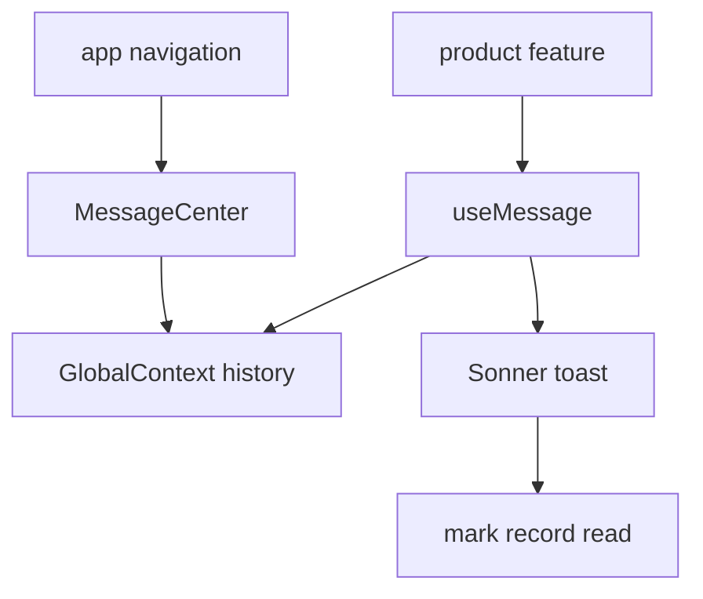

# Notifications

Notifications is the narrow feature facade for application-wide
notifications. It exposes product commands and navigation surfaces while
the cross-cutting notification runtime remains owned by `GlobalContext`.

## State

Notification history is in-memory session state in `GlobalContext`. This
feature has no Query data, feature store, URL state, or browser persistence.
[Notifications](./components/Notifications.tsx) mounts presentation only; it does not own records.

## Flows

Product workflows call [useMessage](./hooks/useMessage.ts). The same event is appended to the
global history and shown as a toast; dismissing the toast marks its matching
record read. [MessageCenter](./components/MessageCenter.tsx) renders recent history and read/clear
commands in navigation. [Notifications](./components/Notifications.tsx) mounts the process-wide
[Toaster](./components/Toaster.tsx).

## Data

There is no backend contract. Notification type, message, duration, read
state, and clearing are runtime values supplied through `GlobalContext`.
The root `index.ts` exports [useMessage](./hooks/useMessage.ts), [MessageCenter](./components/MessageCenter.tsx), and
[Notifications](./components/Notifications.tsx); the toaster implementation remains private to app
composition.
