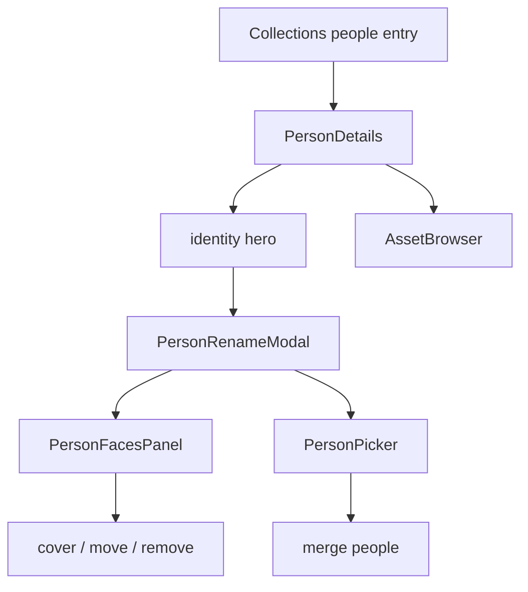

# People

People owns recognized identities, person detail, and the correction tools
for face clusters. Collections owns the people rail/grid entry; Assets owns
photo presentation. AI clustering is assistive, while user corrections are
durable authority.

## State

People lists, details, faces, and mutations remain TanStack Query server
state. The list read follows [usePeople](./api/usePeople.ts)'s browse scope, but person
detail and mutations are owner-scoped rather than repository-scoped because
one identity can span repositories.

Rename-modal tabs, face selection, and merge target are flow-local
interaction. No person or face collection is mirrored into Context,
Zustand, URL state, or browser persistence.

## Flows

[PersonDetails](./flows/detail/PersonDetailsFlow.tsx) renders a collection hero and a person-constrained
[AssetBrowser](../assets/index.ts). The gallery contains photos, not face crops.
[PersonRenameModal](./flows/detail/PersonRenameModal.tsx) owns identity info, hidden state, face correction,
and merge tabs. [PersonFacesPanel](./flows/detail/PersonFacesPanel.tsx) works on face crops and
[PersonPicker](./flows/detail/PersonPicker.tsx) selects move/merge targets.

## Data

[usePeople](./api/usePeople.ts) lists summaries and exposes the optional hidden-person
view. [usePersonDetails](./api/usePeople.ts) and [usePersonFaces](./api/usePeople.ts) load one identity
and its face memberships. [useSetPersonCover](./api/usePeople.ts),
[useMoveFace](./api/usePeople.ts), [useRemoveFaceFromPerson](./api/usePeople.ts),
[useMergePeople](./api/usePeople.ts), and [useSetPersonHidden](./api/usePeople.ts) own correction
mutations and invalidation.

Moves and merges preserve manual assignments so a later clustering rebuild
cannot discard user corrections. Removing a face detaches its membership;
original media is never modified. The root `index.ts` exports only list,
rebuild, and summary contracts needed by Collections and Manage.
