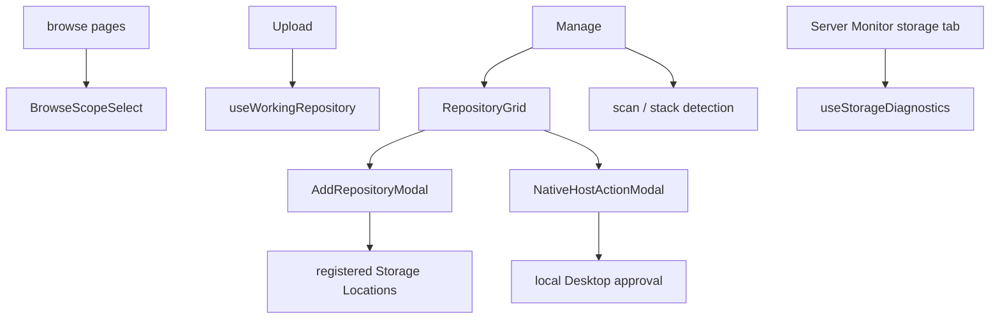

# Repositories

Repositories owns the shared repository option contract, browse scope,
concrete upload destination, Storage Location selection, repository creation,
scan lifecycle, and repository-management UI composed by Manage.

## State

Repository lists, roots, counts, and cloud status are TanStack Query server
state. Browse and working repository ids are user-scoped persisted
preferences and are cleared by authentication reset.

[useBrowseScope](./flows/browse-scope/useBrowseScope.ts) permits an empty value meaning all repositories.
[useWorkingRepository](./flows/working-repository/useWorkingRepository.ts) must resolve one concrete reachable repository;
when no valid explicit choice exists it selects a reachable primary or first
option. An explicit choice remains selected if it later goes offline so the
application can explain the unavailable target rather than silently switch.
Scan/detection id sets are request-local interaction inside
[useRepositoryScan](./api/useRepositoryScan.ts).

## Flows

[BrowseScopeSelect](./flows/browse-scope/BrowseScopeSelect.tsx) is shared by read-oriented pages.
[RepositoryGrid](./flows/manage/RepositoryGrid.tsx) renders repositories as expandable rows grouped under
their Storage Location sections and owns the creation entry plus a
maintenance menu, but receives maintenance commands from Manage. Creation
is a four-step [AddRepositoryModal](./flows/manage/AddRepositoryModal.tsx) wizard that selects an authorized
root, an explicit stable direct-child storage folder, and an immutable
storage strategy through [useCreateRepository](./api/useCreateRepository.ts).
Every Web creation entry uses [StorageStrategyPicker](./components/StorageStrategyPicker.tsx); later PATCH
mutation remains unavailable.

[NativeHostActionModal](./flows/manage/NativeHostActionModal.tsx) persists requests for a Desktop-native folder
grant and polls their durable status. The shared HTTP contract never accepts
a filesystem path or exposes the native approval nonce. Relocate-versus-copy
conflicts return user-facing resolutions and require an explicit copy
confirmation. The Web UI therefore owns the visible task while Desktop owns
the local chooser and final filesystem authority.
Standalone and Docker deployments use [RepositoryCandidateModal](./flows/manage/RepositoryCandidateModal.tsx)
instead. It can only enumerate direct children of the configured default
Storage Location and opens a candidate by portable directory name.

Repository rows keep unavailable repositories visible for diagnosis but
refuse write and maintenance actions. Parent Storage Location state takes
priority over child repository reachability, and activity is shown only once
storage is reachable. Cloud credentials and import status
come through the Cloud public entry rather than being reimplemented here.

## Data

[useRepositoryOptions](./api/useRepositoryOptions.ts) adapts the server repository list through
[normalizeRepositoryOptions](./model/repositoryOptions.ts). [useRepositoryRoots](./api/useRepositoryRoots.ts) reads and
normalizes admin-visible Storage Locations. Both expose the discriminated
[StorageEntity](./types.ts) presentation contract: transport `name` becomes
explicit `rawName`, while stable Storage Location `kind` and Repository
`role` determine reserved product names through
[getStorageEntityDisplayName](./model/storageEntities.ts). UI consumers never infer identity from
seeded English names. [useRepositoryAssetCount](./api/useRepositoryAssetCount.ts) provides the row-sized
typed asset count.
[useNativeHostCapability](./api/useNativeHostActions.ts) gates Desktop handoff entry points and
[useNativeHostAction](./api/useNativeHostActions.ts) resumes an outstanding task after refresh.
[useRepositoryCandidates](./api/useRepositoryCandidates.ts) provides the bounded standalone directory
classification surface.
[useStorageDiagnostics](./api/useStorageDiagnostics.ts), lifecycle audit, and support-bundle queries
are exported for the admin-only Server Monitor storage view. Diagnostics
carry the owning Storage Location id plus Storage Location `kind` or
Repository `role`, so the monitor neither infers filesystem hierarchy from
path strings nor renders transport names as product copy.

[useRepositoryScan](./api/useRepositoryScan.ts) starts scans and stack detection.
[waitForRepositoryScan](./api/waitForRepositoryScan.ts) follows a scan run to a terminal state before
repository-aware list/search queries are invalidated.
[RepositoryReachability](./types.ts) carries storage availability while
[RepositoryActivity](./types.ts) carries current work; neither is guessed from
missing data. Consumers must use the root `index.ts`, which
is the complete cross-feature contract.
