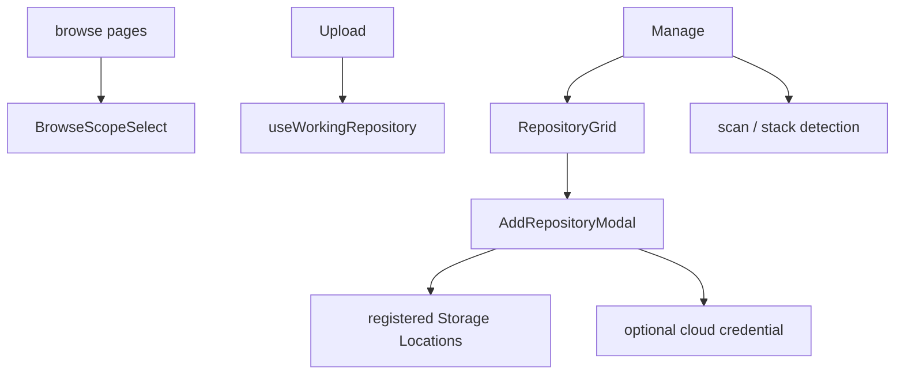

# Repositories

Repositories owns the shared repository option contract, browse scope,
concrete upload destination, Storage Location selection, repository creation,
scan lifecycle, and repository-management UI composed by Manage.

## State

Repository lists, roots, counts, and cloud status are TanStack Query server
state. Browse and working repository ids are user-scoped persisted
preferences and are cleared by authentication reset.

[useBrowseScope](./flows/browse-scope/useBrowseScope.ts) permits an empty value meaning all repositories.
[useWorkingRepository](./flows/working-repository/useWorkingRepository.ts) must resolve one concrete reachable repository;
when no valid explicit choice exists it selects a reachable primary or first
option. An explicit choice remains selected if it later goes offline so the
application can explain the unavailable target rather than silently switch.
Scan/detection id sets are request-local interaction inside
[useRepositoryScan](./api/useRepositoryScan.ts).

## Flows

[BrowseScopeSelect](./flows/browse-scope/BrowseScopeSelect.tsx) is shared by read-oriented pages.
[RepositoryGrid](./flows/manage/RepositoryGrid.tsx) owns repository cards and creation UI but receives
maintenance commands from Manage. Creation selects an authorized root and
explicit storage/duplicate policies through [useCreateRepository](./api/useCreateRepository.ts);
the Web UI cannot authorize arbitrary host paths.

Repository cards keep offline/error repositories visible for diagnosis but
refuse write and maintenance actions. Cloud credentials and import status
come through the Cloud public entry rather than being reimplemented here.

## Data

[useRepositoryOptions](./api/useRepositoryOptions.ts) adapts the server repository list through
[normalizeRepositoryOptions](./model/repositoryOptions.ts). [useRepositoryRoots](./api/useRepositoryRoots.ts) reads
admin-visible Storage Locations. [useRepositoryAssetCount](./api/useRepositoryAssetCount.ts) provides the
card-sized typed asset count.

[useRepositoryScan](./api/useRepositoryScan.ts) starts scans and stack detection.
[waitForRepositoryScan](./api/waitForRepositoryScan.ts) follows a scan run to a terminal state before
repository-aware list/search queries are invalidated.
[RepositoryStatus](./types.ts) carries reachability; offline and error states are
not guessed from missing data. Consumers must use the root `index.ts`, which
is the complete cross-feature contract.
