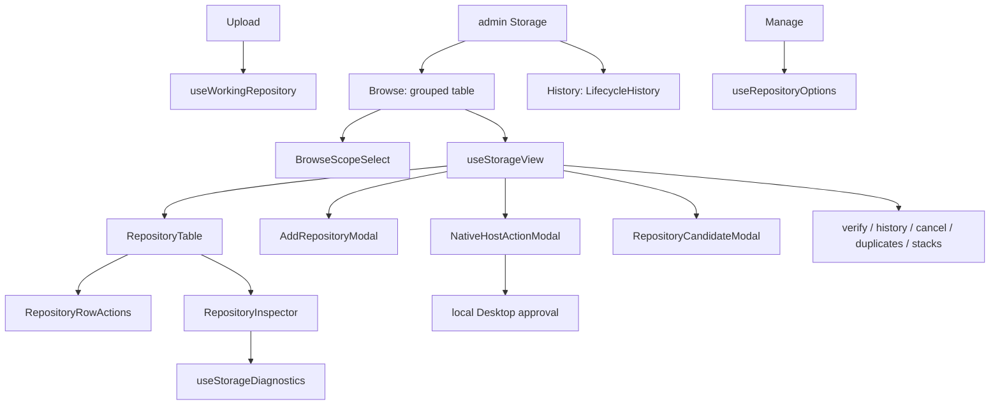

# Repositories

Repositories owns the shared repository option contract, browse scope,
concrete upload destination, and the admin Storage surface. Manage consumes
the non-admin list; admin Storage owns authorization, create/open, verify,
reconnect, detach, and native Desktop handoff.

## State

Repository lists, Storage view, diagnostics, and cloud status are TanStack
Query server state. Browse and working repository ids are user-scoped
persisted preferences and are cleared by authentication reset.

[useBrowseScope](./flows/browse-scope/useBrowseScope.ts) permits an empty value meaning all repositories.
[useWorkingRepository](./flows/working-repository/useWorkingRepository.ts) must resolve one concrete upload destination;
when no valid explicit choice exists it selects an upload-eligible primary
or first option. An explicit choice remains selected if it later becomes
unavailable so the application can explain the blocked target rather than
silently switch. Scan/detection id sets are request-local interaction inside
[useRepositoryScan](./api/useRepositoryScan.ts).

## Flows

[BrowseScopeSelect](./flows/browse-scope/BrowseScopeSelect.tsx) is shared by read-oriented pages. Manage consumes
[useRepositoryOptions](./api/useRepositoryOptions.ts) for its upload target only; it never renders an
administration surface.

Admin Storage is [StoragePanelFlow](./flows/storage-panel/StoragePanelFlow.tsx): one page with two views and a
structure that never changes shape with the data. Browse groups Repositories
by Storage Location; [RepositoryTable](./flows/storage-panel/RepositoryTable.tsx) carries capacity as a Repository
column together with the storage label that names where the figure was
measured. History is [LifecycleHistory](./flows/storage-panel/LifecycleHistory.tsx) as a flat audit list with no
row expansion.
Row commands live in [RepositoryRowActions](./flows/storage-panel/RepositoryRowActions.tsx), one menu per row, so an
action always names its Repository instead of relying on a page-level
selection.
[RepositoryInspector](./flows/storage-panel/RepositoryInspector.tsx) opens inline beneath the selected row as one
level of plain text — a single column on narrow screens, two from `sm` up.
Capacity has exactly one visual form there, a sentence naming its storage
once, and the diagnostic facts sit in the same grid rather than a nested
disclosure.
[deriveStorageLabel](./model/storageLabels.ts) turns the Server's mount path into the storage
identity a reader recognizes; nothing is grouped by backing storage, because
one Storage Location can hold Repositories on different mounts.
Creation is a four-step [AddRepositoryModal](./flows/storage-panel/AddRepositoryModal.tsx) wizard that selects an
authorized Storage Location, an explicit stable direct-child storage folder,
and an immutable storage strategy through [useCreateRepository](./api/useCreateRepository.ts).
Every Web creation entry uses [StorageStrategyPicker](./components/StorageStrategyPicker.tsx); later PATCH
mutation remains unavailable.

[NativeHostActionModal](./flows/storage-panel/NativeHostActionModal.tsx) persists requests for a Desktop-native folder
grant and polls their durable status. The shared HTTP contract never accepts
a filesystem path or exposes the native approval nonce. Relocate-versus-copy
conflicts return user-facing resolutions and require an explicit copy
confirmation. Standalone and Docker deployments use
[RepositoryCandidateModal](./flows/storage-panel/RepositoryCandidateModal.tsx) instead.

Repository rows keep unavailable repositories visible for diagnosis.
Parent Storage Location status does not veto a healthy child. Cloud
credentials and import status come through the Cloud public entry rather
than being reimplemented here.

## Data

[useRepositoryOptions](./api/useRepositoryOptions.ts) adapts `GET /api/v1/storage/targets` through
[normalizeRepositoryOptions](./model/repositoryOptions.ts). [useStorageView](./api/useStorageView.ts) is the admin
aggregate. Both expose the discriminated [StorageEntity](./types.ts) presentation
contract: transport `name` becomes explicit `rawName`, while stable Storage
Location `kind` and Repository `role` determine reserved product names
through [getStorageEntityDisplayName](./model/storageEntities.ts). UI consumers never infer
identity from seeded English names.
[buildStorageView](./flows/storage-panel/storageViewModel.ts) projects the admin read model without inventing
admission: reading and writing eligibility remain the Server's
`GET /api/v1/storage/targets` facts consumed through
[getRepositoryEffectiveState](./model/repositoryOptions.ts) for the non-admin surfaces.
[getRepositoryEffectiveState](./model/repositoryOptions.ts) maps closed admission reasons
(`offline`, `identity_error`, `read_only`, `low_space`, `paused`, `busy`,
`recovery_required`) and does not overlay Location health.
[useNativeHostCapability](./api/useNativeHostActions.ts) gates Desktop handoff entry points and
[useNativeHostAction](./api/useNativeHostActions.ts) resumes an outstanding task after refresh.
[useRepositoryCandidates](./api/useRepositoryCandidates.ts) provides the bounded standalone directory
classification surface.
[useStorageDiagnostics](./api/useStorageDiagnostics.ts) feeds the folded technical details and
[LifecycleHistory](./flows/storage-panel/LifecycleHistory.tsx) renders the durable audit trail, both on the
admin-only Storage page. The support-bundle query downloads the diagnostic
archive from that page.

[useRepositoryScan](./api/useRepositoryScan.ts) starts verification and stack detection.
[useRepositoryVerificationCancel](./api/useRepositoryVerifications.ts) cancels the latest active run, and
[VerificationHistoryModal](./flows/storage-panel/VerificationHistoryModal.tsx) lists durable runs plus one-run detail.
Duplicate detection uses [useRepositoryDuplicateDetect](./api/useRepositoryDuplicateDetect.ts) against
`/duplicates/detect` without importing Collections. A
verification mutation settles when the Server transaction returns its
immutable operation id and inserted/coalesced fact; it never waits for
background crawl or processing. Repository conflicts use the exact generated
Problem subtype for safe recovery facts. Scan and native-host terminal
states retain a Problem Reference, and their flows call
[localizeProblemReference](../../lib/http-commons/problem.ts) only when rendering. Consumers must use
the root `index.ts`, which is the complete cross-feature contract.
