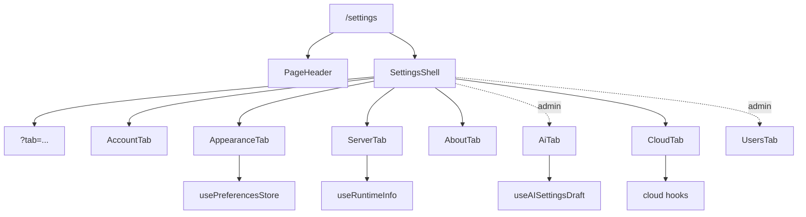

# Settings

The settings feature owns the authenticated settings route, local
preferences, server-backed system settings drafts, runtime info display, AI
and cloud account tabs, and the administrator-only user-management surface.
Repository scope and cloud data access live in their own feature boundaries;
Settings composes those capabilities without owning their persistence or
query rules.

## State

Client-only preferences live in the lower shared [usePreferencesStore](../../lib/preferences/preferences.ts)
so theme effects do not depend on Settings UI. Settings keeps the public
preference API and the model remains persisted under
[PREFERENCES_STORAGE_KEY](./state/registry.ts). [usePreference](../../lib/preferences/preferences.ts) applies immediately,
while [useDebouncedPreference](../../lib/preferences/preferences.ts) keeps high-frequency controls such as
health-check intervals and gallery columns responsive before writing to
localStorage.

Server-backed settings use the shared [useDraftSettings](./hooks/useDraftSettings.ts) contract:
tabs edit a local draft, expose dirty/reset/save state through
[SettingsSaveBar](./components/SettingsSaveBar.tsx), and commit through [useUpdateSystemSettings](./api/useSystemSettings.ts).
[useAISettingsDraft](./flows/ai/useAISettingsDraft.ts) is the current rich draft adapter for LLM/ML
settings, including API-key clearing semantics and server normalization.

Repository preference state is deliberately split by the Repositories feature:

- [useBrowseScope](@/features/repositories) answers "what repository am I looking at?" for list
  pages. "All repositories" is a valid empty preference.
- [useWorkingRepository](@/features/repositories) answers "where should new content land?" for
  upload. It resolves to a concrete repository, falling back to primary/first
  repository once repository options load.

Both repository IDs are user-scoped session state. Authentication reset
clears them while retaining device-level language, theme, and layout choices.

## Data

[useSystemSettings](./api/useSystemSettings.ts) reads `/api/v1/settings/system`; mutations go
through [useUpdateSystemSettings](./api/useSystemSettings.ts), which invalidates setup status and
capabilities because system settings affect bootstrap gates and AI runtime
availability. [useValidateLLMSettings](./api/useSystemSettings.ts) validates the saved LLM config
as an explicit action instead of on every keystroke.

[useRuntimeInfo](./api/useRuntimeInfo.ts) reads `/api/v1/settings/runtime-info` for effective
TOML/env-derived runtime configuration. It is display-only in the UI; users
change those values outside the SPA and restart the server.

[useRepositoryOptions](@/features/repositories) is the shared repository option source used
by browse/working scope pickers and repository-aware status surfaces.
Cloud credentials and repository imports live behind [useCloudProviders](@/features/cloud),
[useCloudCredentials](@/features/cloud), [useCreateCloudCredential](@/features/cloud), and the
repository cloud hooks exposed by the Cloud feature.

## Composition

[Settings](./flows/shell/SettingsPageFlow.tsx) renders the route header and delegates the tabbed surface to
[SettingsShell](./flows/shell/SettingsShell.tsx). The shell always shows [AccountTab](./flows/account/AccountTab.tsx),
[AppearanceTab](./flows/appearance/AppearanceTab.tsx), [CloudTab](./flows/cloud/CloudTab.tsx), [ServerTab](./flows/server/ServerTab.tsx), and
[AboutTab](./flows/about/AboutTab.tsx); admin users additionally see [AiTab](./flows/ai/AiTab.tsx) and
[UsersTab](./flows/users/UsersTab.tsx). The visual hierarchy is centralized in
[SettingsPage](./components/SettingsPage.tsx), [SettingsGroup](./components/SettingsGroup.tsx),
[SettingsRow](./components/SettingsGroup.tsx), and [SettingsBlock](./components/SettingsGroup.tsx); tabs should compose those
primitives instead of inventing local section chrome.

## Decisions

Settings distinguishes instant preferences from manual-save system settings.
Preferences are user-local and reversible through localStorage; system
settings are shared backend state and need explicit Save/Reset affordances.

Runtime defaults do not live here. The Server tab reports effective runtime
config, but durable server defaults belong in TOML and backend config code.

Browse scope and working repository must not be collapsed into one setting:
list pages can intentionally show all repositories, while upload must always
resolve to one concrete target.
