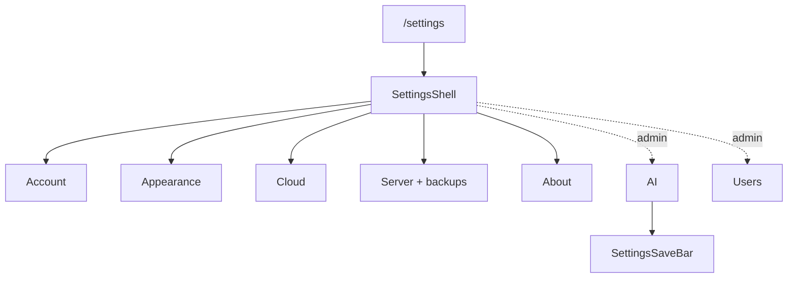

# Settings

Settings owns the authenticated `/settings` route, device-local preferences,
server-backed mutable system settings, runtime information, SQLite backup
management, cloud-account composition, and administrator user management.
Repository and Cloud data contracts remain in their own features.

## State

Device-local preferences live in the lower shared
[usePreferencesStore](../../lib/preferences/preferences.ts) under [PREFERENCES_STORAGE_KEY](./state/registry.ts).
[usePreference](../../lib/preferences/preferences.ts) applies ordinary choices immediately, while
[useDebouncedPreference](../../lib/preferences/preferences.ts) delays high-frequency persistence.

Rich server-backed editors use [useDraftSettings](./hooks/useDraftSettings.ts): a local draft,
dirty/reset/save state, and explicit commit through
[SettingsSaveBar](./components/SettingsSaveBar.tsx). [useAISettingsDraft](./flows/ai/useAISettingsDraft.ts) adapts LLM credentials
and semantic, video-semantic, BioCLIP, OCR, and face switches. Its provider
dropdown and required-field checks consume the Server-advertised descriptor
contract through [normalizeProviderDescriptors](./model/llmProviders.ts); the Web keeps only
the exhaustive localized label boundary for known product IDs. Server facts
remain Query data and are not copied into the preferences store.
[useGeocodingSettingsDraft](./flows/server/useGeocodingSettingsDraft.ts) gives the Server tab an explicit local
draft for the provider, endpoint, language, and User-Agent aggregate.

The active settings tab is the `tab` URL parameter. Repository browse and
upload preferences are owned by Repositories; authentication reset clears
those user-scoped ids while retaining device language, theme, and layout.

## Flows

```mermaid
flowchart TD
    ROUTE["/settings"] --> SHELL["SettingsShell"]
    SHELL --> ACCOUNT["Account"]
    SHELL --> APPEARANCE["Appearance"]
    SHELL --> CLOUD["Cloud"]
    SHELL --> SERVER["Server + backups"]
    SHELL --> ABOUT["About"]
    SHELL -. admin .-> AI["AI"]
    SHELL -. admin .-> USERS["Users"]
    AI --> SAVE["SettingsSaveBar"]
```

[Settings](./flows/shell/SettingsPageFlow.tsx) delegates tab composition to [SettingsShell](./flows/shell/SettingsShell.tsx). Account,
Appearance, Cloud, Server, and About are available to authenticated users;
AI and Users are admin-only. Tabs share [SettingsPage](./components/SettingsPage.tsx),
[SettingsGroup](./components/SettingsGroup.tsx), and [SettingsRow](./components/SettingsGroup.tsx) rather than inventing section
chrome.

[BackupSection](./flows/server/BackupSection.tsx) owns automatic backup schedule/retention plus list,
create, download, restore, and delete interaction. A successful restore
reloads the application because the entire catalog and every cached server
fact have changed.
[GeocodingSection](./flows/server/GeocodingSection.tsx) owns the manual-save reverse-geocoding editor. It
keeps privacy-sensitive endpoint and User-Agent edits local until the admin
explicitly saves them.

## Data

[useSystemSettings](./api/useSystemSettings.ts) reads `/api/v1/settings/system`.
[useUpdateSystemSettings](./api/useSystemSettings.ts) invalidates system settings, setup status,
and capabilities; [useValidateLLMSettings](./api/useSystemSettings.ts) is an explicit validation
command. [useRuntimeInfo](./api/useRuntimeInfo.ts) reports effective manifest-derived runtime
configuration and is display-only.

[useBackups](./api/useBackups.ts) owns the backup list and temporary post-create polling;
[useRestoreBackup](./api/useBackups.ts) performs catalog replacement. Restore polling keeps
the durable Problem Reference and [BackupSection](./flows/server/BackupSection.tsx) localizes it only at
presentation, allowing a language change during recovery. Cloud tabs consume
the Cloud public entry, and user/account tabs consume Users/Auth public
entries. The Settings root `index.ts` exposes only preference effects and
the narrow preference hook required by application composition.
