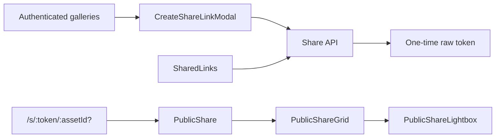

# Share

Share owns revocable, time-limited public links for asset snapshots, albums,
and people. Owner-facing creation and management stay inside the
authenticated app, while the public viewer is deliberately outside the
gated route tree.

## State

Share state is server-owned and read through [useShareLinks](./api/useShareLinks.ts) or
[usePublicShareView](./api/usePublicShareView.ts); the feature has no Context, Zustand store, or
browser persistence. The public token and optional asset id live in the URL,
making direct links and browser navigation authoritative.

The raw share token exists only in [CreateShareLinkModal](./flows/create/CreateShareLinkModal.tsx)'s local
success state. The server stores an HMAC, so an existing link cannot reveal
its URL again; a lost link must be revoked and recreated.

## Flows

[createShareSelectedBulkAction](./flows/create/shareBulkAction.tsx) supplies the reusable “Share selected”
action for multi-select galleries. Album and person pages can instead ask the
server to resolve a collection snapshot, avoiding a large client-side asset
id list. [SharedLinks](./flows/manage/SharedLinksFlow.tsx) owns revoke, extend, and delete operations.

[PublicShare](./flows/public/PublicShareFlow.tsx) uses only token-scoped public endpoints. It renders
[PublicShareGrid](./flows/public/PublicShareGrid.tsx) and [PublicShareLightbox](./flows/public/PublicShareLightbox.tsx) without passing
recipients through authentication or first-run setup.

## Data

The public API returns a minimal asset shape without owner, storage-path, or
filename fields. The public viewer therefore has purpose-built components
instead of widening authenticated gallery types or fabricating private
fields. [shareUrls](./model/shareUrls.ts) builds token-scoped media URLs without the
authenticated media-token query parameter.

Creation and management use `/api/v1/share-links`; public reads use
`/api/v1/public/shares/{token}`. The feature's narrow public entry exposes
creation helpers to authenticated galleries while keeping public-viewer
internals private.
