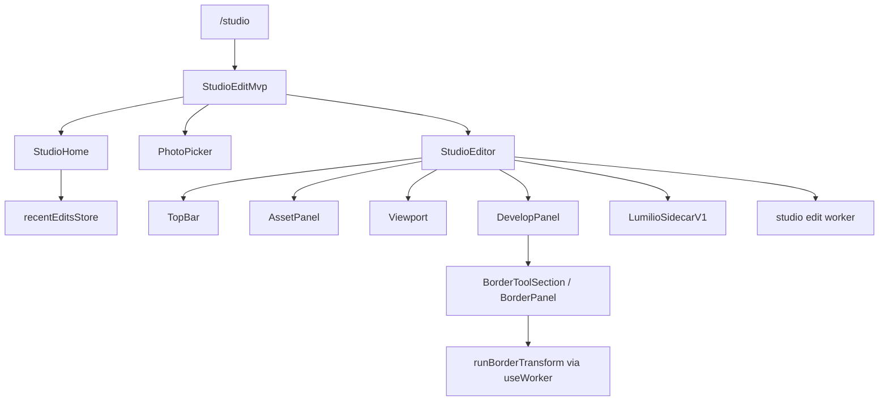

# Studio

The Studio feature owns the authenticated `/studio` editing surface for
photos that already exist in the library. It provides a small route state
machine, a local recent-edit dashboard, the develop editor, sidecar save,
export, and the border tool. It does not import new media, mutate album
membership, or replace the asset gallery; those remain in Upload,
Collections, and Assets.

## State

[StudioEditMvp](./routes/StudioEditMvp.tsx) is the route shell. It switches between three local
views: [StudioHome](./modules/home/StudioHome.tsx), a shared [PhotoPicker](@/features/assets/picker/index.ts), and
[StudioEditor](./modules/editor/StudioEditor.tsx). If the URL includes an `assetId` query parameter, the
shell opens the editor directly. Otherwise the user starts from Studio Home,
chooses a photo, and can resume recent edits.

Recent edits are client-local history stored under
[STUDIO_RECENT_EDITS_KEY](./state/recentEdits.ts). [RecentEditRecord](./state/recentEdits.ts),
[readRecentEdits](./state/recentEdits.ts), [recordRecentEdit](./state/recentEdits.ts), and
[clearRecentEdits](./state/recentEdits.ts) persist only asset id, name, dimensions, and
timestamp; durable edit instructions live in the asset sidecar, not in
localStorage.

[StudioEditor](./modules/editor/StudioEditor.tsx) owns the editor session state: loaded asset metadata,
normalized [StudioEditAdjustments](./modules/editor/runtime/types.ts), undo history, preview URLs, before
preview, save/export flags, render errors, and border-result state. It emits
[StudioEditorActivity](./modules/editor/StudioEditor.tsx) back to the shell so Studio Home can update
recent edits. The default edit state is [DEFAULT_STUDIO_ADJUSTMENTS](./modules/editor/runtime/types.ts);
defaults are intentionally identity operations so an unchanged editor
represents the original image.

## Data

The editor reads the asset record, sidecar, exported source image, and EXIF
record for the selected asset id. Sidecars use [LumilioSidecarV1](./modules/editor/runtime/types.ts):
saving writes the adjustment instructions back to `/api/v1/assets/{id}/sidecar`
without overwriting the preserved original media.

Preview and export rendering run through the feature worker file. The main
thread decodes the source into image data, then sends `LOAD_IMAGE_DATA`,
`RENDER_PREVIEW`, and `EXPORT_IMAGE` messages with request ids. The worker
chooses an engine such as WebGPU, WebGL2, WASM CPU, or Canvas 2D and returns
blobs for the preview/export path. The worker is an implementation boundary,
not a public feature API.

Develop controls are defined by [DEVELOP_GROUPS](./modules/editor/developConfig.ts) and rendered by
[DevelopPanel](./modules/develop/DevelopPanel.tsx). Geometry changes are tracked separately from numeric
photometric controls because preview rendering ignores rotation/flip while
[Viewport](./modules/editor/Viewport.tsx) applies them visually.

The border tool is additive. [BorderPanel](./modules/tools/border/BorderPanel.tsx) edits border params; applying
a border first exports the current develop result, then runs
[runBorderTransform](./modules/tools/border) through the shared worker client from
[useWorker](@/contexts/WorkerProvider.tsx). EXIF-driven border modes use [extractBorderExif](./modules/tools/border),
[hasSufficientExif](./modules/tools/border), [matchBrandKey](./modules/tools/border), and
[rasterizeBrandLogo](./modules/tools/border); users cannot manually edit EXIF or force a
camera logo.

## Composition

[TopBar](./modules/editor/TopBar.tsx) owns session commands such as back, undo, reset, before,
save, and export. [AssetPanel](./modules/editor/AssetPanel.tsx) shows source metadata and EXIF rows.
[Viewport](./modules/editor/Viewport.tsx) owns fit/zoom, before preview, rotation/flip presentation,
and render errors. [DevelopPanel](./modules/develop/DevelopPanel.tsx) owns the grouped controls and mobile
bottom-sheet behavior.

## Decisions

Studio is non-destructive. The original asset stays preserved, saved edits
are sidecar instructions, and export downloads a new rendered file.

Border output is a derived result layered on top of develop adjustments.
Changing any develop control clears the border result because the previous
border no longer represents the current edit state.

Recent edits are convenience state only. Losing localStorage should remove
Studio Home shortcuts, not the saved sidecar or the original media.
