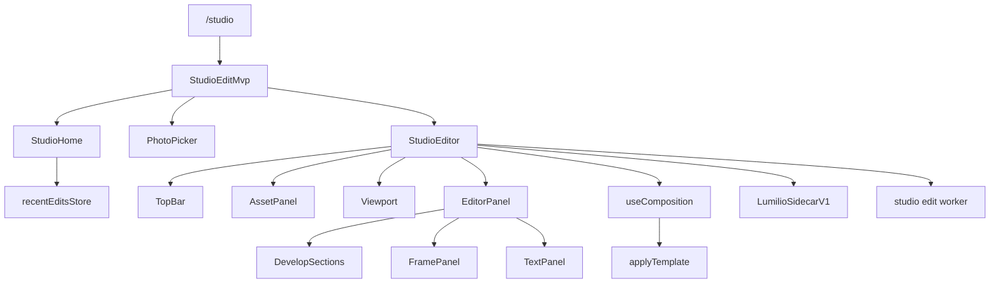

# Studio

The Studio feature owns the authenticated `/studio` editing surface for
photos that already exist in the library. It provides a small route state
machine, a local recent-edit dashboard, the editor, sidecar save, and export.
It does not import new media, mutate album membership, or replace the asset
gallery; those remain in Upload, Collections, and Assets.

## The two halves of an edit

An edit has two independent halves, and keeping them apart is the feature's
central idea.

**Adjustments** ([StudioEditAdjustments](./model/editTypes.ts)) transform the source pixels:
exposure, color, detail, crop, rotation, flip.

**Composition** ([StudioComposition](./model/editTypes.ts)) is drawn around and on top of the
developed result — a [CanvasSpec](./model/canvasSpec.ts) border and a stack of
[Layer](./model/layers.ts)s. It is never baked into the develop pipeline, so changing
exposure does not disturb a caption, and moving a caption does not re-run the
GPU pipeline.

Both halves persist in one sidecar ([LumilioSidecarV1](./model/editTypes.ts)). The
composition fields are additive and nullable, so a sidecar written before
they existed still reads as a valid v1 document.

## State

[StudioEditMvp](./flows/workspace/StudioWorkspaceFlow.tsx) is the route shell. It switches between three local
views: [StudioHome](./flows/home/StudioHome.tsx), a shared [PhotoPicker](@/features/assets/picker/index.ts), and
[StudioEditor](./flows/editor/StudioEditor.tsx). If the URL includes an `assetId` query parameter, the
shell opens the editor directly.

Recent edits are client-local history stored under
[STUDIO_RECENT_EDITS_KEY](./state/recentEdits.ts). [RecentEditRecord](./state/recentEdits.ts),
[readRecentEdits](./state/recentEdits.ts), [recordRecentEdit](./state/recentEdits.ts), and
[clearRecentEdits](./state/recentEdits.ts) persist only asset id, name, dimensions, and
timestamp; durable edit instructions live in the asset sidecar.

[StudioEditor](./flows/editor/StudioEditor.tsx) owns the session: asset metadata, normalized
adjustments, undo history, preview URLs, and save/export flags. Composition
state lives in [useComposition](./flows/editor/useComposition.ts), which also owns template previews and
logo rasterization. The editor emits [StudioEditorActivity](./flows/editor/StudioEditor.tsx) so Studio
Home can update recent edits.

## Rendering

All rendering runs in the feature worker. The main thread decodes the source
into image data, then sends `LOAD_IMAGE_DATA`, `RENDER_PREVIEW`,
`EXPORT_IMAGE`, and `SET_LOGOS`. The worker develops the photo on WebGPU,
WebGL2, WASM CPU, or Canvas 2D, then composes:
[composeStudioImage](./modules/rendering/composeStudioImage.ts) applies [renderCanvasSpec](./modules/rendering/renderCanvas.ts) and
[drawLayers](./modules/rendering/renderLayers.ts). The worker is an implementation boundary, not a public
API.

Geometry renders in the worker rather than as CSS on [Viewport](./flows/editor/Viewport.tsx),
because a frame drawn around the photo must rotate with it, not on top of it.

Fonts load inside the worker through [ensureStudioFontsLoaded](./modules/rendering/fonts/loadStudioFonts.ts), so text
is measured with the same context that draws it. Measuring in one place and
drawing in another is what makes alignment drift with line width.

Logos cannot be rasterized in the worker — decoding SVG needs the DOM — so
[rasterizeLogos](./modules/frame/logoRaster.ts) runs on the main thread and transfers bitmaps across.

## Frames

A [FrameTemplate](./modules/frame/frameTemplate.ts) is declarative data: a canvas treatment plus anchored
elements. [applyTemplate](./modules/frame/applyTemplate.ts) expands one into a canvas spec and ordinary
layers, after which nothing distinguishes template content from something the
user typed. Templates hold no rendering logic.

[expandTemplate](./modules/frame/expandTemplate.ts) is the only place template units are converted, and
resolves EXIF through [extractFrameExif](./modules/frame/frameExif.ts) and brands through
[matchBrand](./modules/frame/logoRegistry.ts).

## Composition

[TopBar](./flows/editor/TopBar.tsx) owns session commands. [AssetPanel](./flows/editor/AssetPanel.tsx) shows source
metadata and EXIF. [Viewport](./flows/editor/Viewport.tsx) owns fit/zoom, before preview, and render
errors. [EditorPanel](./flows/editor/EditorPanel.tsx) hosts the three tabs and the mobile bottom sheet;
[DevelopSections](./flows/editor/develop/DevelopSections.tsx) renders the adjustment groups defined by
[DEVELOP_GROUPS](./model/developConfig.ts), [FramePanel](./flows/editor/frame/FramePanel.tsx) the presets and border, and
[TextPanel](./flows/editor/text/TextPanel.tsx) the layer stack.

## Decisions

Studio is non-destructive. The original asset stays preserved, saved edits
are sidecar instructions, and export downloads a new rendered file.

Recent edits are convenience state only. Losing localStorage should remove
Studio Home shortcuts, not the saved sidecar or the original media.
