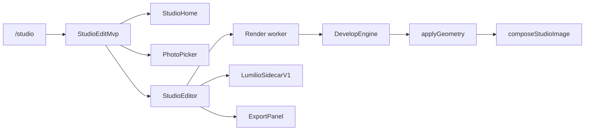

# Studio

Studio owns the authenticated `/studio` workspace for non-destructive photo
editing. It selects an existing photo, edits sidecar instructions, renders a
preview, and exports a new file without changing the preserved original.

## State

[StudioEditMvp](./flows/workspace/StudioWorkspaceFlow.tsx) is a route-local state machine between
[StudioHome](./flows/home/StudioHome.tsx), a photo-only [PhotoPicker](../assets/picker/index.ts), and
[StudioEditor](./flows/editor/StudioEditor.tsx). An `assetId` query parameter opens an edit directly.

[StudioEditor](./flows/editor/StudioEditor.tsx) owns the active session: asset metadata, normalized
adjustments, undo history, preview URLs, and save/export status.
[useComposition](./flows/editor/useComposition.ts) separately owns the canvas treatment, layers,
template previews, and logo rasterization. Durable instructions combine
[StudioEditAdjustments](./model/editTypes.ts) and [StudioComposition](./model/editTypes.ts) in
[LumilioSidecarV1](./model/editTypes.ts).

Recent-edit shortcuts are refresh-safe convenience state stored under
[STUDIO_RECENT_EDITS_KEY](./state/recentEdits.ts). [readRecentEdits](./state/recentEdits.ts),
[recordRecentEdit](./state/recentEdits.ts), and [clearRecentEdits](./state/recentEdits.ts) retain only asset
identity, display metadata, and timestamps; losing them does not lose the
sidecar or original media.

## Flows

```mermaid
flowchart LR
    ROUTE["/studio"] --> SHELL["StudioEditMvp"]
    SHELL --> HOME["StudioHome"]
    SHELL --> PICKER["PhotoPicker"]
    SHELL --> EDITOR["StudioEditor"]
    EDITOR --> WORKER["Render worker"]
    WORKER --> DEVELOP["DevelopEngine"]
    DEVELOP --> GEOMETRY["applyGeometry"]
    GEOMETRY --> COMPOSE["composeStudioImage"]
    EDITOR --> SIDECAR["LumilioSidecarV1"]
    EDITOR --> EXPORT["ExportPanel"]
```

Preview rendering transfers the visible canvas and source blob to a worker.
[DevelopEngine](./modules/rendering/developEngine.ts) applies pixel adjustments in WebGL2,
[applyGeometry](./modules/rendering/geometry.ts) applies crop/rotation/flip, and
[composeStudioImage](./modules/rendering/composeStudioImage.ts) draws the canvas treatment and layers in 2D.
Slider previews stay on the GPU; only export encodes a blob.

[ExportPanel](./flows/editor/export/ExportPanel.tsx) selects format, quality, and output size.
[resolveExportSize](./modules/rendering/coordinateSystem.ts) prevents upscaling and respects GPU limits, then
[preserveExif](./modules/export/exif.ts) copies compatible EXIF to the rendered output with an
upright orientation.

## Data

Asset metadata, source media, EXIF, and sidecars come from authenticated
asset endpoints. A sidecar stores edit instructions, not rendered pixels:
adjustments transform the source, while composition is drawn around or on
top of that result.

[CropOverlay](./flows/editor/crop/CropOverlay.tsx) edits displayed geometry and
[mapRectDisplayedToSource](./modules/rendering/coordinateSystem.ts) commits a source-pixel crop.
[estimateDepthField](./modules/depth/depthEstimation.ts) optionally supplies a self-hosted WebGPU depth
field for layer occlusion; absence of WebGPU or the model simply disables
that effect. [applyTemplate](./modules/frame/applyTemplate.ts) expands declarative frame templates into
the same canvas and layer data used by manual edits.

Studio has no cross-feature public barrel. The application router owns its
entry, and worker, rendering, editor, crop, depth, frame, and export details
remain feature-private.
