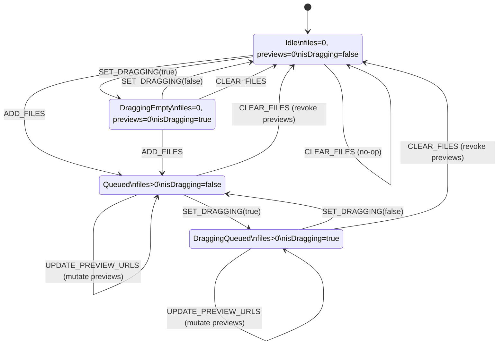

# Upload Feature State Machine (useReducer)

## Scope
This document models the `uploadReducer` transitions in `web/src/features/upload/reducers/index.ts` using the actions defined in `web/src/features/upload/upload.type.ts`. It focuses on reducer-driven state changes (not UI flow).

## State Shape
- `files`: `File[]`
- `previews`: `string[]` (aligned with `files`; empty string means no preview yet)
- `isDragging`: `boolean`

## Actions (Reducer Inputs)
- `SET_DRAGGING(payload: boolean)`: toggles `isDragging`.
- `ADD_FILES({ files, previews })`: appends to `files` and `previews`.
- `UPDATE_PREVIEW_URLS({ startIndex, urls })`: updates preview entries and revokes prior URLs.
- `CLEAR_FILES`: revokes all previews and resets to `initialState`.

## Guards / Preconditions (from UploadProvider)
- `ADD_FILES` only dispatches when input files pass validation and there are available slots (`maxTotalFiles`).
- `CLEAR_FILES` is blocked by the UI while `isProcessing` is true, even though the reducer would accept it.

## Derived States Used in the Diagram
These are logical groupings based on the reducer state:
- `Idle`: `files=[]`, `previews=[]`, `isDragging=false`.
- `DraggingEmpty`: `files=[]`, `previews=[]`, `isDragging=true`.
- `Queued`: `files.length>0`, `isDragging=false` (previews may be empty or partially filled).
- `DraggingQueued`: `files.length>0`, `isDragging=true`.

Note: `UPDATE_PREVIEW_URLS` is defined in the reducer but not dispatched in `src/features/upload` at the time of writing; the transition is still shown because it is part of the reducer contract.

## State Diagram

