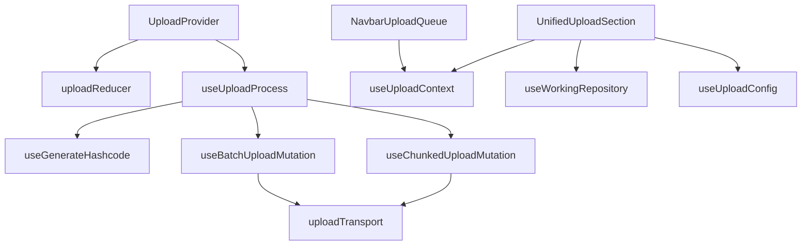

# Upload

The Upload feature owns the client-side queue, drag-and-drop intake, hashing
pipeline, batch/chunk transport calls, and global upload status UI. It is
surfaced primarily on `/manage`, but the feature boundary is separate:
Manage decides where upload appears, while Upload decides how files move from
browser selection into the repository.

## State

[UploadProvider](./UploadProvider.tsx) wraps the app with [UploadContext](./upload.type.ts). The reducer
stores selected `UploadState.files`, placeholder preview slots, and
drag-over state. Consumers use [useUploadContext](./hooks/useUpload.tsx); calling that hook
outside the provider is an error.

Upload processing state comes from [useUploadProcess](./hooks/useUploadProcess.tsx). Its React state
bridge is isolated in [useUploadProgressState](./hooks/uploadProcessProgress.ts); the hash/upload pipeline
is coordinated by [runUploadProcess](./hooks/uploadProcessRunner.ts), and transport-specific behavior is
owned by [createUploadTransport](./hooks/uploadProcessTransport.ts). The hook exposes the aggregate progress
number, per-file [FileUploadProgress](./hooks/useUploadProcess.tsx), hashing progress, and the two active
flags used by the provider: `isGeneratingHashCodes` and `isUploading`.

[UnifiedUploadSection](./components/UnifiedUploadSection.tsx) is the primary queue editor. It validates
selected files, adds them to the provider queue, lets the user clear the
queue while idle, starts upload, and exposes the working repository picker.
[NavbarUploadQueue](./components/NavbarUploadQueue.tsx) is only a compact global status surface; it reuses
provider state and links back to `/manage` for detailed control.

## Data

Upload target selection is the settings feature's working repository, read
through `useWorkingRepository`. The upload path requires one concrete
repository id; unlike browse scope, "all repositories" is not a valid target.
If the user has not selected a working repository, the settings hook resolves
primary/first repository fallback before upload transport receives the id.

[useUploadConfig](./hooks/useUploadQueries.ts) reads `/api/v1/assets/batch/config`. The server is
authoritative for chunk size and concurrency; [useUploadProcess](./hooks/useUploadProcess.tsx) uses
fixed fallbacks only while that config is unavailable. Small files are sent
through [useBatchUploadMutation](./hooks/useUploadMutations.ts); large files are sent through
[useChunkedUploadMutation](./hooks/useUploadMutations.ts). Both pass the resolved repository id to the
upload transport layer.

Files are hashed before transport through `useGenerateHashcode`. Hashing is
pipelined with upload: each hashed large file can start chunked upload, and
small files are buffered into smart batches. The worker fingerprint mirrors
the backend BLAKE3 policy exactly: full hash up to 100 MiB, then quick hash
over little-endian file size plus fixed 1 MiB first/last chunks. Hash and
HTTP failures are terminal per-file failures: successful files leave the
editor queue, while failed `File` objects remain available for retry.

A successful HTTP response means transport was accepted, not that an asset
exists yet. [waitForUploadJobs](@/lib/upload/uploadLifecycle.ts) follows the returned ingest task ids
through `/api/v1/assets/batch/jobs`; [FileUploadProgress](./hooks/useUploadProcess.tsx) remains in
`processing` until every task reaches a backend terminal state. Asset
list/search queries are invalidated only after successful materialization.

## Instant upload

Because the worker fingerprint is byte-identical to the backend's, hashed
files can be checked against the repository before any bytes move.
[useUploadProcess](./hooks/useUploadProcess.tsx) passes each hash and size to `precheckUploads`
(`/api/v1/assets/precheck`) just before transport — batched with the small-file
buffer, and as a single call ahead of each chunked upload. Files the server
already holds are marked `duplicate` in [FileUploadProgress](./hooks/useUploadProcess.tsx) and never
transported.

A duplicate is a success, not a failure: [NavbarUploadQueue](./components/NavbarUploadQueue.tsx) renders it in
the warning color with its own count, separate from the error count, and the
upload summary reports how many files were skipped. Precheck is an optimization
only. If the request fails the files upload normally, and the server repeats the
same check before ingest, returning the `duplicate` status the client also
understands from a transport response. Size is matched alongside the hash
because a quick hash only covers a large file's first and last chunk.

## Composition

[FileDropZone](./components/FileDropZone.tsx) contributes drag/drop interaction, but validation and
queue mutation stay in [UnifiedUploadSection](./components/UnifiedUploadSection.tsx). [ProgressIndicator](./components/ProgressIndicator.tsx)
can render aggregate progress, while [NavbarUploadQueue](./components/NavbarUploadQueue.tsx) renders the
durable per-file queue that remains visible across routes.

## Decisions

The upload queue is global because users can leave `/manage` while an upload
is still running. The navigation queue keeps progress inspectable without
duplicating transport logic.

Transport parameters come from the server because the server owns memory,
chunk, and concurrency limits. Client fallbacks are resilience defaults, not
product configuration.

The working repository boundary must stay separate from browse scope. Upload
creates new assets and therefore needs a concrete destination; browse pages
can intentionally aggregate multiple repositories.
