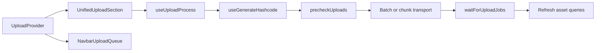

# Upload

Upload owns browser file intake, the in-session queue, hashing, duplicate
precheck, batch/chunk transport, ingest-job tracking, and global progress UI.
Manage chooses where the full editor appears; Upload owns how files reach a
concrete repository.

## State

[UploadProvider](./state/UploadProvider.tsx) wraps the application with [UploadContext](./state/context.ts).
[uploadReducer](./state/reducer.ts) is the queue-mutation boundary: [UploadState](./state/context.ts)
holds files, index-aligned preview URLs, and drag-over state, while
[UploadAction](./state/context.ts) defines additions, retries, preview replacement,
clearing, and drag transitions. Clearing or replacing files revokes obsolete
object URLs.

[useUploadProcess](./modules/process/useUploadProcess.tsx) owns processing progress and active flags.
[useUploadProgressState](./modules/process/progress.ts) bridges per-file [FileUploadProgress](./modules/process/useUploadProcess.tsx)
into React state, while [runUploadProcess](./modules/process/runner.ts) coordinates the pipeline.
The queue is global but intentionally not persisted, so progress remains
visible across routes without pretending interrupted browser work is
resumable after a reload.

## Flows

```mermaid
flowchart LR
    PROVIDER["UploadProvider"] --> QUEUE["UnifiedUploadSection"]
    PROVIDER --> NAV["NavbarUploadQueue"]
    QUEUE --> PROCESS["useUploadProcess"]
    PROCESS --> HASH["useGenerateHashcode"]
    HASH --> PRECHECK["precheckUploads"]
    PRECHECK --> TRANSPORT["Batch or chunk transport"]
    TRANSPORT --> JOBS["waitForUploadJobs"]
    JOBS --> REFRESH["Refresh asset queries"]
```

[UnifiedUploadSection](./flows/intake/UnifiedUploadSection.tsx) validates files, edits the queue, chooses the
working repository, and starts processing. [NavbarUploadQueue](./flows/queue/NavbarUploadQueue.tsx) is a
compact global view over the same provider state and links back to Manage.

[useGenerateHashcode](./modules/process/useGenerateHashcode.ts) fingerprints files before
[precheckUploads](../../lib/upload/uploadTransport.ts). Known files are marked duplicate and skip transport;
a failed precheck falls back to normal upload. Small files use
[useBatchUploadMutation](./api/useUploadMutations.ts), large files use
[useChunkedUploadMutation](./api/useUploadMutations.ts), and [waitForUploadJobs](../../lib/upload/uploadLifecycle.ts) follows
accepted ingest tasks to terminal backend state before asset queries refresh.

## Data

[useWorkingRepository](../repositories/index.ts) resolves the concrete destination. “All
repositories” is valid for browsing but never for upload. [useUploadConfig](./api/useUploadQueries.ts)
reads server-owned chunk and concurrency limits; client values are temporary
resilience fallbacks while configuration is unavailable.

The browser fingerprint mirrors backend BLAKE3 policy: full content through
100 MiB, then a quick hash over little-endian size plus fixed first/last
chunks. Size accompanies the hash during duplicate checks. Per-file success,
duplicate, transport failure, and ingest failure remain distinct so retryable
`File` objects stay in the queue while completed files leave it.

The feature root is the narrow public entry for application-level queue UI
and upload state. Hashing, transport, progress, and lifecycle helpers remain
internal to the feature or shared upload infrastructure.
