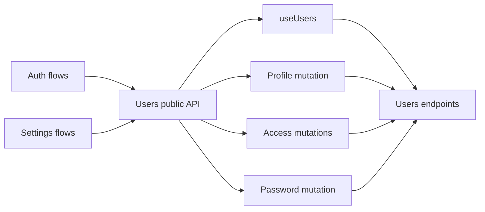

# Users

Users is an API-only feature for listing managed users, updating profiles
and access, and changing the current user's password. Auth and Settings
compose this contract; the feature owns no route or workflow UI.

## State

[useUsers](./api/useUsers.ts) keeps the normalized [ManagedUserDTO](./api/useUsers.ts) list in TanStack
Query. The feature has no Context, client store, or browser persistence:
identities and access policy are server facts.

Mutations expose their request state through TanStack Query. Successful
profile and access changes invalidate the managed-user list instead of
copying it into a second client-side model.

## Flows

[useUpdateMyProfile](./api/useUsers.ts) updates the current profile.
[useAdminUpdateUser](./api/useUsers.ts) and [useResetUserAccess](./api/useUsers.ts) support
administrator flows. [useChangeMyPassword](./api/useUsers.ts) is consumed by the Auth
password-change workflow.

## Data

The API module normalizes generated DTOs at its boundary and centralizes
query keys and invalidation. Consumers depend on the feature entry rather
than endpoint details.

Keeping Users API-only is intentional: adding empty component, flow, or state
layers would obscure ownership. UI belongs to the Auth and Settings
workflows that give each operation its product context.
