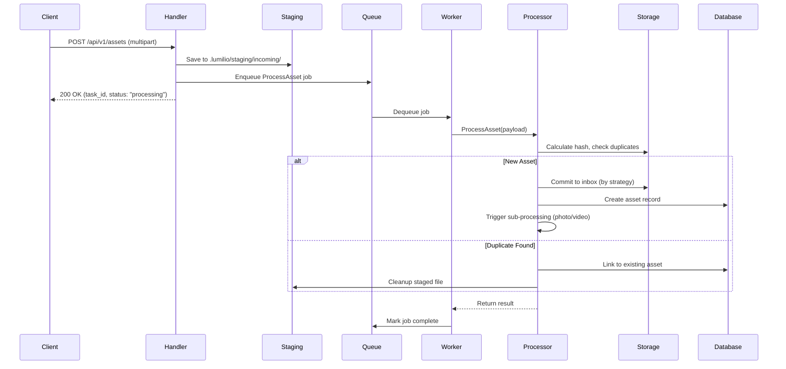

# Inbox Upload Process - Detailed Analysis

## Overview

The inbox upload process is a multi-stage pipeline that handles asset ingestion from client upload to final storage. It implements a staged approach with queuing for reliability and scalability.

## Process Flow

### High-Level Flow



## Stage 1: HTTP Request and Staging

### Endpoints

#### Single Upload
- **Route**: `POST /api/v1/assets`
- **Handler**: `AssetHandler.UploadAsset`
- **Content-Type**: `multipart/form-data`
- **Location**: `server/internal/api/handler/asset_handler.go`

**Request Parameters**:
- `file` (form file): The asset file to upload
- `repository_id` (optional): Target repository UUID
- `X-Content-Hash` (optional header): Client-provided content hash (BLAKE3)

**Example Request**:
```bash
curl -X POST http://localhost:8080/api/v1/assets \
  -H "Authorization: Bearer <token>" \
  -H "X-Content-Hash: abc123..." \
  -F "file=@photo.jpg" \
  -F "repository_id=550e8400-e29b-41d4-a716-446655440000"
```

#### Batch Upload
- **Route**: `POST /api/v1/assets/batch`
- **Handler**: `AssetHandler.BatchUploadAssets`
- **Content-Type**: `multipart/form-data`

**Request Parameters**:
- Multiple `file` parts where field name = content hash
- `repository_id` (optional): Target repository UUID

**Example Request**:
```bash
curl -X POST http://localhost:8080/api/v1/assets/batch \
  -H "Authorization: Bearer <token>" \
  -F "abc123hash1=@photo1.jpg" \
  -F "def456hash2=@photo2.jpg" \
  -F "repository_id=550e8400-..."
```

### Staging Process

**Staging Directory**: `.lumilio/staging/incoming/` within the repository

The handler performs these steps:

1. **Parse Multipart Form**
   ```go
   err := c.Request.ParseMultipartForm(32 << 20) // 32 MB max
   ```

2. **Validate Request**
   - Check file is present
   - Validate repository ID if provided
   - Extract content hash from header or field name

3. **Create Staging File**
   ```go
   stagingFile, err := h.StagingManager.CreateStagingFile(repoPath, filename)
   // Creates: .lumilio/staging/incoming/{uuid}.{ext}
   ```

4. **Write File Content**
   ```go
   osFile, err := os.Create(stagingFile.Path)
   _, err = io.Copy(osFile, file)
   ```

5. **Prepare Job Payload**
   ```go
   payload := processors.AssetPayload{
       ClientHash:   clientHash,
       StagedPath:   stagingFile.Path,
       UserID:       userID,
       Timestamp:    time.Now(),
       ContentType:  header.Header.Get("Content-Type"),
       FileName:     header.Filename,
       RepositoryID: repositoryID,
   }
   ```

### Response Format

**Success Response** (200 OK):
```json
{
  "code": 200,
  "msg": "Upload successful",
  "data": {
    "task_id": 12345,
    "status": "processing",
    "file_name": "photo.jpg",
    "size": 2048576,
    "content_hash": "abc123..."
  }
}
```

**Batch Success Response**:
```json
{
  "code": 200,
  "msg": "Batch upload completed",
  "data": {
    "total": 3,
    "successful": 2,
    "failed": 1,
    "results": [
      {
        "success": true,
        "task_id": 12345,
        "file_name": "photo1.jpg",
        "size": 2048576,
        "message": "Upload successful"
      },
      {
        "success": false,
        "file_name": "photo2.jpg",
        "message": "Invalid file format"
      }
    ]
  }
}
```

## Stage 2: Queue Enqueuing

### River Queue Integration

**Queue Name**: `process_asset`  
**Worker**: `ProcessAssetWorker`  
**Max Workers**: 5 (configurable)

The handler enqueues the job:

```go
job, err := h.QueueClient.Insert(ctx, 
    queue.ProcessAssetArgs{
        ClientHash:   payload.ClientHash,
        StagedPath:   payload.StagedPath,
        UserID:       payload.UserID,
        Timestamp:    payload.Timestamp,
        ContentType:  payload.ContentType,
        FileName:     payload.FileName,
        RepositoryID: payload.RepositoryID,
    },
    &river.InsertOpts{
        Queue: "process_asset",
    },
)
```

**Job Properties**:
- **Unique Key**: `(clientHash, userID)` - prevents duplicate processing
- **Priority**: Normal (0)
- **Max Attempts**: 5 (with exponential backoff)
- **Timeout**: 10 minutes

### Queue Configuration

**Location**: `server/internal/queue/queue_setup.go`

```go
Queues: map[string]river.QueueConfig{
    "process_asset": {
        MaxWorkers: 5,
    },
}
```

**Scaling Considerations**:
- Each worker handles one job at a time
- Workers run concurrently (5 parallel uploads)
- IO-bound operations benefit from more workers
- CPU-bound operations (hashing, thumbnails) may need tuning

## Stage 3: Worker Processing

### ProcessAssetWorker

**Location**: `server/internal/queue/asset_worker.go`

The worker is a thin wrapper that delegates to `AssetProcessor`:

```go
func (w *ProcessAssetWorker) Work(ctx context.Context, job *river.Job[ProcessAssetArgs]) error {
    payload := processors.AssetPayload{
        ClientHash:   job.Args.ClientHash,
        StagedPath:   job.Args.StagedPath,
        UserID:       job.Args.UserID,
        Timestamp:    job.Args.Timestamp,
        ContentType:  job.Args.ContentType,
        FileName:     job.Args.FileName,
        RepositoryID: job.Args.RepositoryID,
    }
    
    asset, err := w.Processor.ProcessAsset(ctx, payload)
    if err != nil {
        return fmt.Errorf("failed to process asset: %w", err)
    }
    
    return nil
}
```

**Error Handling**:
- Transient errors: Job retried automatically
- Permanent errors: Job marked as failed after max attempts
- Staging files cleaned up on permanent failure

## Stage 4: Asset Processing

### AssetProcessor

**Location**: `server/internal/processors/asset_processor.go`

The processor performs the core ingestion logic:

#### Step 1: Validate Staged File

```go
info, err := os.Stat(task.StagedPath)
if err != nil {
    return nil, fmt.Errorf("staged file not found: %w", err)
}
fileSize := info.Size()
```

#### Step 2: Resolve Repository

```go
var repository repo.Repository
if task.RepositoryID != "" {
    // Use specified repository
    repository, err = ap.queries.GetRepository(ctx, repoUUID)
} else {
    // Use default repository
    repositories, err := ap.queries.ListRepositories(ctx)
    repository = repositories[0]
}
```

#### Step 3: Determine Content Type

```go
contentType := file.DetermineAssetType(task.ContentType)
// Returns: "photo", "video", "audio", or "unknown"
```

#### Step 4: Commit to Inbox

The staging manager handles the move from staging to inbox:

```go
stagingFile := &storage.StagingFile{
    ID:        filepath.Base(task.StagedPath),
    Path:      task.StagedPath,
    Filename:  task.FileName,
    RepoPath:  repository.Path,
    CreatedAt: task.Timestamp,
}

// Calculate content hash for CAS and deduplication
hash := calculateFileHash(task.StagedPath)

// Commit based on repository storage strategy
err = ap.stagingManager.CommitStagingFileToInbox(stagingFile, hash)
```

### Storage Strategies

The inbox path depends on repository configuration:

#### Date Strategy (Default)
```
inbox/
  2024/
    10/
      photo.jpg
      another-photo.jpg
```

**Path Resolution**:
```go
// Format: inbox/YYYY/MM/filename
year := time.Now().Format("2006")
month := time.Now().Format("01")
finalPath = filepath.Join("inbox", year, month, filename)
```

#### Flat Strategy
```
inbox/
  photo.jpg
  another-photo.jpg
  video.mp4
```

**Path Resolution**:
```go
// Format: inbox/filename
finalPath = filepath.Join("inbox", filename)
```

#### Content-Addressed Storage (CAS)
```
inbox/
  ab/
    cd/
      ef/
        abcdef123456789.jpg
```

**Path Resolution**:
```go
// Format: inbox/aa/bb/cc/hash.ext
// Uses first 6 chars of hash for directory structure
finalPath = filepath.Join("inbox", 
    hash[0:2], hash[2:4], hash[4:6], 
    hash + extension)
```

**Fallback**: If hash is too short or unavailable, falls back to date strategy.

### Duplicate Handling

When a filename already exists in the target directory:

**UUID Mode** (default):
```
photo.jpg -> photo_550e8400-e29b-41d4.jpg
```

**Rename Mode**:
```
photo.jpg -> photo (1).jpg
photo.jpg -> photo (2).jpg
```

**Overwrite Mode**:
```
photo.jpg -> photo.jpg (replaces existing)
```

## Stage 5: Database Recording

### Asset Creation

**Location**: `server/internal/service/asset_service.go`

```go
asset, err := assetService.CreateAsset(ctx, repo.CreateAssetParams{
    FileName:     filename,
    FilePath:     inboxPath,
    FileSize:     fileSize,
    ContentHash:  &hash,
    MimeType:     &mimeType,
    AssetType:    contentType,
    RepositoryID: repositoryUUID,
    OwnerID:      ownerID,
    UploadedAt:   timestamp,
})
```

**Database Schema** (simplified):
```sql
CREATE TABLE assets (
    asset_id UUID PRIMARY KEY,
    file_name TEXT NOT NULL,
    file_path TEXT NOT NULL,
    file_size BIGINT NOT NULL,
    content_hash TEXT,
    mime_type TEXT,
    asset_type TEXT NOT NULL,
    repository_id UUID REFERENCES repositories(repo_id),
    owner_id INTEGER REFERENCES users(user_id),
    uploaded_at TIMESTAMP NOT NULL,
    created_at TIMESTAMP DEFAULT NOW(),
    updated_at TIMESTAMP DEFAULT NOW()
);

CREATE INDEX idx_assets_content_hash ON assets(content_hash);
CREATE INDEX idx_assets_repository ON assets(repository_id);
CREATE INDEX idx_assets_owner ON assets(owner_id);
```

### Deduplication Check

Before creating a new asset, check for duplicates:

```go
existingAssets, err := queries.GetAssetsByHash(ctx, hash)
if len(existingAssets) > 0 {
    // Asset already exists - link instead of duplicating
    return existingAssets[0], nil
}
```

This saves storage space by avoiding duplicate file storage.

## Stage 6: Post-Processing

After the asset is recorded, additional processing is triggered:

### Type-Specific Processing

#### Photo Processing
1. **EXIF Extraction**: Camera info, GPS, timestamps
2. **Thumbnail Generation**: 150px, 300px, 1024px
3. **CLIP Embedding**: Vector representation for search
4. **Smart Classification**: Species/object detection

#### Video Processing
1. **Metadata Extraction**: Duration, codec, resolution
2. **Thumbnail Extraction**: From first few frames
3. **Transcoding**: H.264/MP4 for web playback
4. **Preview Generation**: Short clip for quick preview

#### Audio Processing
1. **Metadata Extraction**: Artist, album, duration
2. **Waveform Generation**: Visual representation
3. **Transcoding**: MP3 for web playback

**Details**: See [03-asset-processing.md](./03-asset-processing.md)

## Cleanup and Error Handling

### Success Cleanup

On successful processing:
1. Staged file is moved to inbox (not copied)
2. Original staging file is removed
3. Job marked as complete in River

### Error Cleanup

On permanent failure:
1. Staged file moved to `.lumilio/staging/failed/`
2. Error logged with context
3. Job marked as failed in River
4. User notified via API response

### Automatic Cleanup

Background cleanup process:
```go
// Clean up old staging files (older than 24 hours)
stagingManager.CleanupStaging(repoPath, 24 * time.Hour)
```

Runs periodically to free up space from orphaned staging files.

## Performance Characteristics

### Throughput

- **Single Upload**: ~10-50 requests/second per instance
- **Batch Upload**: ~5-20 batches/second (depends on batch size)
- **Worker Processing**: ~5-10 assets/second (depends on asset size and type)

### Latency

- **API Response**: < 100ms (immediate after enqueue)
- **Processing Time**:
  - Small images (< 5MB): 1-3 seconds
  - Large images (> 10MB): 3-10 seconds
  - Videos: 10-60 seconds (depends on transcoding)

### Bottlenecks

1. **Disk I/O**: Moving large files between staging and inbox
2. **Hash Calculation**: CPU-intensive for large files
3. **Thumbnail Generation**: CPU-intensive, especially for RAW formats
4. **ML Processing**: Network latency to ML service + GPU processing time

### Optimization Strategies

1. **Parallel Processing**: Scale workers horizontally
2. **CDN Integration**: Serve thumbnails from CDN
3. **Batch Operations**: Group small files for efficiency
4. **Caching**: Cache file hashes and metadata
5. **Storage**: Use SSD for staging area

## Monitoring and Observability

### Key Metrics

- **Upload Rate**: Requests per second
- **Queue Depth**: Jobs waiting in `process_asset` queue
- **Processing Time**: P50, P95, P99 latencies
- **Error Rate**: Failed jobs / total jobs
- **Storage Usage**: Staging area size, inbox growth rate

### Logging

Key log points:
- Upload request received
- File staged successfully
- Job enqueued
- Worker started processing
- Asset created in database
- Post-processing triggered
- Job completed

**Example Log Output**:
```
[INFO] Upload request received: file=photo.jpg size=2048576 hash=abc123...
[INFO] File staged: path=.lumilio/staging/incoming/550e8400.jpg
[INFO] Job enqueued: job_id=12345 queue=process_asset
[INFO] Worker processing: job_id=12345 asset=photo.jpg
[INFO] Asset created: asset_id=... path=inbox/2024/10/photo.jpg
[INFO] Triggering photo processing: asset_id=...
[INFO] Job completed: job_id=12345 duration=2.3s
```

## Configuration

### Environment Variables

```bash
# Storage configuration
STORAGE_PATH=/path/to/repositories
STAGING_PATH=/path/to/repositories/.lumilio/staging

# Queue configuration
PROCESS_ASSET_WORKERS=5
JOB_TIMEOUT=10m
MAX_JOB_ATTEMPTS=5

# Upload limits
MAX_UPLOAD_SIZE=100MB
MAX_BATCH_SIZE=50

# ML service
ML_SERVICE_ADDR=localhost:50051
CLIP_ENABLED=true
```

### Repository Configuration

Each repository has a `.lumiliorepo` config file:

```yaml
version: "1.0"
id: "550e8400-e29b-41d4-a716-446655440000"
name: "My Photos"
storage_strategy: "date"  # or "flat" or "cas"

local_settings:
  preserve_original_filename: true
  handle_duplicate_filenames: "uuid"  # or "rename" or "overwrite"
  max_file_size: 0  # 0 = no limit
  compress_files: false
```

## Testing

### Unit Tests

```go
func TestAssetHandler_UploadAsset(t *testing.T) {
    // Setup
    handler := setupTestHandler(t)
    
    // Create test file
    file := createTestFile(t, "test.jpg", []byte("fake image data"))
    
    // Make request
    req := createUploadRequest(t, file)
    recorder := httptest.NewRecorder()
    
    handler.UploadAsset(recorder.Context())
    
    // Verify response
    assert.Equal(t, 200, recorder.Code)
    
    // Verify job enqueued
    jobs := getQueuedJobs(t, "process_asset")
    assert.Len(t, jobs, 1)
}
```

### Integration Tests

```go
func TestEndToEndUpload(t *testing.T) {
    // Setup server, database, queue
    server := setupTestServer(t)
    defer server.Close()
    
    // Upload file
    resp := uploadFile(t, server.URL, "test.jpg")
    taskID := resp.TaskID
    
    // Wait for processing
    waitForJobComplete(t, taskID, 10*time.Second)
    
    // Verify asset in database
    asset := getAssetByID(t, resp.AssetID)
    assert.NotNil(t, asset)
    assert.Equal(t, "test.jpg", asset.FileName)
    
    // Verify file in inbox
    inboxPath := filepath.Join(repoPath, asset.FilePath)
    assert.FileExists(t, inboxPath)
}
```

## Security Considerations

### Input Validation

- File size limits enforced
- Content type validation
- Filename sanitization (remove path traversal attempts)
- Hash validation (if provided)

### Authentication

- All upload endpoints require authentication
- User can only upload to their own repositories
- API tokens validated per request

### File Safety

- Staged files are temporary and cleaned up
- System directories protected from user access
- Symbolic links not followed

### Rate Limiting

- Per-user upload rate limits
- Per-IP rate limits
- Queue depth limits to prevent DoS

## Future Improvements

1. **Resumable Uploads**: Support for large file uploads with resume capability
2. **Direct Storage Upload**: Skip staging for trusted clients
3. **Distributed Processing**: Scale workers across multiple machines
4. **Priority Queues**: VIP users get priority processing
5. **Smart Scheduling**: Process during off-peak hours for efficiency
6. **Client-Side Hashing**: Reduce server CPU usage
7. **Progressive Upload**: Show upload progress to user
8. **Chunk Upload**: Break large files into chunks

## Related Documentation

- [Asset Processing Pipeline](./03-asset-processing.md)
- [Storage System README](../server/internal/storage/README.md)
- [Queue System README](../server/internal/queue/README.md)
- [Upload Backend Diagram](../docs/en/developer-documentation/business-diagram/upload-backend.md)

---

*This document is part of the Lumilio Photos server wrap-up documentation.*
